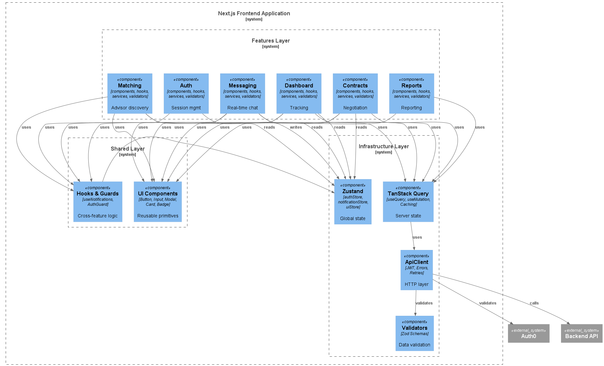

# PymeBoost

Problem Statement: Provide a results-driven connection between SMEs and high-performance advisors.

Currently, starting and scaling an SME can become a complex and exhausting process, especially for entrepreneurs who lack prior experience in business management, process optimization, or scalability strategies. Many SMEs struggle to identify which areas of their business require improvement, how to implement more efficient processes, and most importantly, whom to trust to execute these changes effectively.

In many cases, SMEs do not have access to high-quality specialized advisory services or end up hiring consultants without clear performance metrics, structured follow-up, or real guarantees of results. This often leads to financial losses, poorly implemented processes, and low long-term sustainability. Additionally, there is a lack of trustworthy platforms where businesses can discover verified experts, compare past performance, and engage in transparent, structured collaborations.

PymeBoost emerges as a solution specifically designed for SMEs, creating an ecosystem where businesses can connect with advisors and specialists capable of optimizing specific operational areas within the organization. Through an intelligent matching system powered by AI, the platform analyzes each SME’s context, challenges, and objectives to recommend the most suitable advisors, while also enabling structured interaction through negotiation, contract generation, and continuous performance tracking. In this way, PymeBoost transforms the traditional consulting model into a results-driven system based on measurable outcomes, continuous monitoring, and transparency, ensuring that both the SME and the advisor remain aligned under clear and quantifiable objectives.

--- 

## Authors
 * Isaac Villalobos Bonilla, 2024124285
 * Christopher Daniel Vargas Villalta, 2024108443
 * Santiago Espinoza Rendón, 2024156530
 * Jose Ignacio Paniagua Vargas, 2024163735

--- 

# Prototypes & UX/UI

Vercel: https://pymeboost-v1.vercel.app/

---

# Frontend

## 1.1 Technology Stack 

| Technology                    | Version             | Purpose                               | Justification                                                                                                                            |
| ----------------------------- | ------------------- | ------------------------------------- | ---------------------------------------------------------------------------------------------------------------------------------------- |
| React                         | 19.1.0              | Main UI library                       | Enables the development of dynamic and reusable interfaces for dashboards, chats, and interactive systems within PymeBoost.              |
| Next.js                       | 15.3.3              | Main frontend framework               | Provides routing, hybrid rendering, and a modern architecture compatible with cloud deployments and enterprise APIs.                     |
| TypeScript                    | 5.8.3               | Main frontend language                | Improves maintainability, scalability, and reliability through strong typing and integration with the backend OpenAPI 3.1 specification. |
| Node.js                       | 22.15.0 LTS         | Development runtime                   | Used for builds, tooling, and automation within the frontend ecosystem.                                                                  |
| TailwindCSS                   | 4.1.8               | Utility-first CSS framework           | Enables rapid development of modern, responsive, and consistent interfaces for dashboards and SaaS systems.                              |
| Zustand                       | 5.0.5               | Global state management               | Simplifies management of global states such as authentication, chats, and notifications in a lightweight and scalable way.               |
| TanStack Query                | 5.76.1              | Server state management and caching   | Synchronizes backend data, manages caching, and automatically updates information from APIs.                                             |
| Auth0                         | 3.1.1               | Authentication and session management | Provides secure authentication and centralized user management integrated with the backend authentication system with JWT validation.    |
| Framer Motion                 | 12.15.0             | Animation and transition system       | Enables modern animations and interactive transitions to improve the platform user experience.                                           |
| ESLint                        | 9.18.0              | Static code analysis                  | Detects errors, enforces development conventions, and improves overall frontend code quality.                                            |
| Prettier                      | 3.3.3               | Automatic code formatting             | Maintains visual consistency and code standardization across the project and shared monorepo.                                            |
| React Hook Form               | 7.57.0              | Form management and validation        | Efficiently manages complex forms and input handling with minimal re-renders; integrates seamlessly with Zod validation schemas.         |
| Zod                           | 3.23.8              | Data validation and typing            | Provides typed validation and data consistency before sending information to the backend; runtime schema validation for API DTOs.       |
| Vitest                        | 2.1.8               | Unit and integration testing          | Fast, ESM-native test framework integrated with Vite; enables rapid testing for components, hooks, and utilities.                        |
| Playwright                    | 1.58.2              | End-to-end testing                    | Automates testing for critical flows such as authentication, dashboards, and contracts within the platform across multiple browsers.     |
| Radix UI                      | Latest Stable (13.x)| Accessible component primitives       | Provides unstyled, accessible component foundational elements (Dialog, Select, Tooltip, etc.) for building accessible interfaces.       |
| @radix-ui/react-dialog        | Latest Stable (13.x)| Accessible dialog component           | Foundation for modals, alerts, and forms with full keyboard navigation and screen reader support (WCAG 2.1 AA).                       |
| Fetch API                     | Browser Native      | HTTP client for API communication     | Native browser API used via TanStack Query for making requests to backend REST APIs; no external dependency required.                   |
| Vercel                        | Latest Stable       | Frontend hosting and deployment       | Enables deployment of Next.js applications with native SSR/CSR support, preview deployments, and automatic optimization.                |
| GitHub Actions                | Latest Stable       | CI/CD and automation                  | Automates testing, builds, and deployments within the shared monorepo environment with GitHub Environments.                             |
| GitHub Environments           | Latest Stable       | Environment management                | Supports secure and organized management of Development, Stage, and Production environments with secrets and deployment approvals.      |
| Google Cloud Platform         | Latest Stable       | Main cloud platform service           | Provides integration with backend services (Cloud Run, Cloud SQL) and serves as primary cloud infrastructure.                            |
| Google Cloud Operations Suite | Latest Stable       | Backend observability and monitoring  | Cloud Logging, Cloud Monitoring, Cloud Trace for backend services, infrastructure metrics, and distributed tracing.                      |
| Sentry                        | 8.x                 | Frontend error tracking and monitoring| Real-time error capture, source map integration, user session tracking, and performance monitoring specific to client-side errors.      |
| Client-Side Rendering (CSR)   | Next.js 15          | Frontend rendering strategy           | Enables dynamic and highly interactive user experiences directly in the browser for dashboards, chats, matching systems, and real-time interactions. |
| Feature-Based Architecture    | Custom Architecture | Modular frontend organization         | Supports scalability and separation of functionalities such as dashboards, matching, contracts, and messaging without technical coupling. |
| Monorepo Architecture         | GitHub Monorepo     | Shared frontend/backend repository    | Centralizes workflows, CI/CD pipelines, and collaboration between frontend and backend teams with unified version control.              |
| Development / Stage / Production Environments | Standard Environment Strategy | Environment separation | Allows independent configuration and deployment workflows for development, testing, and production stages of the platform. |

---

## 1.2 Feature-Based Architecture & Folder Structure

PymeBoost frontend follows a **feature-based architecture** where the application is organized by business domains and features rather than technical layers. Each feature is self-contained with its own components, hooks, services, and state management, improving scalability and team autonomy.

The architecture supports:

- Feature ownership: each team can develop, test, and deploy features independently.
- Reduced cross-feature dependencies: features interact only through well-defined interfaces.
- Clear responsibility boundaries: each feature knows its own logic, data, and UI.
- Scalable module growth: new features added without affecting existing ones.
- Simplified testing: feature-specific tests remain isolated.

---

### Core Features

PymeBoost is built around these core features:

- **Matching:** Advisor discovery, recommendations, swipe decisions, match creation.
- **Contracts:** Contract negotiation, proposal submission, acceptance, tracking.
- **Messaging:** Real-time chat between PYME and advisors, message history.
- **Dashboard:** Project overview, metrics, milestones, status tracking.
- **Reports:** Report generation, viewing, download, sharing.
- **Auth:** User authentication, login, logout, session management.

---

### Complete Folder Structure

Each feature is a complete, self-contained module with its own layers:

```txt
src/
├── app/
│   ├── layout.tsx
│   ├── page.tsx
│   ├── globals.css
│   └── (auth)/
│       ├── login/
│       │   └── page.tsx
│       └── callback/
│           └── page.tsx
│
├── features/
│   ├── matching/
│   │   ├── components/
│   │   │   ├── MatchingCard.tsx
│   │   │   ├── MatchingGrid.tsx
│   │   │   └── MatchingFilters.tsx
│   │   ├── hooks/
│   │   │   └── useAdvisorMatching.ts
│   │   ├── services/
│   │   │   └── matchingService.ts
│   │   ├── types/
│   │   │   └── matching.ts
│   │   ├── validators/
│   │   │   └── matchingValidator.ts
│   │   └── page.tsx
│   │
│   ├── contracts/
│   │   ├── components/
│   │   │   ├── ContractViewer.tsx
│   │   │   ├── ContractNegotiation.tsx
│   │   │   └── ContractTerms.tsx
│   │   ├── hooks/
│   │   │   └── useContractNegotiation.ts
│   │   ├── services/
│   │   │   └── contractService.ts
│   │   ├── types/
│   │   │   └── contract.ts
│   │   ├── validators/
│   │   │   └── contractValidator.ts
│   │   └── page.tsx
│   │
│   ├── messaging/
│   │   ├── components/
│   │   │   ├── ChatPanel.tsx
│   │   │   ├── MessageList.tsx
│   │   │   └── MessageInput.tsx
│   │   ├── hooks/
│   │   │   └── useChat.ts
│   │   ├── services/
│   │   │   └── chatService.ts
│   │   ├── types/
│   │   │   └── chat.ts
│   │   ├── validators/
│   │   │   └── chatValidator.ts
│   │   └── page.tsx
│   │
│   ├── dashboard/
│   │   ├── components/
│   │   │   ├── DashboardStats.tsx
│   │   │   ├── ProjectTimeline.tsx
│   │   │   └── PerformanceMetrics.tsx
│   │   ├── hooks/
│   │   │   └── useDashboard.ts
│   │   ├── services/
│   │   │   └── dashboardService.ts
│   │   ├── types/
│   │   │   └── dashboard.ts
│   │   ├── validators/
│   │   │   └── dashboardValidator.ts
│   │   └── page.tsx
│   │
│   ├── reports/
│   │   ├── components/
│   │   │   ├── ReportViewer.tsx
│   │   │   └── ReportGenerator.tsx
│   │   ├── hooks/
│   │   │   └── useReports.ts
│   │   ├── services/
│   │   │   └── reportService.ts
│   │   ├── types/
│   │   │   └── report.ts
│   │   └── page.tsx
│   │
│   └── auth/
│       ├── components/
│       │   ├── LoginForm.tsx
│       │   └── LogoutButton.tsx
│       ├── hooks/
│       │   └── useAuth.ts
│       ├── services/
│       │   └── authService.ts
│       ├── types/
│       │   └── auth.ts
│       └── page.tsx
│
├── shared/
│   ├── components/
│   │   ├── ui/
│   │   │   ├── Button.tsx
│   │   │   ├── Input.tsx
│   │   │   ├── Badge.tsx
│   │   │   ├── Modal.tsx
│   │   │   ├── Card.tsx
│   │   │   └── Dialog.tsx
│   │   ├── layouts/
│   │   │   ├── DashboardLayout.tsx
│   │   │   └── AuthLayout.tsx
│   │   └── Navigation.tsx
│   ├── hooks/
│   │   └── useNotifications.ts
│   ├── types/
│   │   └── common.ts
│   └── utils/
│       └── helpers.ts
│
├── store/
│   ├── authStore.ts
│   ├── notificationStore.ts
│   └── uiStore.ts
│
├── lib/
│   ├── queryClient.ts
│   └── axios.ts
│
├── tests/
│   ├── features/
│   │   ├── matching.spec.ts
│   │   ├── contracts.spec.ts
│   │   ├── messaging.spec.ts
│   │   └── auth.spec.ts
│   └── shared/
│       ├── Button.spec.ts
│       └── helpers.spec.ts
│
├── styles/
│   ├── globals.css
│   └── variables.css
│
└── public/
    ├── logo.png
    └── icons/
```
---

### Folder Responsibilities
 
| Folder | Responsibility |
|--------|----------------|
| [frontend/src/app/layout.tsx](frontend/src/app/layout.tsx) | Next.js App Router pages and route structure. Contains layout.tsx for root layout and route-based pages. |
| [frontend/src/features/matching/page.tsx](frontend/src/features/matching/page.tsx) | Advisor discovery and matching logic. Components for cards, grids, and filters. |
| [frontend/src/features/contracts/page.tsx](frontend/src/features/contracts/page.tsx) | Contract lifecycle management. Components for viewing, negotiating, and tracking contracts. |
| [frontend/src/features/messaging/page.tsx](frontend/src/features/messaging/page.tsx) | Real-time chat between PYME and advisors. Components for chat panel, message list, and input. |
| [frontend/src/features/dashboard/page.tsx](frontend/src/features/dashboard/page.tsx) | Project overview and metrics. Components for stats, timelines, and performance tracking. |
| [frontend/src/features/reports/page.tsx](frontend/src/features/reports/page.tsx) | Report generation and viewing. Components for report viewer and generator. |
| [frontend/src/features/auth/page.tsx](frontend/src/features/auth/page.tsx) | User authentication and session management. Components for login and logout. |
| [frontend/src/features/matching/hooks/useAdvisorMatching.ts](frontend/src/features/matching/hooks/useAdvisorMatching.ts) | Business logic hooks that implement workflows. Called by components. |
| [frontend/src/features/matching/services/matchingService.ts](frontend/src/features/matching/services/matchingService.ts) | API communication functions. Called by hooks. One service per feature. |
| [frontend/src/features/matching/types/matching.ts](frontend/src/features/matching/types/matching.ts) | TypeScript interfaces specific to the feature. |
| [frontend/src/features/contracts/validators/contractValidator.ts](frontend/src/features/contracts/validators/contractValidator.ts) | Zod validation schemas for feature data. |
| [frontend/src/shared/components/ui/Button.tsx](frontend/src/shared/components/ui/Button.tsx) | Basic UI primitives (Button, Input, Badge, Modal, Card, Dialog, etc.). |
| [frontend/src/shared/components/layouts/DashboardLayout.tsx](frontend/src/shared/components/layouts/DashboardLayout.tsx) | Layout wrappers shared across features (DashboardLayout, AuthLayout). |
| [frontend/src/shared/guards/AuthGuard.tsx](frontend/src/shared/guards/AuthGuard.tsx) | Route protection and session validation before rendering any private view. |
| [frontend/src/shared/hooks/useNotifications.ts](frontend/src/shared/hooks/useNotifications.ts) | Common hooks reused across features. |
| [frontend/src/shared/types/common.ts](frontend/src/shared/types/common.ts) | Global TypeScript types used across all features. |
| [frontend/src/shared/utils/helpers.ts](frontend/src/shared/utils/helpers.ts) | Utility functions and helpers. |
| [frontend/src/store/authStore.ts](frontend/src/store/authStore.ts) | User authentication, permissions, JWT token (Singleton pattern). |
| [frontend/src/store/notificationStore.ts](frontend/src/store/notificationStore.ts) | Toast messages, alerts, notifications (Observer pattern). |
| [frontend/src/store/uiStore.ts](frontend/src/store/uiStore.ts) | Modal states, sidebars, theme. |
| [frontend/src/lib/queryClient.ts](frontend/src/lib/queryClient.ts) | TanStack Query configuration; cache, retry, staleTime (Factory pattern). |
| [frontend/src/lib/apiClient.ts](frontend/src/lib/apiClient.ts) | Base HTTP client; JWT injection, error handling, retries (Template Method pattern). |
| [frontend/src/tests/features/matching.spec.ts](frontend/src/tests/features/matching.spec.ts) | Feature and component tests using Vitest (unit tests) and Playwright (E2E tests). |
| [frontend/src/app/globals.css](frontend/src/app/globals.css) | Global CSS and CSS variables. |

---

### Naming Conventions
 
**Components:**
- PascalCase: `MatchingCard.tsx`, `ContractViewer.tsx`, `DashboardStats.tsx`
- Descriptive names matching functionality.
**Hooks:**
- camelCase with `use` prefix: `useAdvisorMatching.ts`, `useChat.ts`, `useDashboard.ts`
- Function name describes the hook's purpose.
**Services:**
- camelCase with `Service` suffix: `matchingService.ts`, `contractService.ts`, `chatService.ts`
- One service file per feature.
**Types/Interfaces:**
- PascalCase: `Advisor.ts`, `Contract.ts`, `Message.ts`
- File name matches the main interface it exports.
**Validators:**
- camelCase with `Validator` suffix: `matchingValidator.ts`, `contractValidator.ts`
- Contains Zod schemas for validation.
**Stores:**
- camelCase with `Store` suffix: `authStore.ts`, `notificationStore.ts`, `uiStore.ts`

---

### Feature Internal Structure

Each feature follows this internal layer pattern:

- **components/:** UI components specific to the feature. Used only within that feature.
- **hooks/:** Business logic hooks that implement workflows. Called by components.
- **services/:** API communication functions. Called by hooks. One service per feature.
- **types/:** TypeScript interfaces and types specific to the feature.
- **validators/:** Zod schemas for validating feature data.
- **[FeatureName]Page.tsx:** Main page component for the feature route.

### Shared Layer

Shared resources live in `src/shared/` and are reused across features:

- **components/ui/:** Basic reusable UI elements (Button, Input, Badge, Modal, etc.).
- **components/layouts/:** Layout wrappers shared across features.
- **hooks/:** Common hooks like useNotifications.
- **types/:** Global TypeScript types used across features.
- **utils/:** Helper functions and utilities.

### Global State Management

Global state (not feature-specific) lives in `src/store/`:

- **authStore.ts:** User authentication, permissions, JWT token.
- **notificationStore.ts:** Toast messages, alerts, notifications.
- **uiStore.ts:** Modal states, sidebars, theme.

Features can read from these stores but should not modify them directly. State updates go through custom hooks.

### Feature Communication

Features communicate through:

- **Shared stores:** Features read from authStore to check permissions or user info.
- **Shared types:** Features import type definitions from shared/types/ for common data structures.
- **API responses:** Features get data from backend APIs, not from other features directly.

Features do NOT import from each other's folders. If feature A needs functionality from feature B, that logic belongs in the shared layer or backend API.

---

### Key Rules
 
- Each feature is independent: its own components, hooks, services, types, validators.
- Features never import from other features' folders. Use shared/ or the backend API instead.
- Shared components and utilities go in `shared/`.
- Global app state (auth, notifications, UI) goes in `store/`.
- Each feature service handles only that feature's API calls.
- Hooks handle business logic and coordinate between components and services.
- Components handle only UI rendering and user event delegation.
- All API responses are validated with Zod before use.
- Tests are colocated with features in `tests/features/`.

---

## 1.3 Component System & UI Architecture
 
PymeBoost uses feature-first component organization where components live within their feature domain. Components belong to the feature that owns them. Shared primitives (Button, Input, Modal, etc.) live in `frontend/src/shared/components/ui/`.
 
If a component is used by 2+ features → `frontend/src/shared/components/ui/`. 

If used by 1 feature → `frontend/src/features/[feature]/components/`.
 
### Component Layers
 
**Layer 1**: Primitives (Feature-specific, presentational, not logic-aware)
- Single-responsibility components that accept data via props.
- Examples: `MatchingCard`, `ContractViewer`, `ChatBubble`, `MetricsChart`.

**Layer 2: Compound Components** (Assembled, reusable within feature)
- Combine primitives into larger, reusable units within the same feature.
- Examples: `MatchingGrid`, `ChatPanel`, `ContractSection`.

**Layer 3: Containers/Pages** (Logic-aware, orchestrators)
- Connect to hooks, API calls, and global state.
- Pass processed data to primitives and compounds.
- Examples: `MatchingPage`, `ContractPage`, `DashboardPage`.

**Shared Primitives** (`shared/components/ui/`)
- Foundational elements used across features: Button, Input, Badge, Modal, Card, Dialog, Select, Checkbox, Avatar, Textarea, Toast, Tooltip.
- Use Radix UI for behavior and TailwindCSS for styling.

---

### Feature Component Structure
 
**Matching Example:**
- [`MatchingCard`](frontend/src/features/matching/components/MatchingCard.tsx) (Primitive): Single advisor card.
- [`MatchingGrid`](frontend/src/features/matching/components/MatchingGrid.tsx) (Compound): Grid of advisor cards.
- [`MatchingPage`](frontend/src/features/matching/page.tsx) (Container): Manages data fetching and state.

**Contracts Example:**
- [`ContractViewer`](frontend/src/features/contracts/components/ContractViewer.tsx) (Primitive): Contract display.
- [`ContractNegotiation`](frontend/src/features/contracts/components/ContractNegotiation.tsx) (Compound): Groups ContractViewer + ContractTerms + actions.
- [`ContractsPage`](frontend/src/features/contracts/page.tsx) (Container): Manages negotiation state.

**Messaging Example:**
- [`MessageBubble`](frontend/src/features/messaging/components/MessageBubble.tsx) (Primitive): Single message bubble.
- [`ChatPanel`](frontend/src/features/messaging/components/ChatPanel.tsx) (Compound): MessageList + MessageInput combined.
- [`MessagingPage`](frontend/src/features/messaging/page.tsx) (Container): Manages real-time updates.

---
 
### Composition Patterns
 
**Props-Based Variants:** Components accept props to adapt appearance. Single Badge component with `status` prop instead of separate `BadgeActive`, `BadgePending`, `BadgeComplete`.
 
**Compound Components:** Complex features organize sub-components that work together. Example: ChatPanel combines MessageList and MessageInput.
 
**Headless Components:** Shared primitives use Radix UI for behavior (keyboard navigation, accessibility) and TailwindCSS for styling. Feature components compose these headless primitives.
 
**No Cross-Feature Imports:** Features never import from other features. If two features need the same component, it moves to `shared/components/ui/`.
 
--- 

### Responsive Design
 
All components use TailwindCSS responsive utilities with desktop-first approach. PymeBoost is designed for web platforms (advisors and SME managers use desktop/laptop).
 
**Breakpoints:**
- Desktop: > 1024px (primary design target)
- Tablet: 640px - 1024px (secondary, graceful degradation)
- Mobile: < 640px (limited support for mobile browsers)

Components are designed for desktop experience first; gracefully adapt to smaller screens using TailwindCSS breakpoints. Use max-width containers (`max-w-4xl`, `max-w-6xl`) to keep layouts readable on large screens.

---

### Styling Rules
 
- All components use **TailwindCSS utilities only**; no external stylesheets or CSS-in-JS.
- Shared primitives establish baseline styles; feature components extend them.
- Form inputs: `bg-white border-2 border-zinc-800 px-3 py-2 rounded-md focus:ring-2 focus:ring-teal-500/20 focus:border-teal-500`.
- Buttons: `primary` (teal-500), `secondary` (zinc-50 + border-zinc-800), `ghost` (transparent).
- Cards: `bg-zinc-50 border-2 border-zinc-800 rounded-lg p-6 shadow-sm`.
- Modals: `bg-black/50` overlay, flexbox centered.
 
---

### Accessibility
 
- All interactive elements use Radix UI (ARIA attributes, keyboard navigation, focus management).
- Form labels linked to inputs via `htmlFor`.
- Focus states visually clear on all interactive elements.
- Color paired with icons or text (not sole indicator of state).
- Semantic HTML: `<button>`, `<a>`, `<form>`.
- Minimum contrast ratio 4.5:1 (WCAG AA).
- Full keyboard navigation support.
 
### Key Rules
 
- Each feature owns its components; no cross-feature imports.
- Shared primitives only in `shared/components/ui/`.
- Primitives: pure presentation. Containers: state and API calls.
- All interactive elements require ARIA attributes and keyboard support.
- One responsibility per component; split if blurred.

---

## 1.4 Visual Design System & Branding

### Color Palette

| Color | Hex | Tailwind | Usage |
|-------|-----|----------|-------|
| Primary Teal | #17B6B0 | `teal-500` | CTAs, highlights, active states |
| Primary Teal Dark | #12918C | `teal-600` | Hover states |
| Background Cream | #F5F1E8 | `stone-100` | Main background |
| Surface White | #FCFCFA | `zinc-50` | Cards, panels |
| Soft Cyan Surface | #DFF4F3 | `cyan-100` | Highlight sections |
| Dark Text | #161616 | `zinc-900` | Primary text |
| Muted Text | #6B6B6B | `zinc-500` | Secondary text |
| Border Dark | #262626 | `zinc-800` | Borders, dividers |
| Success Green | #20B15A | `green-600` | Success states |
| Warning Orange | #F59E0B | `amber-500` | Pending states |
| Danger Red | #DC2626 | `red-600` | Error/cancelled states |
| Gold Accent | #D97706 | `amber-600` | Ratings, premium indicators |

### Typography

| Element | Font | Size | Weight |
|---------|------|------|--------|
| H1 | Righteous | 48px | 700 |
| H2 | Righteous | 32px | 700 |
| H3 | Righteous | 24px | 600 |
| Body | Sans Serif | 16px | 400 |
| Small | Sans Serif | 14px | 400 |
| Mono | JetBrains Mono | 12px | 500 |

### Spacing

- Padding: `p-4` (16px), `p-6` (24px), `p-8` (32px)
- Margin: `m-4`, `m-6`, `m-8`
- Gap: `gap-4`, `gap-6`, `gap-8`

### Components

**Buttons:**
- Primary: `bg-teal-500 text-white hover:bg-teal-600 rounded-md px-4 py-2`
- Secondary: `bg-zinc-50 text-zinc-900 border-2 border-zinc-800 rounded-md px-4 py-2`

**Cards:**
- `bg-zinc-50 border-2 border-zinc-800 rounded-lg p-6 shadow-sm`

**Inputs:**
- `bg-white border-2 border-zinc-800 text-zinc-900 px-3 py-2 rounded-md focus:ring-2 focus:ring-teal-500/20 focus:border-teal-500`

**Modals:**
- `bg-zinc-50 rounded-lg p-8 border-2 border-zinc-800 with bg-black/50 overlay`

### Icons & Images

- Icon library: Heroicons (24px)
- Avatars: 64px (matching/contracts), 48px (chat)

### Standards

- Teal primary color for actions and active states
- Cream/light backgrounds with dark outlined cards
- Thick visible borders (`border-2 border-zinc-800`)
- Rounded industrial-style components
- WCAG AA contrast (4.5:1 minimum)
- Focus states: `focus:ring-2 focus:ring-teal-500`
- Semantic HTML and full keyboard navigation
- No hardcoded colors; use Tailwind only
- Monospace labels for metadata, tags, and section headers
- Subtle retro-dashboard aesthetic with spacious layouts

---

## 1.5 Design Patterns & Engineering Standards

PymeBoost employs strategic, essential OOP design patterns to maintain a modular, testable, and maintainable frontend. Patterns are applied only where they solve real architectural problems—no over-engineering.

### Design Patterns by Responsibility

| Class / Interface | Location | Responsibility | Pattern | Justification |
|------------------|----------|----------------|---------|----------------|
| AuthGuard | [frontend/src/shared/guards/AuthGuard.tsx](frontend/src/shared/guards/AuthGuard.tsx) | Protects private routes; validates active session before rendering | Guard | **Security at a single point.** PymeBoost handles sensitive advisor-SME relationships and contracts. Without Guard, every component must check auth, creating security gaps. Guard enforces authorization before any logic executes. |
| authStore | [frontend/src/store/authStore.ts](frontend/src/store/authStore.ts) | Manages global auth state (user, token, permissions) | Singleton | **One authoritative source.** Auth state must be consistent across all features (contracts, messaging, dashboards). Multiple instances = token mismatches = silent feature breakage. Zustand enforces one instance automatically. |
| notificationStore | [frontend/src/store/notificationStore.ts](frontend/src/store/notificationStore.ts) | Publishes system-wide toasts, alerts, notifications | Observer (Pub-Sub) | **Decouples event producers from consumers.** When contracts are accepted or milestones update, 5+ features must react without knowing each other. Without Observer, features need direct imports or prop drilling through 5+ levels = fragile code. |
| ApiClient | [frontend/src/lib/apiClient.ts](frontend/src/lib/apiClient.ts) | Base HTTP client with reusable request/response logic | Template Method | **Eliminates duplicate error handling.** Every API call needs JWT injection, error handling, rate limiting, retries. Template Method defines the flow once, reused by all services. Without it, duplicate logic across 10+ services means bugs fixed in one place don't propagate. |
| MatchingService | [frontend/src/features/matching/services/matchingService.ts](frontend/src/features/matching/services/matchingService.ts) | Executes Swipe Approved / Swipe Rejected actions as discrete commands; fetches AI-generated recommendations | Command | **Swipe actions are the core interaction unit.** Each swipe (approved/rejected) is encapsulated as a Command object with `execute()`. This decouples the action from the trigger, enables logging, queuing, and future undo — without Command, swipe logic would be scattered across components. |
| useAdvisorMatching | [frontend/src/features/matching/hooks/useAdvisorMatching.ts](frontend/src/features/matching/hooks/useAdvisorMatching.ts) | Assembles AI recommendation fetch + swipe commands + notifications into a single hook | Factory | **Encapsulates workflow complexity.** Setup requires: TanStack Query config, swipe command creation, cache invalidation, notification publishing. Factory gives components `useAdvisorMatching()` instead of assembling these pieces manually — reduces bugs and cognitive load. |
| ContractValidator | [frontend/src/features/contracts/validators/contractValidator.ts](frontend/src/features/contracts/validators/contractValidator.ts) | Validates contract terms per tier: standard (1mo/3%), medium (3mo/5%), high (6mo/7%), custom (incremental commission) | Strategy | **Each tier has different commission and duration rules.** Standard locks commission at 3%, custom enforces 3% + 1% per extra month via `.refine()`. Without Strategy, a single schema can't enforce tier-specific rules — invalid commissions would silently reach the backend. |
| QueryClientFactory | [frontend/src/lib/queryClient.ts](frontend/src/lib/queryClient.ts) | Initializes and configures TanStack Query | Factory | **Consistent caching across all features.** Factory centralizes cache settings, retry logic, staleTime. Without it, some features cache aggressively while others refetch constantly = data inconsistency and poor UX. |

---

### Code Layer Structure: How Patterns Enforce Separation

**Components** (`features/[feature]/components/`):
- Pure presentation; no API calls, business logic, or state mutations.
- Supported by **Composition pattern**: build complex UIs from simple, reusable pieces.
- Example: `MatchingCard` knows only props; `MatchingGrid` composes `MatchingCard` instances.

**Hooks** (`features/[feature]/hooks/`):
- Implement business workflows using **Factory pattern**.
- Orchestrate: TanStack Query (server state), Zustand reads, Zod validation, service calls.
- Example: `useAdvisorMatching()` returns ready-to-use state and handlers.

**Services** (`features/[feature]/services/`):
- Pure API communication, enforced by **Dependency Inversion**.
- All responses validated with Zod before returning.
- Example: `matchingService.getAdvisors()` returns validated DTO, never raw API data.

**Validators** (`features/[feature]/validators/`):
- Zod schemas define **Strategy**: different contract types validate differently.
- Runtime validation ensures no invalid data reaches components or state.

---

### State Distribution: Patterns in Practice

**Global State (Zustand) — Singleton Pattern:**
- [`authStore`](frontend/src/store/authStore.ts): Single instance manages user, token, permissions globally.
  - **Why Singleton:** Any feature reading auth must see the same state. Multiple instances = data inconsistency.
- [`notificationStore`](frontend/src/store/notificationStore.ts): Single instance publishes toasts, alerts system-wide.
  - **Why Singleton + Observer:** Swipe approved, contracts accepted, milestones met → all features receive notifications from one source.
- [`uiStore`](frontend/src/store/uiStore.ts): Single instance manages modal states, sidebar visibility, theme.

**Server State (TanStack Query) — Factory + Cache Strategy:**
- All API data (advisors, contracts, messages) cached and managed via [`QueryClientFactory`](frontend/src/lib/queryClient.ts).
- **Why Factory:** Ensures consistent cache settings, retry behavior, staleTime across all queries.
- Automatic refetch, deduplication, background updates reduce stale data bugs.

**Local State (React `useState`):**
- [`MessageInput`](frontend/src/features/messaging/components/MessageInput.tsx) — message text before sending.
- [`MatchingFilters`](frontend/src/features/matching/components/MatchingFilters.tsx) — industry filter input.
- Never persisted beyond the component. Keeps global state clean and predictable.

---

### Composition Over Inheritance

Components are built from primitives, not extended:
- [`ContractNegotiation`](frontend/src/features/contracts/components/ContractNegotiation.tsx) = [`ContractViewer`](frontend/src/features/contracts/components/ContractViewer.tsx) + [`ContractTerms`](frontend/src/features/contracts/components/ContractTerms.tsx) + `ActionButtons` (composition, not inheritance).
- [`Button`](frontend/src/shared/components/ui/Button.tsx) accepts `variant` prop instead of creating `PrimaryButton`, `SecondaryButton` subclasses.
- **Why:** Composition is flexible; inheritance creates rigid hierarchies prone to fragility.

---

### Immutability & State Safety

All state updates use immutable patterns (spread operator, Zustand setters, React hooks). Mutating state directly:
- Breaks Zustand reactivity
- Causes stale UI renders
- Creates race conditions in async workflows 

Zustand and React enforce this automatically through their APIs.

---

### Example: Matching Flow Pattern Integration

**How patterns work together for advisor matching:**

1. **User navigates to Matching** → `AuthGuard` validates session (Guard pattern)
2. **Component calls hook** → `useAdvisorMatching()` factory sets up the workflow
3. **Hook initiates query** → `QueryClientFactory` provides configured client (Factory)
4. **Hook calls service** → `matchingService` applies Strategy (rule-based vs. AI)
5. **Service fetches data** → `ApiClient` injects JWT, handles errors (Template Method)
6. **Response validated** → Zod schema validates advisor DTO (Strategy)
7. **Match created event** → `notificationStore` publishes to all features (Observer/Singleton)
8. **Advisor is notified** → Chat feature listens to notification event, updates UI

**Without these patterns:** Each layer would duplicate auth checking, error handling, validation, and event logic. Adding a new feature would require copying code from 3+ places, guaranteeing bugs.

---

## 1.6  State Management & API Communication

### Global State (Zustand)
 
Three Zustand stores hold state shared across all features:
 
| Store | Data | Why It Matters |
|-------|------|--------|
| **authStore** | User, token, account type, permissions | Every feature needs to know who you are and what you can do |
| **notificationStore** | Toast messages, alerts | When contracts are accepted or errors happen, all features need to notify users |
| **uiStore** | Sidebar open/closed, modal visibility, theme | UI state doesn't belong on the backend; it's purely client-side |
 
Features access stores via hooks (e.g., `useAuthStore()`). State changes only through explicit actions, never direct mutations.
 
Zustand is lightweight, no boilerplate, no prop drilling through 5+ component levels.
 
---
 
### Server State (TanStack Query)
 
All data from the backend (advisors, contracts, messages, dashboards) is cached and kept in sync via TanStack Query.
 
**How it works:**
1. Service fetches from API
2. Response validated with Zod (no invalid data enters state)
3. Hook wraps service call with TanStack Query caching
4. Component calls hook, receives ready-to-use data
**Three data types:**
- **Initial fetch:** useQuery caches and deduplicates requests
- **Mutations:** Create/update/delete via useMutation
- **Refetch:** After mutations, queries are invalidated to refetch fresh data

TanStack Query basically handles caching, deduplication, background updates, and stale data automatically. Components never manage backend data manually.

---
 
### API Communication Layer
 
Single centralized `ApiClient` handles all HTTP communication:
- Injects JWT token into every request from authStore
- Handles errors (401 → logout user, 5xx → retry with backoff)
- Logs requests/responses to observability system
- No service duplicates auth or error logic
All services call through `apiClient`. No direct fetch() calls.
 
**Why centralized:** JWT injection, error handling, retries, and logging happen once, not duplicated across 10+ service files.

---
 
### Data Validation (Zod)
 
Every response from the backend is validated against a Zod schema before entering state or components.
 
Invalid data is rejected immediately. Components never receive unvalidated data.
 
**Why mandatory:** Bad backend data (missing fields, wrong types) crashes features silently. Zod catches it at the boundary.

---
 
### Mutations (Create, Update, Delete)
 
When data changes (new contract, updated metrics), mutations trigger:
1. Send change to backend
2. On success, invalidate related queries to refetch fresh data
3. Publish notification to notificationStore
Queries automatically refetch and components re-render with new data.
 
**Why invalidate:** No manual state updates. Backend is source of truth; invalidation keeps client in sync.
 
### State Distribution Summary
 
| State Type | Managed By | Where | When to Use |
|-----------|-----------|-------|-----------|
| **Global (auth, notifications, UI)** | Zustand | `src/store/` | Info needed across multiple features |
| **Backend data** | TanStack Query | Services via hooks | Advisors, contracts, messages, dashboards |
| **Form/UI toggles** | React useState | Component | Temporary, not shared (form inputs, dropdowns) |
 
### Key Rules
 
- **Zustand only for global state.** Auth, notifications, UI toggles. Not backend data.
- **TanStack Query for all backend data.** One service per feature. Query invalidation on mutations.
- **Zod validates every API response.** No unvalidated data enters state.
- **ApiClient is the single HTTP entry point.** JWT injection, error handling, logging centralized.
- **No prop drilling.** Use hooks to access global or server state.
- **Components never call API directly.** Always through services and hooks.

---

## 1.7 Workflows & Interaction Flows

PymeBoost has four main user workflows that drive the platform. Each workflow spans multiple features and involves specific interaction patterns.

### 1. PYME Registration & Onboarding

**Users:** New PYME owners

**Flow:**
1. User lands on homepage
2. Clicks "Sign Up as PYME"
3. Redirected to Auth0 login/signup
4. Completes basic info (email, company name, phone)
5. Uploads legal document (cédula jurídica as PDF)
6. AI validates document against MEIC registry
7. Completes company context form (300 words max)
8. Dashboard shows "Account pending verification"
9. Backend validates document → Account activated
10. User redirected to Matching feature

**Key Interactions:**
- Form validation with Zod before submission
- File upload with progress indicator
- Real-time status updates via notifications
- AuthGuard redirects unauthenticated users to login

**Features Involved:** Auth, Dashboard

---

### 2. Advisor Discovery & Matching (Swipe Interface)

**Users:** PYME looking for advisors

**Flow:**
1. User navigates to Matching page
2. AI generates personalized advisor recommendations
3. User sees advisor cards (Tinder-like)
4. User swipes right (approved) or left (rejected)
5. Right swipe creates a match → Chat opens automatically
6. Left swipe discards recommendation → Next card loads

**Key Interactions:**
- Card animations (swipe, fade, slide)
- Real-time compatibility score display
- Previous project showcase on each card
- Estimated metrics improvement visible
- One-tap messaging after approval

**Features Involved:** Matching, Messaging

---

### 3. Contract Negotiation & Signing

**Users:** PYME and Advisor negotiating terms

**Flow:**
1. PYME and Advisor chat about project details
2. PYME clicks "Negotiate Tariff"
3. Modal opens with contract template
4. PYME adjusts: budget, duration, metrics, deliverables
5. PYME sends proposal to Advisor
6. Advisor reviews proposal in chat
7. Advisor accepts or counter-offers
8. Both agree on terms
9. PYME clicks "Marry The Prospect"
10. Contract becomes active → Dashboard tracking begins

**Key Interactions:**
- Form fields for tariff, duration, metrics
- Real-time validation of contract terms
- Visual summary of proposed terms
- Notification when Advisor responds
- One-click contract finalization

**Features Involved:** Messaging, Contracts, Dashboard

---

### 4. Project Tracking & Reporting

**Users:** PYME and Advisor monitoring active contract

**Flow:**
1. Contract is active → Dashboard visible to both
2. Dashboard shows: progress %, phases, metrics, timeline
3. Advisor completes phase → Submits phase report
4. Report visible on dashboard immediately
5. Metrics auto-update based on reported data
6. PYME sees progress in real-time
7. Project ends → PYME rates Advisor
8. Rating stored in Advisor profile
9. Contract closed → Accessible in history

**Key Interactions:**
- Progress bar updates on phase completion
- Metric charts showing before/after
- Phase timeline with completed/pending indicators
- Report submission form with validation
- Rating modal at project end
- History accessible from dashboard

**Features Involved:** Dashboard, Reports, Contracts

---

### User Journey

**PYME Journey**
```
Sign Up → Onboarding → Browse Advisors → Swipe & Match → Chat → Negotiate → Sign Contract → Track Progress → Rate Advisor → View History
```

**Advisor Journey**
```
Sign Up → Profile Setup → Wait for Matches → Accept Chat → Negotiate Terms → Sign Contract → Work & Report → Receive Rating → View Analytics
```

---

## Interaction Patterns

| Pattern | Where | Purpose |
|---------|-------|---------|
| **Modal Forms** | Contract negotiation, phase reports | Focused input without page navigation |
| **Toast Notifications** | Every feature | Status updates (contract accepted, phase done, error) |
| **Loading States** | Data fetching | Spinner or skeleton while data loads |
| **Empty States** | No data yet | Friendly message + CTA (e.g., "No contracts yet. Browse advisors") |
| **Inline Validation** | Forms | Real-time feedback (red border + error text) |
| **Swipe Animations** | Matching | Smooth card transitions (right = approve, left = reject) |
| **Real-time Updates** | Dashboard, chat | WebSocket for live metric/message updates |
| **Confirmation Dialogs** | Critical actions | "Are you sure?" before deleting or canceling |

### Key Rules

- **Every workflow starts with authentication.** AuthGuard protects all pages.
- **Forms validate before submission.** Zod schemas prevent invalid data.
- **Notifications inform all state changes.** Contract accepted? Match created? User gets toast.
- **No silent errors.** Every API error shows a user-friendly message.
- **Undo where possible.** Swipe rejected? Can swipe right later. Contract pending? Can cancel before signing.

---

## 1.8 Authentication, Security & Session Management

### Authentication Flow

PymeBoost uses Auth0 for centralized authentication. Frontend delegates login/logout to Auth0; backend validates JWT tokens.

**Authentication Sequence:**
1. User clicks "Login" → Redirected to Auth0
2. User enters credentials (email/password or social login)
3. Auth0 validates and returns JWT token + user metadata
4. Frontend stores token in `authStore`
5. All subsequent API requests include JWT in Authorization header
6. Backend validates JWT on every request
7. User clicks "Logout" → Token cleared from `authStore` → Redirected to homepage

**Token Storage:**
- JWT stored in memory (authStore) during session
- Token refreshed automatically before expiration via Auth0 silent authentication
- On page refresh, Auth0 callback validates session and restores token
- No localStorage/sessionStorage (prevents XSS attacks)

---

### Authorization & Permissions

**Permission Model:**

| User Type | Can Do | Cannot Do |
|-----------|--------|-----------|
| **PYME (Verified)** | Browse advisors, swipe, message, create contracts, track projects, rate advisors | Access advisor analytics, upload fake documents |
| **Advisor (Verified)** | Receive matches, message, negotiate contracts, submit reports, view ratings | Browse all PYMES, initiate contacts, accept unverified PYMES |
| **Unauthenticated** | View homepage, sign up | Access any feature |

**Permission Enforcement:**
- Frontend: `AuthGuard` redirects unauthenticated users
- Frontend: Feature components check `authStore.accountType` before rendering admin-only sections
- Backend: Every endpoint validates JWT + checks `accountType` + verifies resource ownership (can't view other PYME's contracts)

---

### Session Management

**Session Lifecycle:**

| Event | Action |
|-------|--------|
| **Login** | Auth0 returns JWT (valid 24 hours). Token stored in authStore |
| **Active Use** | Auth0 silent authentication refreshes token automatically (5 min before expiration) |
| **Page Refresh** | Auth0 callback checks session → Restores token if still valid |
| **Token Expired** | User redirected to login. Clear authStore |
| **Logout** | Token removed from authStore → User redirected to homepage |
| **Inactivity Timeout** | Optional: Clear session after 30 min idle (implement via useEffect hook) |

**Token Refresh Strategy:**
- Frontend monitors token expiration via `useEffect`
- 5 minutes before expiration, silently refresh via Auth0
- No user interruption unless internet disconnects
- If refresh fails, logout user gracefully

---

### Security Measures

### Frontend Security

| Measure | Implementation |
|---------|-----------------|
| **XSS Prevention** | No innerHTML. React escapes by default. DOMPurify for user-generated content (chat messages) |
| **CSRF Protection** | Backend uses SameSite cookies. Frontend sends CSRF token in headers for mutations |
| **Input Validation** | Zod schemas validate all user input before submission |
| **Sensitive Data** | JWT in memory only. No passwords ever stored. Mask credit cards in payment forms (show last 4 digits) |
| **Secure Headers** | Content-Security-Policy, X-Frame-Options, X-Content-Type-Options set by backend |
| **HTTPS Only** | All traffic encrypted. Backend redirects HTTP → HTTPS |

### API Communication Security

| Measure | Implementation |
|---------|-----------------|
| **JWT Authentication** | Every request includes `Authorization: Bearer <token>` header |
| **Request Signing** | Optional: HMAC signature for sensitive mutations (contracts, payments) |
| **Rate Limiting** | Backend rate limits API endpoints (100 req/min per user) |
| **Data Encryption** | Sensitive fields encrypted at rest (credit cards, phone numbers) |
| **Audit Logging** | Backend logs all sensitive actions (contract created, payment made) |

### Message Security (Chat)

| Measure | Implementation |
|---------|-----------------|
| **Blocked Keywords** | Chat validates messages. Blocks external emails, phone numbers, social media links |
| **Message Encryption** | Optional: E2E encryption for chat messages (TLS transport + database encryption) |
| **Access Control** | Only matched PYME and Advisor can see each other's messages. Verified via backend |

---

### Data Privacy

**What Data Exists:**
- PYME: Company name, legal ID, industry, objectives, payment method
- Advisor: Name, experience, certifications, projects, ratings
- Contracts: Terms, budget, metrics, reports
- Chat: Messages, timestamps
- Payments: Credit card (masked), transaction history

**Data Handling:**
- No personal data shared between PYME and Advisor without consent (only within contract context)
- PYME can download own data (GDPR compliance)
- Advisor ratings visible to other PYMEs but not PYME identities
- Deleted contracts kept in archive (not shown to users, audit trail for compliance)

---

### Password & Credential Management

- **No passwords stored in frontend.** Auth0 handles credentials.
- **No secrets in code.** Credentials loaded from Google Secret Manager via environment variables.
- **Payment credentials:** Credit card info sent to payment processor (Stripe), never stored in PymeBoost database.
- **API keys:** Backend API keys stored in Google Secret Manager, rotated quarterly.

---

### Compliance & Standards

| Standard | Requirement |
|----------|------------|
| **OWASP Top 10** | Implement protections against injection, XSS, broken auth, sensitive data exposure |
| **GDPR** | Users can export data, delete account (soft delete with audit trail) |
| **PCI-DSS** | Credit card info handled by Stripe, not stored locally |
| **WCAG 2.1 AA** | All authentication UI keyboard navigable, screen reader compatible |

---

### Monitoring & Alerts

**What Gets Monitored:**
- Failed login attempts (alert if >5 in 10 min)
- Token refresh failures
- Unauthorized access attempts (401, 403 errors)
- Suspicious activity (unusual IP, rapid requests)
- Payment failures

**Alerting:**
- Frontend: Sentry captures errors, sends to monitoring dashboard
- Backend: Logs all security events to Cloud Logging
- Team: On-call engineer notified of critical security issues

---

### Key Rules

- **Auth0 owns authentication.** Frontend never handles passwords.
- **JWT in memory only.** Never localStorage.
- **Every API request validated.** JWT + permission check on backend.
- **No sensitive data in logs.** Never log passwords, credit cards, tokens.
- **Validate & escape user input.** Frontend (Zod) + Backend (server-side validation).
- **Blocked keywords in chat.** Prevent contact info sharing outside platform.
- **Audit trail for sensitive actions.** Track who did what, when.
- **Refresh tokens silently.** User never sees "session expired" unless truly necessary.

## 1.9 Testing, Observability & CI/CD

### Testing Strategy

### Unit Tests (Vitest)

**What to test:** Utilities, hooks, validators, services

**Coverage target:** 80% of business logic

**Importance:**
- ESM-native support for modern JavaScript
- Perfect integration with Vite and Next.js 15
- Faster test execution
- TypeScript out-of-the-box

```
frontend/src/features/matching/hooks/useAdvisorMatching.ts → frontend/src/tests/features/matching.spec.ts
frontend/src/features/contracts/validators/contractValidator.ts → frontend/src/tests/features/contracts.spec.ts
frontend/src/lib/helpers.ts → frontend/src/tests/shared/helpers.spec.ts
```

**Run locally:** `npm run test` (watch mode)
**Run once:** `npm run test:run`
**Coverage report:** `npm run test:coverage`

---

### Integration Tests (Playwright)

**What to test:** Complete user workflows end-to-end

**Critical flows:**
- PYME signup → onboarding → browse advisors
- Advisor matching → chat → contract negotiation
- Contract tracking → phase reporting → completion
- Error handling (network failures, validation errors)

**Run locally:** `npm run test:e2e`

**Run in CI:** GitHub Actions runs on every PR

---

### Test Organization

| Test Type | Tool | Location | Frequency |
|-----------|------|----------|-----------|
| **Unit** | Vitest | `frontend/src/tests/features/`, `frontend/src/tests/shared/` | On save (watch mode) |
| **Integration** | Playwright | `frontend/tests/e2e/` | Before commit, on PR |
| **Visual** | Optional (Percy, Chromatic) | CI/CD only | On PR |

---

### Observability

### Frontend Logging & Error Tracking

**Tools:**
- **Sentry:** Captures all errors, sends to dashboard
- **Google Cloud Logging:** Logs important events (login, contract created)
- **Console logs:** Development only (removed in production via tree-shaking)

**What gets logged:**

| Event | Tool | Purpose |
|-------|------|---------|
| **Unhandled errors** | Sentry | Catch bugs before users report them |
| **API errors** | Google Cloud Logging + Sentry | Debug backend issues |
| **User actions** | Google Cloud Logging | Track feature usage (which advisors get clicked) |
| **Performance metrics** | Google Cloud Monitoring | Monitor slow pages |

**Error Tracking Pattern:**
```
ApiClient catches error
→ Logs to Sentry + Cloud Logging
→ Notifies user via toast
→ Does NOT crash app
```

### Performance Monitoring

**Metrics tracked:**
- Page load time (First Contentful Paint, Largest Contentful Paint)
- API response times
- JavaScript bundle size
- Memory usage

**Tools:** Google Cloud Monitoring, Sentry

---

### CI/CD Pipeline

### GitHub Actions Workflows

**On every push to main:**

1. **Lint & Format** (ESLint, Prettier)
   - Check code style
   - Fail if errors found

2. **Unit Tests** (Vitest)
   - Run all unit tests with `npm run test:run`
   - Report coverage
   - Fail if <80% coverage

3. **Integration Tests** (Playwright)
   - Run critical user flows
   - Fail if any flow breaks

4. **Build** (Next.js)
   - Build production bundle
   - Check for TypeScript errors
   - Verify build succeeds

5. **Deploy to Staging** (Google App Engine)
   - Deploy to staging environment
   - Run smoke tests
   - Notify team if failed

**On PR merge to main:**

6. **Deploy to Production** (Google App Engine)
   - Deploy to production
   - Monitor Sentry + Cloud Logging for 10 min
   - Rollback if critical errors detected

---

### Deployment Environments

| Environment | Purpose | Auto-Deploy | Branch |
|-------------|---------|------------|--------|
| **Development** | Local testing | No | Feature branches |
| **Staging** | Final testing before production | Yes (on push to develop) | `develop` |
| **Production** | Live users | Manual approval | `main` |

---

### Deployment Strategy

**Rolling deployment:** New code gradually replaces old code (no downtime)

**Rollback:** If critical errors detected post-deploy, one-click rollback to previous version

---

### Quality Gates

Code must pass these checks before merging to main:

| Gate | Tool | Rule |
|------|------|------|
| **Lint** | ESLint | No style violations |
| **Tests** | Vitest | 80%+ coverage, all tests pass |
| **Build** | Next.js | No TypeScript errors |
| **E2E** | Playwright | All critical workflows pass |
| **Security** | Snyk | No critical vulnerabilities |
| **Performance** | Lighthouse | Core Web Vitals meet targets |

---

### Monitoring Alerts

**Critical alerts (page team immediately):**
- Unhandled errors spike (>10 in 5 min)
- API error rate >5%
- Page load time >3s
- Failed deployments

**Warning alerts (check next morning):**
- Sentry error threshold crossed
- Code coverage dropped below 80%
- Bundle size increased >10%

---

### Key Rules

- **Test critical workflows.** Unit tests for logic, integration tests for user flows.
- **100% test pass before merging.** No exceptions.
- **Monitor in real-time.** Sentry + Cloud Logging always on.
- **Errors don't crash app.** Graceful error handling with user-friendly messages.
- **Auto-deploy to staging.** Manual approval for production.
- **Coverage target 80%.** Acceptable trade-off between speed and reliability.
- **Rollback one-click away.** If production breaks, roll back immediately.

## 1.10 Performance Optimization Strategy

### Core Performance Targets

| Metric | Target | Tool |
|--------|--------|------|
| **First Contentful Paint (FCP)** | <1.8s | Lighthouse |
| **Largest Contentful Paint (LCP)** | <2.5s | Lighthouse |
| **Cumulative Layout Shift (CLS)** | <0.1 | Lighthouse |
| **JavaScript Bundle** | <150KB (gzipped) | Webpack Bundle Analyzer |
| **API Response Time** | <500ms | Cloud Monitoring |

---

### Code Splitting

Next.js automatically code-splits by route. Each feature loads only when accessed:

```
Initial bundle: app shell + authentication (50KB)
/matching: +40KB (loaded on demand)
/contracts: +35KB (loaded on demand)
/dashboard: +30KB (loaded on demand)
```

**Result:** Users loading the app don't download matching/contracts code until needed.

---

### Image Optimization

**Rules:**
- Use Next.js `<Image>` component (automatic lazy loading, responsive sizes)
- Compress images before upload (use TinyPNG)
- WebP format for advisors avatars, project screenshots
- Lazy load images below fold (native `loading="lazy"`)

---

### Caching Strategy

| Data | Cache Duration | Tool |
|------|-----------------|------|
| **Advisors list** | 5 minutes | TanStack Query |
| **Active contracts** | 1 minute (refetch on mutation) | TanStack Query |
| **Chat messages** | Infinite (sync via WebSocket) | TanStack Query |
| **User profile** | 30 minutes | TanStack Query |
| **Static assets (CSS, JS)** | 1 year (cache busted on deploy) | Browser cache |

---

### Component Memoization

Prevent unnecessary re-renders:

- **Heavy components:** Use `React.memo()` (MatchingCard, ContractViewer)
- **Expensive hooks:** Use `useMemo()` for calculations (advisor compatibility score)
- **Callback stability:** Use `useCallback()` for handlers passed to children

---

### Bundle Analysis

**Track bundle size in CI/CD:**
- Generate bundle report on every PR
- Fail if bundle increases >10KB
- Monitor third-party dependencies bloat

**Tools:** Webpack Bundle Analyzer, Next.js built-in stats

---

### Database Query Optimization

- **Only fetch needed fields** (don't select *)
- **Paginate results** (advisors list: 20 per page)
- **Index frequently filtered columns** (advisor specialization, contract status)
- **Avoid N+1 queries** (use JOINs, not loops)

---

### Network Optimization

- **Compression:** gzip enabled on backend + frontend
- **HTTP/2:** Enabled by default on Google App Engine
- **CDN:** Static assets served from Google Cloud CDN (geo-distributed)
- **Request batching:** Combine multiple requests where possible (e.g., fetch user + contracts in one call)

---

### Real-time Performance

- **WebSocket for chat:** Reduce polling, instant updates
- **Debounce search inputs:** Wait 300ms before API call (advisor search)
- **Pagination:** Load 20 advisors per page, not all 1000
- **Virtual scrolling:** For long lists (if contract history >100 items)

---

### Monitoring Performance

**In production:**
- Google Cloud Monitoring tracks Core Web Vitals
- Sentry tracks frontend performance (API times, slow renders)
- Alerts if FCP >3s or API response >1s

**Locally:**
- Run `npm run lighthouse` before commits
- Check bundle size: `npm run analyze`

---

### Key Rules

- **Ship less JavaScript.** Code split by route. Lazy load images.
- **Cache aggressively.** TanStack Query + browser cache. Refetch on mutations.
- **Monitor bundle size.** Fail PR if increases >10KB.
- **Avoid re-renders.** Memoize heavy components. Use useCallback for stability.
- **Database first.** Optimize queries, pagination, indexes. Don't fix on frontend.
- **Measure constantly.** Lighthouse, Sentry, Cloud Monitoring in CI/CD and production.

---

## 1.11 C4 Diagrams

Level 2 visualizes external dependencies that the frontend communicates with. Level 3 visualizes how code is organized internally in layers (Features, Shared, Infrastructure) and how data flows between them.

---

### Level 2: Container Diagram

The container diagram visualizes the Next.js Frontend as a black box within its external ecosystem.

**Main Components:**
- **Browser:** PYME and Advisor users
- **Next.js Frontend:** Main React application (SSR)
- **Auth0:** OAuth 2.0 authentication service
- **Backend API:** Node.js REST API with JWT validation
- **Google Cloud Logging:** Observability system (logs, metrics)
- **Sentry:** Real-time frontend error tracking

**Relationships:**
- Users access frontend via HTTPS
- Frontend authenticates with Auth0 via OAuth 2.0
- Frontend fetches data from Backend API via REST + JWT
- Frontend sends logs and metrics to Cloud Logging via gRPC
- Frontend reports errors to Sentry via HTTPS


---

### Component Diagram

The component diagram breaks down the internal architecture of the Next.js Frontend into three vertical layers.

### Features Layer (Top Layer)

Six independent features, each with its own: components, hooks, services, validators.

- **Matching:** Advisor discovery and swipe interface
- **Contracts:** Negotiation and contract signing
- **Messaging:** Real-time chat and message history
- **Dashboard:** Project tracking and metrics display
- **Reports:** Report generation and viewing
- **Auth:** Login, logout, session management

**Characteristic:** They don't import from each other. Each feature is an autonomous module.

### Shared Layer (Middle Layer)

Reusable resources shared by all features.

- **UI Components:** Button, Input, Modal, Card, Badge (reusable primitives)
- **Hooks & Guards:** useNotifications, AuthGuard (cross-feature logic)

**Characteristic:** If 2+ features need something, it lives here. Single point of definition.

### Infrastructure Layer (Bottom Layer)

The base that all features depend on. Handles state, data, HTTP, and validation.

- **Zustand:** authStore, notificationStore, uiStore (global state)
- **TanStack Query:** useQuery, useMutation, caching (server state)
- **ApiClient:** JWT injection, error handling, retries (HTTP layer)
- **Validators:** Zod schemas (data validation)

**Characteristic:** Centralized. A change here propagates automatically to all features.

### Data Flow

```
Features → Shared Components/Hooks → Infrastructure (Zustand, TanStack Query)
         → Infrastructure (Zustand, TanStack Query)
         
TanStack Query → ApiClient → Backend API / Auth0
```



---

### Key Insights

**From Level 2:**
- Frontend is a client that depends on Auth0, Backend, Cloud Logging, Sentry
- All communications are secure (HTTPS, OAuth 2.0, JWT)
- Observability and error tracking are integrated from the start

**From Level 3:**
- Features are independent but share UI and hooks via the Shared layer
- Infrastructure is the immutable base that all features depend on
- Zustand manages global state (auth, notifications, UI)
- TanStack Query manages server data with automatic caching
- ApiClient centralizes JWT injection, error handling, and logging
- Validators ensure data integrity at the boundary (API ↔ App)
- A change in Infrastructure automatically affects all features (no duplication)

---

# Backend

## Technology Stack

- API type: REST API, HTTPS
- API standard: OpenAPI 3.1
- API gateway: Google Cloud API Gateway
- Hosting: Google Cloud Run
- Architecture: Monorepo with Domain-Driven Design (DDD) and Event Driven Design
- Coding language: Python 3.12
- Web framework: FastAPI 0.115.4
- Unit testing framework: Pytest 8.3.3
- Data validation framework: Pydantic 2.10.2
- Asynchronous operations & notifications: Google Cloud Pub/Sub and Google Cloud Tasks
- Document & file storage: Google Cloud Storage
- OCR processing: Google Cloud Document AI
- Secret management: Google Secret Manager
- Code repository: GitHub (monorepo shared with the frontend)
- CI/CD automation: GitHub Actions
- Environments: Development, Stage, Production
- Environment deployments: GitHub Environments
- Observability: Google Cloud Operations Suite (Cloud Logging + Cloud Monitoring)
- Authentication verification: Auth0 (JWT token validation with syncrony from the frontend)
- Service architecture: Domain-driven services, Event Driven Design, Monorepo
- Database: Google Cloud SQL (PostgreSQL 16)
- Encryption key management: Google Cloud KMS
- Session cache: Google Cloud Memorystore (Redis)
- Agent orchestration framework: LangGraph 0.2.41

---

## Environment Variables

### Management
- **Secrets:** All sensitive values (API keys, database passwords, encryption keys) stored in **Google Secret Manager**; never hardcoded or in `.env` files.
- **Non-sensitive config:** Passed via environment variables at runtime through GitHub Environments (Development, Stage, Production), this are variables like API version, name of the bucket, etc.
- **Validation:** Required variables validated on application startup using Pydantic `ConfigDict`; missing or invalid values prevent deployment.

### Required Variables by Environment


**All Environments:**

**Setup:** Three GitHub Environments configured (Development, Staging, Production) with environment-specific variables.

**Result:** Same Docker image deployed to all environments, but each behaves differently based on GitHub-injected variables.

- `ENVIRONMENT` — Deployment stage: `development`, `staging`, `production`
- `LOG_LEVEL` — Logging verbosity: `DEBUG`, `INFO`, `WARNING`, `ERROR`. Defines how many information needs to be log.
- `API_VERSION` — OpenAPI version: `v1`
- `AUTH0_DOMAIN` — Auth0 tenant domain for JWT validation, every environment uses a different url to get the JWKS public keys.
- `JWKS_URL` — Auth0 JWKS endpoint for token key caching
- `GCP_PROJECT_ID` — Google Cloud project identifier

**Database:**
- `DATABASE_URL` — Cloud SQL connection string (from Secret Manager)
- `DATABASE_POOL_SIZE` — Connection pool size per environment

**GCP Services:**
- `GCS_BUCKET_NAME` — Google Cloud Storage bucket for documents/reports
- `PUBSUB_TOPIC_CONTRACTS` — Pub/Sub topic for contract events
- `REDIS_URL` — Cloud Memorystore Redis connection (from Secret Manager)
- `KMS_KEY_NAME` — Cloud KMS key for AES-256 encryption

**Third-party Integrations:**
- `LANGRAPH_API_KEY` — LangGraph agent orchestration API key (from Secret Manager)

### Loading Strategy
- Variables loaded at startup with clear error messages for missing values.
- Environment-specific overrides applied automatically from GitHub Environments.

---

## Security

### Authentication & Authorization
- Authentication delegated to Auth0 with Google OAuth 
- JWT tokens validated on every request; expiration: 1 hour, automatic rotation with refresh token
- Four roles with role-based access control: `pyme_owner`, `advisor`, `admin`, `system_agent`
- Per-endpoint authorization enforced using role claims from JWT payload

**Permission Matrix:**

| Action | PYME Owner | Advisor | Admin | System Agent |
|--------|-----------|---------|-------|--------------|
| Browse Advisors | Yes | No | Yes | No |
| Send/Receive Match | Yes | Yes | Yes | No |
| Chat (Matched) | Yes* | Yes* | Yes | No |
| Propose/Accept Contract | Yes* | Yes* | Yes | No |
| View Own Contracts | Yes | Yes | Yes | No |
| View All Contracts | No | No | Yes | No |
| Submit Project Report | Yes* | Yes* | Yes | No |
| Rate Advisor | Yes* | No | Yes | No |
| Process OCR Documents | No | No | No | Yes |
| Generate Recommendations | No | No | No | Yes |

`* = Requires bilateral match or resource ownership`

**Resource Ownership:**
- Users can only access resources they own or participate in
- Example: PYME A cannot view Contract created between PYME B and Advisor C
- Validated at Service layer: user_id must match resource owner or participant
- Ownership violation returns 403 Forbidden

**Token Expiration & Refresh:**
- JWT expiration: **1 hour** from Auth0
- **Silent renewal:** Frontend automatically refreshes JWT **5 minutes before expiration** using Auth0 refresh token (transparent to user)
- Refresh token validity: **30 days** from Auth0 (token can be renewed while still valid)
- Backend validates token on every request against JWKS cache
- If token expired AND refresh token also expired → 401 Unauthorized, user must re-authenticate
- JWKS cache TTL: 50 hours (synchronized with session TTL + grace period); fallback to Auth0 if cache miss

**Rate Limiting:**

| Role | Limit | Window |
|------|-------|--------|
| pyme_owner | 100 requests | per minute |
| advisor | 100 requests | per minute |
| admin | 200 requests | per minute |
| system_agent | 500 requests | per minute |

- Rate limit exceeded → 429 Too Many Requests
- Limits applied per user_id, not per IP
- Blocking duration: 60 seconds

### Error Handling

**Exception Mapping to HTTP Status Codes:**

| Exception Type | HTTP Code | Response | When |
|----------------|-----------|----------|------|
| ValidationException | 400 | Invalid input format | Pydantic validation fails |
| DomainException | 400 | Business rule violated | Email exists, advisor unavailable |
| AuthException | 401/403 | JWT invalid/expired or no permission | Auth failed or insufficient role |
| NotFoundException | 404 | Resource not found | Contract ID doesn't exist |
| ConflictException | 409 | Resource state conflict | Double-accept contract |
| InternalServerError | 500 | Internal error (no details to user) | Unhandled exception |

**Error Response Format:**
```json
{
  "error_code": "RESOURCE_NOT_FOUND",
  "message": "Contract ABC123 not found",
  "timestamp": "2026-06-05T10:30:00Z",
  "trace_id": "abc-123-def"
}
```

**Retry Strategy:**
- Transient errors (5xx, timeout): Exponential backoff (100ms → 200ms → 400ms → 2s → 5s)
- Max retries: 5
- Non-retryable errors (4xx, validation): No retry
- Database connection failures: Retry with exponential backoff

**Fallback & Degradation:**
- Document AI down: Return partial validation, notify user
- Redis down: Query database directly (slower but functional)
- Pub/Sub unavailable: Dead Letter Policy for failed messages; exponential backoff retry (100ms → 200ms → 400ms); max 3 retries

### Transport
- All communication between backend services and GCP managed services (Cloud SQL, Storage, Pub/Sub) is secured via HTTPS/TLS 1.3 using Google-managed certificates

### Encryption at Rest
- The Encryption algorithm will use AES-256 to storage sensitive content in google cloud sql.
- Encryption keys are managed through Google Cloud KMS (Customer-Managed Encryption Keys - CMEK).
- Encryption is handled transparently by the cloud provider; no application-level encryption of the database is performed.

### Secrets
- All secrets managed in Google Secret Manager; never stored in the repository or hardcoded as environment variables.
 
 ### API Surface
- General maximum payload size: 10 MB; exception on the document upload endpoint: 50 MB
- Rate limit: maximum 100 concurrent requests per user
- Input validation with Pydantic on all endpoints
- OWASP API Top 10 protections applied

### Network
- Backend deployed within a private Virtual Private Cloud on Google Cloud Platform.
- Google Cloud SQL configured with no public IP, accessible only within the VPC
- Google Cloud Armor configured as firewall for the API Gateway

---

## Observability

### Logs
* Format: Structured JSON with trace_id, request_id, user_id, user_role, timestamp, level, message, service, enviroment, version, endpoint, method, statuscode
* Destination: Google Cloud Logging (same as frontend)
* Correlation: X-Trace-ID header propagated across all requests (unified with frontend logs)
* Retention: 1 year

### Metrics
* What to measure: Latency (P95, P99), error rate, CPU utilization, memory usage, Pub/Sub queue depth
* Destination: Google Cloud Monitoring
* Tool: Google Cloud Monitoring dashboards
* Retention: 1 year
 
### Distributed Traces
* Instrumentation: OpenTelemetry SDK for Python (FastAPI)
* Destination: Google Cloud Trace
* Scope: Trace every HTTP request from entry to exit, including Cloud SQL queries and Pub/Sub messages
* Retention: 1 year
 
### Application Patterns
 
* Health Checks: /health/live (liveness), /health/ready (readiness) endpoints checked every 30 seconds by Cloud Run
* Correlation IDs: X-Trace-ID injected into all logs, metrics, and spans; same ID across Frontend and Backend
* Service Level Indicators: 
  - Availability: 99.9% (max 43 min downtime/month)
  - Latency: 95% of requests < 500ms
  - Error rate: < 0.5%
 
### Events to Register
 
* User login (success/failure), JWT validation failures, unauthorized access attempts
* Recommendations created, Documentos processed.
* API requests (received/completed), database queries, Pub/Sub messages (enqueued/processed)
* Exceptions/errors, health check results, performance degradation
 
### Centralization
 
* Events Platform: Google Cloud Operations Suite (Cloud Logging + Cloud Monitoring + Cloud Trace)
* Log Storage: Cloud Logging (structured logs retained 1 year; audit logs follow the retention schedule: Year 1 hot storage, Year 2 cool storage, Year 3+ archive, purged after 5 years via Cloud Scheduler)
* Dashboard Tool: Google Cloud Monitoring Dashboards 
* Frontend Synchronization: Same X-Trace-ID and Cloud Logging workspace for full-stack tracing

---

## Infrastructure  (DevOps)

### CI/CD Tool
* GitHub Actions: Automates build, test, and deployment from code repository
* Trigger: Automatic on push to develop (Dev) and main (Staging → Prod)
 
### Deployment Tool
* Terraform: Infrastructure as Code for Google Cloud resources (Cloud Run, Cloud SQL, Cloud Storage, Secret Manager)
* Environments: 
  - Dev: Cloud Run with 1 minimum instances (automatic deploy)
  - Staging: Cloud Run with 2 minimum instances (automatic deploy)
  - Prod: Cloud Run with auto-scaling from 1 to 10 instances (manual approval required, blue-green deployment). We intentionally keep the maximum number of instances low to optimize costs. At this stage of the project, we do not expect traffic levels that would require more than 10 instances. Based on our estimates, a single instance can handle approximately 5–20 requests per second, making a limit of 10 instances sufficient—and likely conservative—for the expected user base during the first year.

### Container Registry
* Google Artifact Registry: Store Docker images with automatic vulnerability scanning and binary authorization (approval)

---

## Availability

### SLA (Service Level Agreement) Target For The Business
* 99.9% uptime: Maximum 8.7 hours downtime per year
* Applies to production environment only

### Component SLAs & Recovery From the Providers

| Component | Native SLA | Recovery Strategy |
|-----------|-----------|-------------------|
| **Google Cloud Run** | 99.95% | Multi-region deployment (us-central1 + us-west1); auto-failover < 1 min |
| **Google Cloud SQL** | 99.99% (HA) | Cloud SQL HA with automatic failover and automated backups; RTO < 30 sec |
| **Google Cloud Storage** | 99.99% | Geo-redundant storage; automatic failover to secondary region |
| **Google Secret Manager** | 99.99% | Geo-replicated; retry with backoff on transient failures |
| **Google Cloud API Gateway** | 99.95% | Premium tier; circuit breaker for backend failures |
| **Google Cloud Pub/Sub** | 99.99% | Dead Letter Policy for failed messages; exponential backoff retry |
| **Google Cloud Document AI** | 99.9% | Retry with exponential backoff; degraded mode returns partial data |
| **Auth0** | 99.99% | Managed HA by Auth0; JWT cache allows short-term offline tolerance |
| **Google Cloud Logging** | 99.95% | Best-effort; non-critical for availability |

**Dead Letter Policy (Pub/Sub):**
- When a message fails to process (after max retries), it's moved to a Dead Letter Queue (DLQ) instead of being discarded
- Prevents message loss: failed messages stored for later inspection
- Flow: Message → Process → Fails 3x → Dead Letter Queue → Alert
- Team can fix issue or GC pub/sub may be up again so it can retry sending messages from DLQ
- Example: Notification fails to send → DLQ → Alert → Fix/GC gets up again → Retry sending

### Single Point of Failure Analysis
- **Auth0:**
   1. Valid JWT token arrives at API
   2. Validated against Auth0 JWKS (JSON Web Key Set) cached in Redis (50h TTL)
   3. Session stored in Redis with extended TTL (base 48h + 2h grace during outage = 50h max)
   4. If Auth0 goes down → Backend continues validating signatures against cached JWKS
   5. **Guarantee:** JWKS always available for entire session lifetime (both expire at 50h)
   6. **Result:** Every JWT signature validated cryptographically; no unverified claims extraction needed
   7. If Redis also down → Fallback to database, no JWT validation (fails safely with 401)

- Document AI: If unavailable, OCR fails; mitigated with retry and partial response fallback

- Cloud SQL: Mitigated with Cloud SQL HA (Secondary Instance of the DB) and automatic failover

### Resilience Patterns (Production)
Circuit Breaker: Prevents cascading failures by opening circuit after 5 consecutive failures; 30-second timeout before retry (Document AI)
Retry with Backoff: Exponential backoff (100ms → 200ms → 400ms) for transient failures
Bulkhead: OCR processing isolated to 20 max concurrent threads via Pub/Sub concurrency limits
Degraded Mode: If OCR or AI unavailable, returns partial response with cached data and user notification
Health Checks: /health/ready endpoint checked every 30 seconds by Cloud Run; auto-restart if unhealthy

---

## Backend Caching Strategy

PymeBoost implements a robust caching strategy at the backend to guarantee availability, performance, and service continuity even when Auth0 is down. The strategy covers multiple layers: JWT tokens, refresh tokens, Redis sessions, and JWKS (JSON Web Key Set).

### JWT (JSON Web Token) - Quick Access

**Standard TTL (Normal):**
- **1 hour**: JWT lifespan under normal conditions when Auth0 is available.
- Purpose: Maintain secure and short-lived sessions to minimize risk of token compromise.

**TTL with Grace Period (Auth0 Down):**
- **3 hours total** (1 hour standard + 2 hours grace): Maximum time a JWT is valid even if Auth0 is down.
- Purpose: Guarantee users can continue using the application for up to 2 additional hours without losing access if Auth0 fails.
- Validation: During grace period, JWT is validated locally using cached JWKS instead of connecting to Auth0.

### Refresh Token - Session Renewal (30 Days)

**Refresh Token TTL:**
- **30 days**: Maximum time a user can remain without re-authenticating.
- Purpose: Allow users to renew JWT automatically without re-entering credentials.
- Mechanism: When JWT expires, the client uses the Refresh Token to obtain a new JWT without UX interruptions.

**User Behavior:**

1. **User logs in** → JWT (1 hour) + Refresh Token (30 days) issued.

2. **User closes app after 30 minutes** → Returns after 2 hours:
   - JWT expired (1 hour lifespan passed).
   - Refresh Token still valid (30 days).
   - **Result**: Client automatically uses Refresh Token to get a new JWT. **No re-authentication needed**.

3. **User closes app after 3 days** → Returns after 30 days:
   - Refresh Token expired.
   - **Result**: Must re-authenticate.

4. **User stays in app for more than 1 hour (without closing):**
   - JWT approaches expiration.
   - Client automatically refreshes in background to obtain new JWT.
   - **Result**: User never experiences session expiration while actively using the app.

### Redis Session Store - Session Data Storage

**Redis TTL:**
- **3 hours** (equal to maximum JWT TTL with grace): Maximum duration session data is stored in Redis.
- Purpose: Keep session data synchronized with maximum JWT validity, even if Auth0 is down.
- Content stored: User ID, permissions, roles, session metadata.
- Benefit: If Auth0 is down for 2 hours then recovers, Redis still has session data available for fast validation.

**Automatic Cleanup:**
- After 3 hours without activity, data is removed from Redis.
- If user tries to use an expired JWT without valid Refresh Token, server rejects the request and requires re-authentication.

### JWKS (JSON Web Key Set) - Cache Storage

**JWKS Cache TTL:**
- **3 hours** (equal to maximum JWT TTL): Duration Auth0 public certificates are stored locally on the server.
- Purpose: Validate JWT signatures locally without depending on Auth0, enabling service continuity if Auth0 is down.

**Mechanics:**

1. Server periodically downloads Auth0 public certificates (JWKS).
2. Stored in server memory/cache with 3-hour TTL.
3. When JWT arrives, server validates signature using cached JWKS.
4. If cached JWKS expires, server attempts to refresh from Auth0. If Auth0 doesn't respond, JWT is rejected after grace period.

**Why 3 Hours (Justified by Auth0 SLA 99.99%):**

Auth0 guarantees **99.99% uptime**, which translates to:
- **Maximum downtime per year:** ~52.6 minutes (0.01% × 525,600 minutes/year)
- **Average downtime per incident:** Typically 15-30 minutes

PymeBoost uses **3 hours as a conservative grace buffer** because:
1. **Covers rare extended outages:** Though 99.99% is the target, edge cases (regional issues, cascading failures) may exceed typical recovery time
2. **Operational safety margin:** 180 minutes >> 52 minutes/year average, ensuring no user is suddenly locked out
3. **User continuity:** Balances security with UX—worst-case outage still keeps most users operational
4. **Technical requirement:** Server must validate JWTs locally (without Auth0) for the entire session window

**Result:** During the 3-hour grace period, PymeBoost remains fully operational using cached JWKS for signature validation. After 3 hours, if Auth0 is still down (extremely rare), tokens are rejected to maintain security boundaries.

### Error Handling & Recovery

**If JWT expires and Auth0 is available:**
- Client automatically uses Refresh Token to get new JWT.
- Redis session renewed.
- User continues without interruptions.

**If JWT expires and Auth0 is down (within 2 hours):**
- JWT remains valid by grace period (up to 3 hours total).
- Redis session remains valid.
- User can continue operating.

**If JWT expires and Auth0 still down after 2 hours:**
- JWT rejected (exceeded 3-hour grace).
- Refresh Token cannot be used (requires Auth0).
- User must re-authenticate.

**If JWKS cache expires without Auth0 connection:**
- Server cannot validate new JWTs.
- Rejects requests to maintain security.
- Once Auth0 recovers, JWKS updates and continues normally.

### Caching Timeline Summary

| Component | TTL | Purpose |
|---|---|---|
| JWT (normal) | 1 hour | Token validity with Auth0 available |
| JWT (with grace) | 3 hours | Maximum tolerance if Auth0 is down |
| Refresh Token | 30 days | Maximum time without re-authenticating |
| Redis Session | 3 hours | Session data storage |
| JWKS Cache | 3 hours | Local validation without depending on Auth0 |

This strategy guarantees **PymeBoost maintains availability even during Auth0 interruptions, with a balance between security, UX, and service continuity**.

---

## Layered Design (Domain-Driven Design)

PymeBoost backend follows a **vertical domain-driven layered architecture** where the application is organized by business domains rather than technical layers. Each domain is a self-contained module encapsulating its own logic, data, and API endpoints while maintaining clear boundaries through event-driven communication.

The architecture enables:

- **Domain ownership:** Each domain team owns their logic, database schema, and API contracts.
- **Reduced coupling:** Domains communicate through well-defined events and service queries, never direct database access.
- **Scalable growth:** New domains added without affecting existing ones; domain logic stays isolated.
- **Clear responsibility boundaries:** Each domain knows its entities, use cases, and business rules.
- **Event-driven resilience:** Asynchronous communication decouples domains and enables eventual consistency.

The design has 4 main layers: Controllers (HTTP) → Services (logic) → Repositories (data) → Models (schema)

### Code Organization

The repository is structured to make navigation, maintenance, and scaling predictable. Each domain lives as a self-contained vertical slice under `src/backend/domains/<domain>/`. Within each slice, the four layers always appear in the same folder names (`controllers/`, `services/`, `repositories/`, `models/`, `schemas/`, `events/`), so any developer can find or add logic without reading other domains. Cross-domain utilities (auth, logging, exceptions, validators) live in `src/backend/shared/` and are imported by any domain that needs them. Tests live under `src/backend/tests/` organized by test type: `unit/` splits into `api/`, `contract/`, and `health/`; `integration/` holds full domain workflow tests. This layout means adding a new domain is additive: create a new folder, follow the same internal structure, and nothing existing is touched.

Examples:

- HTTP handler for creating an SME account: `src/backend/domains/user/controllers/create_sme_account_controller.py`
- Business logic for calculating an advisor's reputation: `src/backend/domains/advisor/services/reputation_service.py`
- Database queries for matching results: `src/backend/domains/matching/repositories/match_repository.py`
- Event published when a contract is accepted: `src/backend/domains/contract/events/contract_accepted_event.py`
- Shared JWT validation used by all domains: `src/backend/shared/auth/jwt_validator.py`
- Unit test for API endpoints: `src/backend/tests/unit/api/`
- Integration test suite: `src/backend/tests/integration/`

### Core Domains

PymeBoost is built around these core business domains:

- **User:** Account creation, authentication, profile management (SME, Advisor).
- **Advisor:** Reputation, specializations, base rates, availability.
- **Pyme:** Business information, optimization needs, performance metrics, industry data.
- **Matching:** Advisor discovery, recommendation engine, swipe decisions, match creation.
- **Contract:** Negotiation, proposal submission, terms agreement, tracking.
- **Communication:** Real-time chat, messaging between PYME and advisors.
- **Project:** Project lifecycle, milestones, health monitoring, completion tracking.
- **Review:** Ratings and feedback for advisors and PYMEs.
- **Notification:** Event-driven alerts, email notifications, system-wide broadcasts.
- **Event:** Event audit logging, event sourcing, domain event storage.

### Complete Folder Structure

Each domain is a vertical slice with its own layers:

```txt
src/backend/
├── domains/
│   ├── user/
│   │   ├── controllers/
│   │   │   ├── create_sme_account_controller.py
│   │   │   ├── create_advisor_account_controller.py
│   │   │   ├── login_controller.py
│   │   │   ├── update_sme_profile_controller.py
│   │   │   └── update_advisor_profile_controller.py
│   │   ├── services/
│   │   │   ├── user_service.py
│   │   │   ├── session_cache_service.py
│   │   │   └── auth_service.py
│   │   ├── repositories/
│   │   │   ├── user_repository.py
│   │   │   └── session_repository.py
│   │   ├── models/
│   │   │   ├── user_model.py
│   │   │   └── session_model.py
│   │   ├── schemas/
│   │   │   ├── create_sme_request.py
│   │   │   ├── create_advisor_request.py
│   │   │   ├── user_response.py
│   │   │   └── session_response.py
│   │   └── events/
│   │       ├── sme_account_created_event.py
│   │       └── advisor_account_created_event.py
│   │
│   ├── advisor/
│   │   ├── controllers/
│   │   │   ├── get_advisor_profile_controller.py
│   │   │   ├── calculate_reputation_controller.py
│   │   │   └── update_base_rate_controller.py
│   │   ├── services/
│   │   │   ├── advisor_service.py
│   │   │   ├── reputation_service.py
│   │   │   └── base_rate_service.py
│   │   ├── repositories/
│   │   │   ├── advisor_repository.py
│   │   │   ├── reputation_repository.py
│   │   │   └── specialization_repository.py
│   │   ├── models/
│   │   │   ├── advisor_model.py
│   │   │   ├── specialization_model.py
│   │   │   └── reputation_model.py
│   │   ├── schemas/
│   │   │   ├── advisor_profile_response.py
│   │   │   ├── reputation_dto.py
│   │   │   └── base_rate_dto.py
│   │   └── events/
│   │       ├── advisor_reputation_updated_event.py
│   │       └── advisor_base_rate_updated_event.py
│   │
│   ├── pyme/
│   │   ├── controllers/
│   │   │   ├── get_pyme_profile_controller.py
│   │   │   ├── get_advisor_recommendations_controller.py
│   │   │   └── get_similar_projects_controller.py
│   │   ├── services/
│   │   │   ├── pyme_service.py
│   │   │   ├── recommendation_service.py
│   │   │   └── impact_prediction_service.py
│   │   ├── repositories/
│   │   │   ├── pyme_repository.py
│   │   │   └── industry_repository.py
│   │   ├── models/
│   │   │   ├── pyme_model.py
│   │   │   ├── industry_model.py
│   │   │   └── optimization_area_model.py
│   │   ├── schemas/
│   │   │   ├── pyme_profile_response.py
│   │   │   ├── recommendation_dto.py
│   │   │   └── impact_prediction_dto.py
│   │   └── events/
│   │       ├── advisor_recommended_event.py
│   │       └── recommendation_recalculated_event.py
│   │
│   ├── matching/
│   │   ├── controllers/
│   │   │   ├── get_advisor_matches_controller.py
│   │   │   ├── create_swipe_decision_controller.py
│   │   │   ├── create_match_controller.py
│   │   │   ├── cancel_match_controller.py
│   │   │   └── finalize_match_controller.py
│   │   ├── services/
│   │   │   ├── matching_service.py
│   │   │   ├── match_expiration_service.py
│   │   │   └── discovery_service.py
│   │   ├── repositories/
│   │   │   ├── match_repository.py
│   │   │   ├── swipe_repository.py
│   │   │   └── discovery_repository.py
│   │   ├── models/
│   │   │   ├── match_model.py
│   │   │   └── swipe_model.py
│   │   ├── schemas/
│   │   │   ├── match_dto.py
│   │   │   ├── swipe_request.py
│   │   │   └── match_response.py
│   │   └── events/
│   │       ├── match_created_event.py
│   │       ├── match_swiped_event.py
│   │       └── match_expired_event.py
│   │
│   ├── contract/
│   │   ├── controllers/
│   │   │   ├── propose_contract_controller.py
│   │   │   ├── counter_offer_controller.py
│   │   │   ├── accept_contract_controller.py
│   │   │   └── reject_contract_controller.py
│   │   ├── services/
│   │   │   ├── contract_service.py
│   │   │   ├── negotiation_service.py
│   │   │   └── contract_generator_service.py
│   │   ├── repositories/
│   │   │   ├── contract_repository.py
│   │   │   └── negotiation_repository.py
│   │   ├── models/
│   │   │   ├── contract_model.py
│   │   │   └── negotiation_model.py
│   │   ├── schemas/
│   │   │   ├── contract_proposal_request.py
│   │   │   ├── contract_response.py
│   │   │   └── counter_offer_dto.py
│   │   └── events/
│   │       ├── contract_proposed_event.py
│   │       ├── contract_accepted_event.py
│   │       └── contract_rejected_event.py
│   │
│   ├── communication/
│   │   ├── controllers/
│   │   │   ├── validate_chat_access_controller.py
│   │   │   ├── send_message_controller.py
│   │   │   └── get_messages_controller.py
│   │   ├── services/
│   │   │   ├── chat_service.py
│   │   │   └── message_service.py
│   │   ├── repositories/
│   │   │   ├── message_repository.py
│   │   │   └── chat_session_repository.py
│   │   ├── models/
│   │   │   ├── message_model.py
│   │   │   └── chat_session_model.py
│   │   ├── schemas/
│   │   │   ├── message_request.py
│   │   │   ├── message_response.py
│   │   │   └── chat_session_dto.py
│   │   └── events/
│   │       └── message_sent_event.py
│   │
│   ├── project/
│   │   ├── controllers/
│   │   │   ├── create_project_controller.py
│   │   │   ├── get_project_status_controller.py
│   │   │   ├── generate_milestones_controller.py
│   │   │   ├── validate_milestone_controller.py
│   │   │   ├── monitor_health_controller.py
│   │   │   └── close_project_controller.py
│   │   ├── services/
│   │   │   ├── project_service.py
│   │   │   ├── milestone_service.py
│   │   │   ├── health_monitoring_service.py
│   │   │   └── project_completion_service.py
│   │   ├── repositories/
│   │   │   ├── project_repository.py
│   │   │   └── milestone_repository.py
│   │   ├── models/
│   │   │   ├── project_model.py
│   │   │   ├── milestone_model.py
│   │   │   └── project_health_model.py
│   │   ├── schemas/
│   │   │   ├── create_project_request.py
│   │   │   ├── project_response.py
│   │   │   ├── milestone_dto.py
│   │   │   └── health_status_dto.py
│   │   └── events/
│   │       ├── project_created_event.py
│   │       ├── project_status_changed_event.py
│   │       ├── milestone_completed_event.py
│   │       └── project_completed_event.py
│   │
│   ├── review/
│   │   ├── controllers/
│   │   │   ├── leave_advisor_review_controller.py
│   │   │   ├── leave_pyme_review_controller.py
│   │   │   └── get_reviews_controller.py
│   │   ├── services/
│   │   │   └── review_service.py
│   │   ├── repositories/
│   │   │   └── review_repository.py
│   │   ├── models/
│   │   │   └── review_model.py
│   │   ├── schemas/
│   │   │   ├── review_request.py
│   │   │   └── review_response.py
│   │   └── events/
│   │       └── review_submitted_event.py
│   │
│   ├── notification/
│   │   ├── controllers/
│   │   │   └── (notification delivery managed via Pub/Sub, not REST)
│   │   ├── services/
│   │   │   ├── notification_service.py
│   │   │   ├── email_notification_service.py
│   │   │   └── in_app_notification_service.py
│   │   ├── repositories/
│   │   │   └── notification_repository.py
│   │   ├── models/
│   │   │   ├── notification_model.py
│   │   │   └── notification_preference_model.py
│   │   ├── schemas/
│   │   │   └── notification_dto.py
│   │   └── handlers/
│   │       ├── match_created_handler.py
│   │       ├── contract_proposed_handler.py
│   │       ├── project_status_handler.py
│   │       └── advisor_selected_handler.py
│   │
│   └── event/
│       ├── controllers/
│       │   └── (Event publishing managed internally)
│       ├── services/
│       │   ├── event_service.py
│       │   └── event_audit_service.py
│       ├── repositories/
│       │   └── event_repository.py
│       ├── models/
│       │   └── domain_event_model.py
│       ├── schemas/
│       │   └── domain_event_dto.py
│       └── publishers/
│           ├── event_publisher.py
│           └── pubsub_publisher.py
│
├── shared/
│   ├── database/
│   │   ├── connection.py
│   │   ├── session.py
│   │   ├── migrations/
│   │   └── seeders/
│   ├── auth/
│   │   ├── jwt_validator.py
│   │   ├── permission_checker.py
│   │   └── auth0_service.py
│   ├── events/
│   │   ├── event_bus.py
│   │   ├── event_handler.py
│   │   └── event_registry.py
│   ├── exceptions/
│   │   ├── domain_exception.py
│   │   ├── validation_exception.py
│   │   ├── auth_exception.py
│   │   └── not_found_exception.py
│   ├── logging/
│   │   ├── logger.py
│   │   └── structured_logging.py
│   ├── messaging/
│   │   ├── pubsub_client.py
│   │   ├── message_publisher.py
│   │   └── message_subscriber.py
│   ├── validators/
│   │   ├── email_validator.py
│   │   ├── phone_validator.py
│   │   └── business_validator.py
│   └── utils/
│       ├── uuid_generator.py
│       ├── datetime_utils.py
│       └── encryption_utils.py
│
├── api/
│   └── routes.py
│
├── main.py
└── config.py
```

### Folder Responsibilities

| Folder | Responsibility |
|--------|----------------|
| `domains/[domain]/controllers/` | HTTP endpoint handlers. Parse requests, delegate to services, return responses. One controller per endpoint. |
| `domains/[domain]/services/` | Business logic layer. Implements use cases, orchestrates repositories, publishes events, enforces domain rules. |
| `domains/[domain]/repositories/` | Data access layer. Queries and mutations to database. Abstract database details from services. |
| `domains/[domain]/models/` | SQLAlchemy ORM models. Database table definitions and relationships. |
| `domains/[domain]/schemas/` | Pydantic request/response DTOs. Input validation and API contract definitions. |
| `domains/[domain]/events/` | Domain events published by this domain. Event class definitions. |
| `domains/[domain]/handlers/` | (Notification & Event domains) Event subscribers. Process async events from other domains. |
| `shared/database/` | Database connection, session factory, migrations (Alembic). Shared by all domains. |
| `shared/auth/` | Auth0 JWT validation, permission checking, session management. |
| `shared/events/` | Event bus, event registry, event handler interfaces. Core event infrastructure. |
| `shared/exceptions/` | Custom exception classes (DomainException, ValidationException, etc.). |
| `shared/logging/` | Structured logging, correlation IDs, distributed tracing integration. |
| `shared/messaging/` | Google Cloud Pub/Sub client, message publisher, subscriber utilities. |
| `shared/validators/` | Reusable validation functions (email, phone, business rules). |
| `shared/utils/` | Utility functions (UUID generation, datetime handling, encryption). |
| `api/routes.py` | FastAPI router registration. Aggregates all domain endpoints. |
| `main.py` | FastAPI application factory. Middleware setup, startup/shutdown hooks. |
| `config.py` | Environment configuration, database settings, API keys. |

### Dependency Flow (Within Each Domain)

The dependency flow is **unidirectional and downward**:

```
Controller
    ↓
Service
    ↓
Repository
    ↓
Database (SQLAlchemy Models)
```

**Rules:**
- Controllers never call repositories directly; always through services.
- Controllers never access the database.
- Services orchestrate repositories and publish events.
- Repositories only query and mutate the database.
- Models define schema; no business logic in models.
- Events are published by services, not controllers.

### Controllers — HTTP Handler Layer

#### DO
- Parse HTTP request into Pydantic DTO
- Return appropriate HTTP status codes (200, 400, 401, 500)
- Delegate all business logic to services
- Catch service exceptions and convert to HTTP responses
- Inject dependencies (service, repository) via constructor
- Document endpoint behavior in docstrings

#### DO NOT
| Restriction | Why | Impact |
|-------------|-----|--------|
| Call repositories directly | Breaking layer abstraction | Hidden database coupling |
| Implement business logic | Controllers handle HTTP only | Logic becomes untestable |
| Access the database | Service's responsibility | Breaks dependency inversion |
| Publish events directly | Services own state changes | Events fire at wrong time |
| Call other domain's services | Hard dependencies between domains | Can't deploy independently |
| Mutate request objects | DTOs should be immutable | Silent state corruption |
| Catch and swallow exceptions | Errors need to propagate | Debugging becomes impossible |

---

### Services — Business Logic Layer

#### DO
- Orchestrate repositories to fetch/persist data
- Validate business rules before state changes
- Call other domain services via REST API (with timeout & retry)
- Publish domain events after successful persistence
- Return response DTOs (never raw models)
- Log important business decisions
- Raise domain-specific exceptions

#### DO NOT
| Restriction | Why | Impact |
|-------------|-----|--------|
| Query database directly | Use repositories for abstraction | Database changes break multiple services |
| Import from other domains' folders | Breaks domain isolation | Can't test domains independently |
| Return raw database models | DTOs are API contracts | Frontend couples to schema |
| Perform HTTP calls directly | Use dependency injection | Untestable; hard-coded external deps |
| Mutate input DTOs | Data transformations explicit | Silent bugs; hard to trace changes |
| Publish events in request path | Event handlers may fail | Poor resilience; cascading failures |
| Call database in event handlers | Should be isolated & async | Cascading failures between domains |

---

### Repositories — Data Access Layer

#### DO
- Query the database using SQLAlchemy ORM
- Return complete entities (never partial/null projections)
- Use parameterized queries (ORM prevents SQL injection)
- Let database constraints enforce data integrity
- Raise exceptions if queries fail
- Keep methods focused on single query pattern

#### DO NOT
| Restriction | Why | Impact |
|-------------|-----|--------|
| Implement business logic | Only query/mutate data | Logic gets duplicated |
| Call other repositories | Service's job | Breaks testability |
| Return partial objects | Always return complete entities | Inconsistent data shapes |
| Perform validation | Service's job | Validation gets duplicated |
| Catch exceptions & return null | Let exceptions bubble | Errors silently disappear |
| Execute raw SQL queries | Use ORM consistently | SQL injection risk |
| Publish events | Services own state changes | Events fire at DB level |

---

### Models (SQLAlchemy) — Schema Definition

#### DO
- Define table structure with columns and types
- Use relationships to model domain connections
- Set database constraints (UNIQUE, NOT NULL, FK)
- Keep models as passive data structures
- Use computed properties for read-only derived data

#### DO NOT
| Restriction | Why | Impact |
|-------------|-----|--------|
| Implement business logic or validation | Models define schema only | Constraints become inconsistent with app logic |
| Return models directly to API consumers | Use DTOs as API contracts | Clients couple to internal schema |
| Perform database queries | Models are passive | Logic in wrong place |
| Include state-mutating methods | Mutations go through services | Bypasses validation & events |

---

### Data Validation (Pydantic)

Every request to the backend is validated against a Pydantic schema before entering services or repositories.

Invalid data is rejected immediately. Services never receive unvalidated input.

**Why mandatory:** Malformed requests (missing fields, wrong types, invalid formats) bypass domain rules silently. Pydantic catches them at the API boundary before business logic executes.

---

### Validation Layer Distribution

Validation happens at **multiple layers**, each with specific responsibility:

| Validation Type | Layer | Tool | When | Example |
|-----------------|-------|------|------|---------|
| **Input Format** | Controller | FastAPI + Pydantic | Request arrives | Email format, phone number format, UUID validity |
| **Request DTO** | Controller | Pydantic Schemas | Parse incoming JSON | Required fields present, type correctness |
| **Business Rules (Pre-Service)** | Service | Python + custom validators | Before state change | Email not already registered, advisor exists |
| **Domain Rules** | Service | Domain-specific logic | During use case | Contract terms respect minimum hours, advisor reputation > threshold |
| **Data Integrity** | Repository | Database constraints | Before persist | Unique constraints, foreign keys, NOT NULL |
| **Immutability** | Repository | SQLAlchemy read-only props | After persist | Prevent accidental mutations of retrieved entities |
| **Response Validation** | Service | Zod (frontend) / Pydantic (backend) | Before return | Response matches DTO schema; no null where forbidden |

**Layer-by-Layer Breakdown:**

**1. Controller (Request Entry Point)**
- Parse HTTP body into Pydantic DTO
- Validate required fields, types, formats (Pydantic enforces automatically)
- Reject malformed requests with 400 Bad Request
- Pass clean DTO to service
- **Never:** Call business logic; skip validation

**2. Service (Business Logic)**
- Assume DTO is valid (controller guaranteed it)
- Validate business rules: "Does this email already exist?", "Is advisor available?"
- Enforce domain invariants: "Contract cannot be accepted if parties don't match"
- Validate cross-domain constraints: "Is this advisor in valid specialization?"
- Orchestrate repository calls; collect result
- Publish events only after successful persistence
- **Never:** Re-validate DTO format (controller did it); skip business validation

**3. Repository (Data Access)**
- Assume service passed valid data (service validated it)
- Database constraints enforce final validation: unique indexes, foreign keys, NOT NULL
- Raise exceptions if constraints violated
- Return complete, consistent entities
- **Never:** Validate business rules (service did it); return partial objects

**4. Frontend (Zod Validation)**
- Validate API response against schema
- Reject invalid backend responses early
- Provide type-safe data to components
- Ensure runtime safety even if backend contract changed
- **Never:** Trust unvalidated API data; assume backend never breaks

---

### Domain Isolation & Boundaries

Each domain owns:

- **Its database schema:** No cross-domain foreign keys. Domains reference each other by ID only.
- **Its business logic:** Rules and validations specific to the domain live in its service layer.
- **Its API contracts:** Schemas and DTOs are domain-specific.
- **Its events:** Only this domain publishes these events.

Domains **never**:
- Import from other domains' folders (no `from domains.advisor.services import ...`).
- Share database tables.
- Call other domains' services directly.
- Mutate other domains' data.

**How domains reference each other:**

If Matching domain needs advisor info, it queries the Advisor service via REST API (internal) or caches the data locally. It does **not** import `AdvisorRepository`.

### Communication Strategy

#### 1. Synchronous Communication (Queries)

Used when a domain needs **immediate data** from another domain:

```
Matching Service → Query Advisor Service → Get advisor profile, base rate, reputation
Pyme Service → Query Advisor Service → Get similar projects completed
```

**Rules:**
- Always use service-level calls, not direct repository access.
- Keep queries lightweight to avoid cascading latency.
- Implement timeout and retry logic for resilience.

#### 2. Asynchronous Communication (Events)

Used for **state changes** that other domains need to react to:

```
Advisor Updates Industry
        ↓
AdvisorIndustryUpdated Event Published
        ↓
Event Bus
        ↓
├─ Pyme Domain (Recalculate Recommendations)
├─ Matching Domain (Update Active Matches)
└─ Notification Domain (Notify SMEs)
```

**Key Business Events:**

| Event | Triggered By | Published By | Consumed By | Purpose |
|-------|--------------|--------------|-------------|---------|
| **AdvisorAccountCreated** | User creates advisor account | User Domain | Advisor Domain, Notification Domain | Initialize advisor profile, send welcome notification |
| **SmeAccountCreated** | User creates SME account | User Domain | Pyme Domain, Notification Domain | Initialize PYME profile, send welcome notification |
| **AdvisorIndustryUpdated** | Advisor updates specializations | Advisor Domain | Pyme Domain, Matching Domain | Recalculate recommendations, update active matches |
| **AdvisorReputationUpdated** | Reputation score changes | Advisor Domain | Matching Domain, Notification Domain | Update advisor ranking, notify of reputation change |
| **RecommendationUpdated** | New advisors match SME needs | Pyme Domain | Matching Domain, Notification Domain | Refresh recommendations, notify SME |
| **MatchCreated** | PYME and Advisor matched | Matching Domain | Communication Domain, Notification Domain, Contract Domain | Enable chat, notify both parties, prepare contract |
| **MatchSwiped** | Advisor swipes on PYME | Matching Domain | Notification Domain | Notify counterparty of interest |
| **ContractProposed** | Contract sent for negotiation | Contract Domain | Communication Domain, Notification Domain | Enable discussion, notify parties |
| **ContractAccepted** | Contract terms agreed | Contract Domain | Project Domain, Notification Domain | Create project, notify parties, start work |
| **ProjectCreated** | Project starts | Project Domain | Notification Domain, Communication Domain | Initialize milestones, enable project chat |
| **ProjectStatusChanged** | Project health or stage updates | Project Domain | Notification Domain | Notify stakeholders of progress |
| **MilestoneCompleted** | PYME/Advisor completes milestone | Project Domain | Notification Domain, Review Domain | Notify parties, enable review collection |
| **ProjectCompleted** | Project finalized | Project Domain | Review Domain, Notification Domain | Enable reviews, calculate final metrics |
| **ReviewSubmitted** | Review left for advisor/PYME | Review Domain | Advisor Domain, Notification Domain, Pyme Domain | Update reputation, notify subject, archive review |

### Shared Components

Shared infrastructure lives in `src/backend/shared/` and is used by all domains:

**shared/database/:**
- `connection.py` — Database connection pool, session factory.
- `session.py` — SQLAlchemy session management, transaction handling.
- `migrations/` — Alembic migrations (versioned schema changes). (similar to flyway)
- `seeders/` — Data fixtures for development and testing.

**shared/auth/:**
- `jwt_validator.py` — Validates JWT tokens from Auth0; caches JWKS locally.
- `permission_checker.py` — Checks user permissions against endpoint requirements.
- `auth0_service.py` — Creates/updates users in Auth0 (called by User domain).

**shared/events/:**
- `event_bus.py` — In-memory event broker for publishing/subscribing to domain events.
- `event_handler.py` — Base class for event handlers. Each handler subscribes to specific events.
- `event_registry.py` — Registry of all event handlers. Loaded at startup.

**shared/exceptions/:**
- `domain_exception.py` — Base exception for domain-specific errors.
- `validation_exception.py` — Input validation failures.
- `auth_exception.py` — Authentication/authorization failures.
- `not_found_exception.py` — Resource not found.

**shared/logging/:**
- `logger.py` — Structured JSON logging with correlation IDs.
- `structured_logging.py` — Middleware to inject trace_id, request_id, user_id into logs.

**shared/messaging/:**
- `pubsub_client.py` — Google Cloud Pub/Sub connection and utilities.
- `message_publisher.py` — Publish messages to topics (for external integrations, email notifications).
- `message_subscriber.py` — Subscribe to topics and process messages asynchronously.

**shared/validators/:**
- `email_validator.py` — Email format and uniqueness validation.
- `phone_validator.py` — Phone number format validation.
- `business_validator.py` — Business rule validations (e.g., valid industry codes).

**shared/utils/:**
- `uuid_generator.py` — Generate consistent UUIDs.
- `datetime_utils.py` — Datetime parsing, formatting, timezone handling.
- `encryption_utils.py` — Encrypt/decrypt sensitive fields.


### Naming Conventions

**Controllers:**
- Verb-noun: `create_sme_account_controller.py`, `get_advisor_profile_controller.py`, `accept_contract_controller.py`
- Class name: `CreateSmeAccountController`, `GetAdvisorProfileController`
- Route: `/api/sme/accounts`, `/api/advisors/{id}`, `/api/contracts/{id}/accept`

**Services:**
- Noun-service: `user_service.py`, `advisor_service.py`, `matching_service.py`
- Class name: `UserService`, `AdvisorService`, `MatchingService`
- Methods: `create_sme_account()`, `get_advisor_profile()`, `calculate_match_score()`

**Repositories:**
- Noun-repository: `user_repository.py`, `advisor_repository.py`, `match_repository.py`
- Class name: `UserRepository`, `AdvisorRepository`, `MatchRepository`
- Methods: `save()`, `find_by_id()`, `find_all()`, `delete()`

**Models:**
- Noun + `Model`: `sme_model.py`, `advisor_model.py`, `match_model.py`
- Class name: `SMEModel`, `AdvisorModel`, `MatchModel`
- Table name: `smes`, `advisors`, `matches` (snake_case, plural)

**Schemas (DTOs):**
- Request: `create_sme_request.py`, `counter_offer_request.py`
- Response: `sme_response.py`, `advisor_response.py`
- DTO: `reputation_dto.py`, `match_dto.py`
- Class name: `CreateSmeRequest`, `SmeResponse`, `ReputationDTO`

**Events:**
- Past tense: `sme_account_created_event.py`, `advisor_reputation_updated_event.py`, `match_created_event.py`
- Class name: `SmeAccountCreatedEvent`, `AdvisorReputationUpdatedEvent`, `MatchCreatedEvent`

**Handlers (Async Event Processing):**
- Event + handler: `match_created_handler.py`, `project_status_handler.py`
- Class name: `MatchCreatedHandler`, `ProjectStatusHandler`
- Method: `handle(event: MatchCreatedEvent)`

### Key Rules

- **Domain isolation:** Domains never import from other domains; communicate via REST APIs and events only.
- **No circular dependencies:** If A calls B, B must not call A (directly or indirectly).
- **Single responsibility:** Each service has one reason to change; repositories only do data access.
- **Immutable requests:** Request DTOs are read-only; responses are built from domain entities.
- **Event-driven resilience:** State changes are published as events; subscribers handle them asynchronously.
- **Repository contracts:** Repositories expose only query/mutation methods, not entities directly.
- **Service orchestration:** Services call repositories and publish events; they own the use case logic.
- **Explicit dependencies:** All dependencies injected via function parameters or constructor, never imported globals.
- **No business logic in models:** Models define schema only; validation and rules live in services.
- **One controller per endpoint:** Each controller handles a single HTTP operation; delegate all logic to services.

---

## Scalability

### Elements That Scale with Request Volume
 
* Cloud Run: Auto-scale 5-50 instances (trigger: CPU > 70% or request concurrency > 80)
* Cloud SQL: Vertical scaling; read replicas for read-heavy workloads
* Pub/Sub: Auto-scales throughput; subscriber concurrency auto-adjusts (max 1000 concurrent pulls per subscription)
* Background Workers (Cloud Tasks): Auto-scale job processing threads based on queue depth
* Cloud Memorystore (Redis): Vertical scaling (Basic < Standard < Premium); auto-failover in Standard+ tiers
* Cloud Storage: Auto-scales (unlimited capacity, unlimited throughput)
 
### Auto-Scaling Triggers
 
* CPU > 70% → add Cloud Run instance
* Request concurrency > 80 → add Cloud Run instance
* Pub/Sub queue depth > 100 messages → increase subscriber concurrency
* Cloud SQL CPU > 80% → scale up (vertical); add read replica if reads spike
* Max limit: 50 Cloud Run instances (cost control)

 ---
## Testing Strategies

All backend tests run with Pytest 8.3.3 on Python 3.12 and execute automatically through GitHub Actions on every push and pull request. Each strategy has a runner script that executes its suite and produces a coverage report measuring how much of `src/backend` is exercised. The pipeline fails if total coverage drops below 80%.

### Unit Testing Strategy

Runner script: `src/backend/tests/unit/run_unit_tests.sh`

Unit tests validate isolated components (controllers, services, repositories, validators) with all external dependencies mocked (database, Auth0, Pub/Sub, Cloud Storage). API, contract, and health checks are treated as part of unit testing and run inside this same suite and coverage report.

Coverage command: `pytest src/backend/tests/unit --cov=src/backend --cov-report=term-missing --cov-fail-under=80`

#### API Unit Testing Strategy

Runner script: `src/backend/tests/unit/api/run_api_tests.sh`

Tests each controller and endpoint in isolation using FastAPI TestClient with mocked services. Validates status codes, request validation errors, and response shapes for every route.

#### Contract Unit Testing Strategy

Runner script: `src/backend/tests/unit/contract/run_contract_tests.sh`

Validates that request and response Pydantic schemas match the published OpenAPI 3.1 contract, so DTOs never drift from the documented API.

#### Health Checks Unit Testing Strategy

Runner script: `src/backend/tests/unit/health/run_health_tests.sh`

Tests the `/health/live` and `/health/ready` endpoints return the expected status and payload, keeping the Cloud Run liveness and readiness probes reliable.

### Integration Testing Strategy

Runner script: `src/backend/tests/integration/run_integration_tests.sh`

Integration tests exercise full domain workflows against a real PostgreSQL test database and the in-memory event bus, with external providers stubbed. Coverage is reported the same way as unit tests.

Coverage command: `pytest src/backend/tests/integration --cov=src/backend --cov-report=term-missing --cov-fail-under=80`

### CI/CD Pipeline

Workflow file: `.github/workflows/backend-tests.yml`

On every push to the working branch, GitHub Actions runs the jobs in order:

1. `unit-tests` runs `run_unit_tests.sh` (includes API, contract, and health checks) with coverage.
2. `integration-tests` runs `run_integration_tests.sh` with coverage.
3. `coverage-gate` fails the pipeline if total coverage is below 80%.
4. `promote-to-main` runs only if all previous jobs pass and promotes the current branch into `main`.

The `promote-to-main` job is the last step because the hosting service builds the production image from `main`. A branch only reaches `main`, and therefore production, after every test passes and the coverage gate is met.

 ---
## Environments Configs and Scripts

### Environments 

### Development

### Stage

### Production


 ---

## Backend Key Workflows


### User Domain

#### Create Account (SME)

Implementation: [src/backend/domains/user/controllers/create_sme_account_controller.py](src/backend/domains/user/controllers/create_sme_account_controller.py)

1. The user completes the registration form on the frontend.
2. The frontend sends the information to Google Cloud API Gateway through a POST request.
3. Google Cloud API Gateway validates that the endpoint exists and applies rate limiting.
4. Google Cloud API Gateway routes the request to Cloud Run.
5. FastAPI validates the format of the received data.
6. Business validations are executed:
   - Email is not already registered.
   - Phone number is not already registered.
   - Valid company name.
   - Required fields are completed (Legal Entity ID, associated bank account).
7. The request data is mapped into the corresponding Domain-Driven Design DTO.
8. The user is created in Auth0 and the JWT access token is retrieved.
9. The SME profile is created in the database.
10. A `SmeAccountCreated` event is generated.
11. The system returns a successful account creation confirmation.

---

#### Create Account (Advisor)

Implementation: [src/backend/domains/user/controllers/create_advisor_account_controller.py](src/backend/domains/user/controllers/create_advisor_account_controller.py)

1. The advisor completes the registration form.
2. The frontend sends the information through a POST request to Google Cloud API Gateway.
3. Google Cloud API Gateway validates the endpoint and applies rate limiting.
4. The request is routed to Cloud Run.
5. FastAPI validates the structure of the received data.
6. Business validations are executed:
   - Unique email address.
   - Valid specialization.
   - Required profile information is provided.
7. The request data is mapped into the corresponding Domain-Driven Design DTO.
8. The user is created in Auth0 and the JWT access token is retrieved.
9. The Advisor profile is created in the database.
10. An `AdvisorAccountCreated` event is generated.
11. The system returns a successful registration confirmation.

---

#### Login

Implementation: [src/backend/domains/user/controllers/login_controller.py](src/backend/domains/user/controllers/login_controller.py)

1. The user sends credentials from the frontend to Auth0.
2. The frontend sends the JWT to the backend using Bearer authentication.
3. Google Cloud API Gateway validates the endpoint and applies rate limiting.
4. Google Cloud API Gateway routes the request to Cloud Run.
5. FastAPI validates the JWT using Auth0 JWKS.
6. If the token is valid, the JWT claims are mapped into the corresponding domain session DTO.
7. The `Session Cache` workflow is executed.
8. The authenticated session is returned.

---

#### Session Cache

Implementation: [src/backend/domains/user/services/session_cache_service.py](src/backend/domains/user/services/session_cache_service.py)

1. An authenticated user accesses the system.
2. FastAPI retrieves information from the validated JWT.
3. The system checks whether the session already exists in Redis.
4. If the session exists:
   - The cached session is reused.
5. If the session does not exist:
   - User information is retrieved from the database using the Auth0 ID.
   - A session object is created.
   - The session is stored in Redis.
6. The session becomes available for future requests.
7. The session TTL (Time To Live) is refreshed whenever user activity is detected, standard time is 48 hours.

---

#### Change Information About an SME

Implementation: [src/backend/domains/user/controllers/update_sme_profile_controller.py](src/backend/domains/user/controllers/update_sme_profile_controller.py)

1. The SME requests an update to its business information.
2. The frontend sends an authenticated PUT request.
3. Google Cloud API Gateway validates the endpoint and JWT.
4. Cloud Run receives the request.
5. FastAPI validates the user's identity.
6. The system verifies that the user owns the SME profile.
7. The SME entity is retrieved from the database.
8. Allowed fields are updated:
   - Profile picture.
   - Business name.
   - Description.
   - Contact information.
9. Changes are persisted.
10. A `SmeInformationUpdated` event is generated.
11. The updated information is returned.

---

#### Change Information About an Advisor

Implementation: [src/backend/domains/user/controllers/update_advisor_profile_controller.py](src/backend/domains/user/controllers/update_advisor_profile_controller.py)

1. The advisor requests an update to their professional information.
2. The frontend sends an authenticated PUT request.
3. Google Cloud API Gateway validates the endpoint and JWT.
4. Cloud Run receives the request.
5. FastAPI validates the JWT.
6. The system verifies profile ownership.
7. The Advisor entity is retrieved.
8. Allowed fields are updated:
   - Profile picture.
   - Display name.
   - Description.
   - Contact information.
9. Changes are persisted.
10. An `AdvisorInformationUpdated` event is generated.
11. The updated profile is returned.

---

#### Change Industry for an Advisor

Implementation: [src/backend/domains/user/controllers/update_advisor_industry_controller.py](src/backend/domains/user/controllers/update_advisor_industry_controller.py)

1. The advisor selects new specialization industries.
2. The frontend sends an authenticated PUT request.
3. Google Cloud API Gateway validates the endpoint and JWT.
4. The request is routed to Cloud Run.
5. FastAPI validates the user's identity through Auth0.
6. The Advisor profile is retrieved.
7. The selected industries are validated against the system catalog.
8. The advisor's associated industries are updated.
9. An `AdvisorIndustryUpdated` event is generated.
10. The system returns a successful update confirmation.


### Notifications Domain Workflows

#### Project Status Notifications
#### Messages Notifications
#### Advisor Selection Notifications


### Pyme Domain Workflows

#### Advisor Recommendation
#### Advisor Recommendation Recalculation (Triggered by AdvisorIndustryUpdated Event)
#### Advisor Similar Project Retrieval
#### Advisor Impact Prediction


### Advisor Domain Workflows

#### Advisor Reputation Calculation
#### Advisor Base Rate Calculation (el porcentaje que saldra como "cobro base" puede ser negociado en chat luego)

### Matching Domain Workflows

#### Advisor Swipe Decision
#### Create Match
#### Match Expiration
#### Cancel Match
#### Finalize Advisor Selection (Marry the prospect)


### Communication Domain Workflows

#### Chat Access Validation
#### Chat Between Advisor and Pyme


### Contract Domain Workflows

#### Propose Contract
#### Counter Offer (Se puede definir en el chat una vez hay match para bajar la tarifa del advisor)
#### Accepted Contract 
#### Reject Contract


### Project Domain Workflows

#### Create Project 
#### Close Project 
#### Project Milestone Generation
#### Project Milestone Validation	
#### Project Health Monitoring	
#### Project Completion Validation	
#### Project Status Management


### Review Domain Workflows

#### Leave a Review for a Advisor (that you have already hired in the past)
#### Leave a Review for a Pime (that you have been hired by in the past)


### Event Domain Workflows

#### Event Audit Logging
#### AdvisorIndustryUpdated Event
#### MatchCreated Event
#### ProjectStatusChanged Event
#### RecommendationUpdated Event
#### ProjectAssigned Event


#### [QUITAR LUEGO DE REALIZARLO] Reflection Pattern puede aprovechar con el recommendations verificar si tiene projectos similares con Advisor Similar Project Retrieval


---

## Architecture Diagram in Layers
### Component Diagram

### Container Diagram

---

## Design Considerations
### Algorithm Selection & Parameters


---

## Source Code

### Backend (Python/FastAPI - Domain-Driven Design)

---

# Data Design
