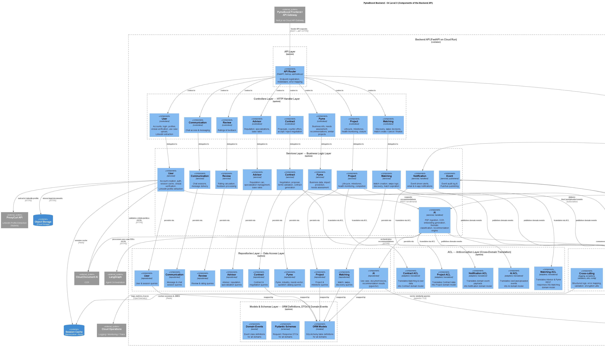

# PymeBoost

Problem Statement: Provide a results-driven connection between SMEs and high-performance advisors.

Currently, starting and scaling an SME can become a complex and exhausting process, especially for entrepreneurs who lack prior experience in business management, process optimization, or scalability strategies. Many SMEs struggle to identify which areas of their business require improvement, how to implement more efficient processes, and most importantly, whom to trust to execute these changes effectively.

In many cases, SMEs do not have access to high-quality specialized advisory services or end up hiring consultants without clear performance metrics, structured follow-up, or real guarantees of results. This often leads to financial losses, poorly implemented processes, and low long-term sustainability. Additionally, there is a lack of trustworthy platforms where businesses can discover verified experts, compare past performance, and engage in transparent, structured collaborations.

PymeBoost emerges as a solution specifically designed for SMEs, creating an ecosystem where businesses can connect with advisors and specialists capable of optimizing specific operational areas within the organization. Through an intelligent matching system powered by AI, the platform analyzes each SME’s context, challenges, and objectives to recommend the most suitable advisors, while also enabling structured interaction through negotiation, contract generation, and continuous performance tracking. In this way, PymeBoost transforms the traditional consulting model into a results-driven system based on measurable outcomes, continuous monitoring, and transparency, ensuring that both the SME and the advisor remain aligned under clear and quantifiable objectives.

--- 

## Authors
 * Isaac Villalobos Bonilla, 2024124285
 * Christopher Daniel Vargas Villalta, 2024108443
 * Santiago Espinoza Rendón, 2024156530
 * Jose Ignacio Paniagua Vargas, 2024163735

--- 

# Prototypes & UX/UI

Vercel: https://pymeboost-v1.vercel.app/

---

# Frontend

## 1.1 Technology Stack 

| Technology                    | Version             | Purpose                               | Justification                                                                                                                            |
| ----------------------------- | ------------------- | ------------------------------------- | ---------------------------------------------------------------------------------------------------------------------------------------- |
| React                         | 19.1.0              | Main UI library                       | Enables the development of dynamic and reusable interfaces for dashboards, chats, and interactive systems within PymeBoost.              |
| Next.js                       | 15.3.3              | Main frontend framework               | Provides routing, hybrid rendering, and a modern architecture compatible with cloud deployments and enterprise APIs.                     |
| TypeScript                    | 5.8.3               | Main frontend language                | Improves maintainability, scalability, and reliability through strong typing and integration with the backend OpenAPI 3.1 specification. |
| Node.js                       | 22.15.0 LTS         | Development runtime                   | Used for builds, tooling, and automation within the frontend ecosystem.                                                                  |
| TailwindCSS                   | 4.1.8               | Utility-first CSS framework           | Enables rapid development of modern, responsive, and consistent interfaces for dashboards and SaaS systems.                              |
| Zustand                       | 5.0.5               | Global state management               | Simplifies management of global states such as authentication, chats, and notifications in a lightweight and scalable way.               |
| TanStack Query                | 5.76.1              | Server state management and caching   | Synchronizes backend data, manages caching, and automatically updates information from APIs.                                             |
| Auth0                         | 3.1.1               | Authentication and session management | Provides secure authentication and centralized user management integrated with the backend authentication system with JWT validation.    |
| Framer Motion                 | 12.15.0             | Animation and transition system       | Enables modern animations and interactive transitions to improve the platform user experience.                                           |
| ESLint                        | 9.18.0              | Static code analysis                  | Detects errors, enforces development conventions, and improves overall frontend code quality.                                            |
| Prettier                      | 3.3.3               | Automatic code formatting             | Maintains visual consistency and code standardization across the project and shared monorepo.                                            |
| React Hook Form               | 7.57.0              | Form management and validation        | Efficiently manages complex forms and input handling with minimal re-renders; integrates seamlessly with Zod validation schemas.         |
| Zod                           | 3.23.8              | Data validation and typing            | Provides typed validation and data consistency before sending information to the backend; runtime schema validation for API DTOs.       |
| Vitest                        | 2.1.8               | Unit and integration testing          | Fast, ESM-native test framework integrated with Vite; enables rapid testing for components, hooks, and utilities.                        |
| Playwright                    | 1.58.2              | End-to-end testing                    | Automates testing for critical flows such as authentication, dashboards, and contracts within the platform across multiple browsers.     |
| Radix UI                      | Latest Stable (13.x)| Accessible component primitives       | Provides unstyled, accessible component foundational elements (Dialog, Select, Tooltip, etc.) for building accessible interfaces.       |
| @radix-ui/react-dialog        | Latest Stable (13.x)| Accessible dialog component           | Foundation for modals, alerts, and forms with full keyboard navigation and screen reader support (WCAG 2.1 AA).                       |
| Fetch API                     | Browser Native      | HTTP client for API communication     | Native browser API used via TanStack Query for making requests to backend REST APIs; no external dependency required.                   |
| Vercel                        | Latest Stable       | Frontend hosting and deployment       | Enables deployment of Next.js applications with native SSR/CSR support, preview deployments, and automatic optimization.                |
| GitHub Actions                | Latest Stable       | CI/CD and automation                  | Automates testing, builds, and deployments within the shared monorepo environment with GitHub Environments.                             |
| GitHub Environments           | Latest Stable       | Environment management                | Supports secure and organized management of Development, Stage, and Production environments with secrets and deployment approvals.      |
| Google Cloud Platform         | Latest Stable       | Main cloud platform service           | Provides integration with backend services (Cloud Run, Cloud SQL) and serves as primary cloud infrastructure.                            |
| Google Cloud Operations Suite | Latest Stable       | Backend observability and monitoring  | Cloud Logging, Cloud Monitoring, Cloud Trace for backend services, infrastructure metrics, and distributed tracing.                      |
| Sentry                        | 8.x                 | Frontend error tracking and monitoring| Real-time error capture, source map integration, user session tracking, and performance monitoring specific to client-side errors.      |
| Client-Side Rendering (CSR)   | Next.js 15          | Frontend rendering strategy           | Enables dynamic and highly interactive user experiences directly in the browser for dashboards, chats, matching systems, and real-time interactions. |
| Feature-Based Architecture    | Custom Architecture | Modular frontend organization         | Supports scalability and separation of functionalities such as dashboards, matching, contracts, and messaging without technical coupling. |
| Monorepo Architecture         | GitHub Monorepo     | Shared frontend/backend repository    | Centralizes workflows, CI/CD pipelines, and collaboration between frontend and backend teams with unified version control.              |
| Development / Stage / Production Environments | Standard Environment Strategy | Environment separation | Allows independent configuration and deployment workflows for development, testing, and production stages of the platform. |

---

## 1.2 Feature-Based Architecture & Folder Structure

PymeBoost frontend follows a **feature-based architecture** where the application is organized by business domains and features rather than technical layers. Each feature is self-contained with its own components, hooks, services, and state management, improving scalability and team autonomy.

The architecture supports:

- Feature ownership: each team can develop, test, and deploy features independently.
- Reduced cross-feature dependencies: features interact only through well-defined interfaces.
- Clear responsibility boundaries: each feature knows its own logic, data, and UI.
- Scalable module growth: new features added without affecting existing ones.
- Simplified testing: feature-specific tests remain isolated.

---

### Core Features

PymeBoost is built around these core features:

- **Matching:** Advisor discovery, recommendations, swipe decisions, match creation.
- **Contracts:** Contract negotiation, proposal submission, acceptance, tracking.
- **Messaging:** Real-time chat between PYME and advisors, message history.
- **Dashboard:** Project overview, metrics, milestones, status tracking.
- **Reports:** Report generation, viewing, download, sharing.
- **Auth:** User authentication, login, logout, session management.

---

### Complete Folder Structure

Each feature is a complete, self-contained module with its own layers:

```txt
src/
├── app/
│   ├── layout.tsx
│   ├── page.tsx
│   ├── globals.css
│   └── (auth)/
│       ├── login/
│       │   └── page.tsx
│       └── callback/
│           └── page.tsx
│
├── features/
│   ├── matching/
│   │   ├── components/
│   │   │   ├── MatchingCard.tsx
│   │   │   ├── MatchingGrid.tsx
│   │   │   └── MatchingFilters.tsx
│   │   ├── hooks/
│   │   │   └── useAdvisorMatching.ts
│   │   ├── services/
│   │   │   └── matchingService.ts
│   │   ├── types/
│   │   │   └── matching.ts
│   │   ├── validators/
│   │   │   └── matchingValidator.ts
│   │   └── page.tsx
│   │
│   ├── contracts/
│   │   ├── components/
│   │   │   ├── ContractViewer.tsx
│   │   │   ├── ContractNegotiation.tsx
│   │   │   └── ContractTerms.tsx
│   │   ├── hooks/
│   │   │   └── useContractNegotiation.ts
│   │   ├── services/
│   │   │   └── contractService.ts
│   │   ├── types/
│   │   │   └── contract.ts
│   │   ├── validators/
│   │   │   └── contractValidator.ts
│   │   └── page.tsx
│   │
│   ├── messaging/
│   │   ├── components/
│   │   │   ├── ChatPanel.tsx
│   │   │   ├── MessageList.tsx
│   │   │   └── MessageInput.tsx
│   │   ├── hooks/
│   │   │   └── useChat.ts
│   │   ├── services/
│   │   │   └── chatService.ts
│   │   ├── types/
│   │   │   └── chat.ts
│   │   ├── validators/
│   │   │   └── chatValidator.ts
│   │   └── page.tsx
│   │
│   ├── dashboard/
│   │   ├── components/
│   │   │   ├── DashboardStats.tsx
│   │   │   ├── ProjectTimeline.tsx
│   │   │   └── PerformanceMetrics.tsx
│   │   ├── hooks/
│   │   │   └── useDashboard.ts
│   │   ├── services/
│   │   │   └── dashboardService.ts
│   │   ├── types/
│   │   │   └── dashboard.ts
│   │   ├── validators/
│   │   │   └── dashboardValidator.ts
│   │   └── page.tsx
│   │
│   ├── reports/
│   │   ├── components/
│   │   │   ├── ReportViewer.tsx
│   │   │   └── ReportGenerator.tsx
│   │   ├── hooks/
│   │   │   └── useReports.ts
│   │   ├── services/
│   │   │   └── reportService.ts
│   │   ├── types/
│   │   │   └── report.ts
│   │   └── page.tsx
│   │
│   └── auth/
│       ├── components/
│       │   ├── LoginForm.tsx
│       │   └── LogoutButton.tsx
│       ├── hooks/
│       │   └── useAuth.ts
│       ├── services/
│       │   └── authService.ts
│       ├── types/
│       │   └── auth.ts
│       └── page.tsx
│
├── shared/
│   ├── components/
│   │   ├── ui/
│   │   │   ├── Button.tsx
│   │   │   ├── Input.tsx
│   │   │   ├── Badge.tsx
│   │   │   ├── Modal.tsx
│   │   │   ├── Card.tsx
│   │   │   └── Dialog.tsx
│   │   ├── layouts/
│   │   │   ├── DashboardLayout.tsx
│   │   │   └── AuthLayout.tsx
│   │   └── Navigation.tsx
│   ├── hooks/
│   │   └── useNotifications.ts
│   ├── types/
│   │   └── common.ts
│   └── utils/
│       └── helpers.ts
│
├── store/
│   ├── authStore.ts
│   ├── notificationStore.ts
│   └── uiStore.ts
│
├── lib/
│   ├── queryClient.ts
│   └── axios.ts
│
├── tests/
│   ├── features/
│   │   ├── matching.spec.ts
│   │   ├── contracts.spec.ts
│   │   ├── messaging.spec.ts
│   │   └── auth.spec.ts
│   └── shared/
│       ├── Button.spec.ts
│       └── helpers.spec.ts
│
├── styles/
│   ├── globals.css
│   └── variables.css
│
└── public/
    ├── logo.png
    └── icons/
```
---

### Folder Responsibilities
 
| Folder | Responsibility |
|--------|----------------|
| [frontend/src/app/layout.tsx](frontend/src/app/layout.tsx) | Next.js App Router pages and route structure. Contains layout.tsx for root layout and route-based pages. |
| [frontend/src/features/matching/page.tsx](frontend/src/features/matching/page.tsx) | Advisor discovery and matching logic. Components for cards, grids, and filters. |
| [frontend/src/features/contracts/page.tsx](frontend/src/features/contracts/page.tsx) | Contract lifecycle management. Components for viewing, negotiating, and tracking contracts. |
| [frontend/src/features/messaging/page.tsx](frontend/src/features/messaging/page.tsx) | Real-time chat between PYME and advisors. Components for chat panel, message list, and input. |
| [frontend/src/features/dashboard/page.tsx](frontend/src/features/dashboard/page.tsx) | Project overview and metrics. Components for stats, timelines, and performance tracking. |
| [frontend/src/features/reports/page.tsx](frontend/src/features/reports/page.tsx) | Report generation and viewing. Components for report viewer and generator. |
| [frontend/src/features/auth/page.tsx](frontend/src/features/auth/page.tsx) | User authentication and session management. Components for login and logout. |
| [frontend/src/features/matching/hooks/useAdvisorMatching.ts](frontend/src/features/matching/hooks/useAdvisorMatching.ts) | Business logic hooks that implement workflows. Called by components. |
| [frontend/src/features/matching/services/matchingService.ts](frontend/src/features/matching/services/matchingService.ts) | API communication functions. Called by hooks. One service per feature. |
| [frontend/src/features/matching/types/matching.ts](frontend/src/features/matching/types/matching.ts) | TypeScript interfaces specific to the feature. |
| [frontend/src/features/contracts/validators/contractValidator.ts](frontend/src/features/contracts/validators/contractValidator.ts) | Zod validation schemas for feature data. |
| [frontend/src/shared/components/ui/Button.tsx](frontend/src/shared/components/ui/Button.tsx) | Basic UI primitives (Button, Input, Badge, Modal, Card, Dialog, etc.). |
| [frontend/src/shared/components/layouts/DashboardLayout.tsx](frontend/src/shared/components/layouts/DashboardLayout.tsx) | Layout wrappers shared across features (DashboardLayout, AuthLayout). |
| [frontend/src/shared/guards/AuthGuard.tsx](frontend/src/shared/guards/AuthGuard.tsx) | Route protection and session validation before rendering any private view. |
| [frontend/src/shared/hooks/useNotifications.ts](frontend/src/shared/hooks/useNotifications.ts) | Common hooks reused across features. |
| [frontend/src/shared/types/common.ts](frontend/src/shared/types/common.ts) | Global TypeScript types used across all features. |
| [frontend/src/shared/utils/helpers.ts](frontend/src/shared/utils/helpers.ts) | Utility functions and helpers. |
| [frontend/src/store/authStore.ts](frontend/src/store/authStore.ts) | User authentication, permissions, JWT token (Singleton pattern). |
| [frontend/src/store/notificationStore.ts](frontend/src/store/notificationStore.ts) | Toast messages, alerts, notifications (Observer pattern). |
| [frontend/src/store/uiStore.ts](frontend/src/store/uiStore.ts) | Modal states, sidebars, theme. |
| [frontend/src/lib/queryClient.ts](frontend/src/lib/queryClient.ts) | TanStack Query configuration; cache, retry, staleTime (Factory pattern). |
| [frontend/src/lib/apiClient.ts](frontend/src/lib/apiClient.ts) | Base HTTP client; JWT injection, error handling, retries (Template Method pattern). |
| [frontend/src/tests/features/matching.spec.ts](frontend/src/tests/features/matching.spec.ts) | Feature and component tests using Vitest (unit tests) and Playwright (E2E tests). |
| [frontend/src/app/globals.css](frontend/src/app/globals.css) | Global CSS and CSS variables. |

---

### Naming Conventions
 
**Components:**
- PascalCase: `MatchingCard.tsx`, `ContractViewer.tsx`, `DashboardStats.tsx`
- Descriptive names matching functionality.
**Hooks:**
- camelCase with `use` prefix: `useAdvisorMatching.ts`, `useChat.ts`, `useDashboard.ts`
- Function name describes the hook's purpose.
**Services:**
- camelCase with `Service` suffix: `matchingService.ts`, `contractService.ts`, `chatService.ts`
- One service file per feature.
**Types/Interfaces:**
- PascalCase: `Advisor.ts`, `Contract.ts`, `Message.ts`
- File name matches the main interface it exports.
**Validators:**
- camelCase with `Validator` suffix: `matchingValidator.ts`, `contractValidator.ts`
- Contains Zod schemas for validation.
**Stores:**
- camelCase with `Store` suffix: `authStore.ts`, `notificationStore.ts`, `uiStore.ts`

---

### Feature Internal Structure

Each feature follows this internal layer pattern:

- **components/:** UI components specific to the feature. Used only within that feature.
- **hooks/:** Business logic hooks that implement workflows. Called by components.
- **services/:** API communication functions. Called by hooks. One service per feature.
- **types/:** TypeScript interfaces and types specific to the feature.
- **validators/:** Zod schemas for validating feature data.
- **[FeatureName]Page.tsx:** Main page component for the feature route.

### Shared Layer

Shared resources live in `src/shared/` and are reused across features:

- **components/ui/:** Basic reusable UI elements (Button, Input, Badge, Modal, etc.).
- **components/layouts/:** Layout wrappers shared across features.
- **hooks/:** Common hooks like useNotifications.
- **types/:** Global TypeScript types used across features.
- **utils/:** Helper functions and utilities.

### Global State Management

Global state (not feature-specific) lives in `src/store/`:

- **authStore.ts:** User authentication, permissions, JWT token.
- **notificationStore.ts:** Toast messages, alerts, notifications.
- **uiStore.ts:** Modal states, sidebars, theme.

Features can read from these stores but should not modify them directly. State updates go through custom hooks.

### Feature Communication

Features communicate through:

- **Shared stores:** Features read from authStore to check permissions or user info.
- **Shared types:** Features import type definitions from shared/types/ for common data structures.
- **API responses:** Features get data from backend APIs, not from other features directly.

Features do NOT import from each other's folders. If feature A needs functionality from feature B, that logic belongs in the shared layer or backend API.

---

### Key Rules
 
- Each feature is independent: its own components, hooks, services, types, validators.
- Features never import from other features' folders. Use shared/ or the backend API instead.
- Shared components and utilities go in `shared/`.
- Global app state (auth, notifications, UI) goes in `store/`.
- Each feature service handles only that feature's API calls.
- Hooks handle business logic and coordinate between components and services.
- Components handle only UI rendering and user event delegation.
- All API responses are validated with Zod before use.
- Tests are colocated with features in `tests/features/`.

---

## 1.3 Component System & UI Architecture
 
PymeBoost uses feature-first component organization where components live within their feature domain. Components belong to the feature that owns them. Shared primitives (Button, Input, Modal, etc.) live in `frontend/src/shared/components/ui/`.
 
If a component is used by 2+ features → `frontend/src/shared/components/ui/`. 

If used by 1 feature → `frontend/src/features/[feature]/components/`.
 
### Component Layers
 
**Layer 1**: Primitives (Feature-specific, presentational, not logic-aware)
- Single-responsibility components that accept data via props.
- Examples: `MatchingCard`, `ContractViewer`, `ChatBubble`, `MetricsChart`.

**Layer 2: Compound Components** (Assembled, reusable within feature)
- Combine primitives into larger, reusable units within the same feature.
- Examples: `MatchingGrid`, `ChatPanel`, `ContractSection`.

**Layer 3: Containers/Pages** (Logic-aware, orchestrators)
- Connect to hooks, API calls, and global state.
- Pass processed data to primitives and compounds.
- Examples: `MatchingPage`, `ContractPage`, `DashboardPage`.

**Shared Primitives** (`shared/components/ui/`)
- Foundational elements used across features: Button, Input, Badge, Modal, Card, Dialog, Select, Checkbox, Avatar, Textarea, Toast, Tooltip.
- Use Radix UI for behavior and TailwindCSS for styling.

---

### Feature Component Structure
 
**Matching Example:**
- [`MatchingCard`](frontend/src/features/matching/components/MatchingCard.tsx) (Primitive): Single advisor card.
- [`MatchingGrid`](frontend/src/features/matching/components/MatchingGrid.tsx) (Compound): Grid of advisor cards.
- [`MatchingPage`](frontend/src/features/matching/page.tsx) (Container): Manages data fetching and state.

**Contracts Example:**
- [`ContractViewer`](frontend/src/features/contracts/components/ContractViewer.tsx) (Primitive): Contract display.
- [`ContractNegotiation`](frontend/src/features/contracts/components/ContractNegotiation.tsx) (Compound): Groups ContractViewer + ContractTerms + actions.
- [`ContractsPage`](frontend/src/features/contracts/page.tsx) (Container): Manages negotiation state.

**Messaging Example:**
- [`MessageBubble`](frontend/src/features/messaging/components/MessageBubble.tsx) (Primitive): Single message bubble.
- [`ChatPanel`](frontend/src/features/messaging/components/ChatPanel.tsx) (Compound): MessageList + MessageInput combined.
- [`MessagingPage`](frontend/src/features/messaging/page.tsx) (Container): Manages real-time updates.

---
 
### Composition Patterns
 
**Props-Based Variants:** Components accept props to adapt appearance. Single Badge component with `status` prop instead of separate `BadgeActive`, `BadgePending`, `BadgeComplete`.
 
**Compound Components:** Complex features organize sub-components that work together. Example: ChatPanel combines MessageList and MessageInput.
 
**Headless Components:** Shared primitives use Radix UI for behavior (keyboard navigation, accessibility) and TailwindCSS for styling. Feature components compose these headless primitives.
 
**No Cross-Feature Imports:** Features never import from other features. If two features need the same component, it moves to `shared/components/ui/`.
 
--- 

### Responsive Design
 
All components use TailwindCSS responsive utilities with desktop-first approach. PymeBoost is designed for web platforms (advisors and SME managers use desktop/laptop).
 
**Breakpoints:**
- Desktop: > 1024px (primary design target)
- Tablet: 640px - 1024px (secondary, graceful degradation)
- Mobile: < 640px (limited support for mobile browsers)

Components are designed for desktop experience first; gracefully adapt to smaller screens using TailwindCSS breakpoints. Use max-width containers (`max-w-4xl`, `max-w-6xl`) to keep layouts readable on large screens.

---

### Styling Rules
 
- All components use **TailwindCSS utilities only**; no external stylesheets or CSS-in-JS.
- Shared primitives establish baseline styles; feature components extend them.
- Form inputs: `bg-white border-2 border-zinc-800 px-3 py-2 rounded-md focus:ring-2 focus:ring-teal-500/20 focus:border-teal-500`.
- Buttons: `primary` (teal-500), `secondary` (zinc-50 + border-zinc-800), `ghost` (transparent).
- Cards: `bg-zinc-50 border-2 border-zinc-800 rounded-lg p-6 shadow-sm`.
- Modals: `bg-black/50` overlay, flexbox centered.
 
---

### Accessibility
 
- All interactive elements use Radix UI (ARIA attributes, keyboard navigation, focus management).
- Form labels linked to inputs via `htmlFor`.
- Focus states visually clear on all interactive elements.
- Color paired with icons or text (not sole indicator of state).
- Semantic HTML: `<button>`, `<a>`, `<form>`.
- Minimum contrast ratio 4.5:1 (WCAG AA).
- Full keyboard navigation support.
 
### Key Rules
 
- Each feature owns its components; no cross-feature imports.
- Shared primitives only in `shared/components/ui/`.
- Primitives: pure presentation. Containers: state and API calls.
- All interactive elements require ARIA attributes and keyboard support.
- One responsibility per component; split if blurred.

---

## 1.4 Visual Design System & Branding

### Color Palette

| Color | Hex | Tailwind | Usage |
|-------|-----|----------|-------|
| Primary Teal | #17B6B0 | `teal-500` | CTAs, highlights, active states |
| Primary Teal Dark | #12918C | `teal-600` | Hover states |
| Background Cream | #F5F1E8 | `stone-100` | Main background |
| Surface White | #FCFCFA | `zinc-50` | Cards, panels |
| Soft Cyan Surface | #DFF4F3 | `cyan-100` | Highlight sections |
| Dark Text | #161616 | `zinc-900` | Primary text |
| Muted Text | #6B6B6B | `zinc-500` | Secondary text |
| Border Dark | #262626 | `zinc-800` | Borders, dividers |
| Success Green | #20B15A | `green-600` | Success states |
| Warning Orange | #F59E0B | `amber-500` | Pending states |
| Danger Red | #DC2626 | `red-600` | Error/cancelled states |
| Gold Accent | #D97706 | `amber-600` | Ratings, premium indicators |

### Typography

| Element | Font | Size | Weight |
|---------|------|------|--------|
| H1 | Righteous | 48px | 700 |
| H2 | Righteous | 32px | 700 |
| H3 | Righteous | 24px | 600 |
| Body | Sans Serif | 16px | 400 |
| Small | Sans Serif | 14px | 400 |
| Mono | JetBrains Mono | 12px | 500 |

### Spacing

- Padding: `p-4` (16px), `p-6` (24px), `p-8` (32px)
- Margin: `m-4`, `m-6`, `m-8`
- Gap: `gap-4`, `gap-6`, `gap-8`

### Components

**Buttons:**
- Primary: `bg-teal-500 text-white hover:bg-teal-600 rounded-md px-4 py-2`
- Secondary: `bg-zinc-50 text-zinc-900 border-2 border-zinc-800 rounded-md px-4 py-2`

**Cards:**
- `bg-zinc-50 border-2 border-zinc-800 rounded-lg p-6 shadow-sm`

**Inputs:**
- `bg-white border-2 border-zinc-800 text-zinc-900 px-3 py-2 rounded-md focus:ring-2 focus:ring-teal-500/20 focus:border-teal-500`

**Modals:**
- `bg-zinc-50 rounded-lg p-8 border-2 border-zinc-800 with bg-black/50 overlay`

### Icons & Images

- Icon library: Heroicons (24px)
- Avatars: 64px (matching/contracts), 48px (chat)

### Standards

- Teal primary color for actions and active states
- Cream/light backgrounds with dark outlined cards
- Thick visible borders (`border-2 border-zinc-800`)
- Rounded industrial-style components
- WCAG AA contrast (4.5:1 minimum)
- Focus states: `focus:ring-2 focus:ring-teal-500`
- Semantic HTML and full keyboard navigation
- No hardcoded colors; use Tailwind only
- Monospace labels for metadata, tags, and section headers
- Subtle retro-dashboard aesthetic with spacious layouts

---

## 1.5 Design Patterns & Engineering Standards

PymeBoost employs strategic, essential OOP design patterns to maintain a modular, testable, and maintainable frontend. Patterns are applied only where they solve real architectural problems—no over-engineering.

### Design Patterns by Responsibility

| Class / Interface | Location | Responsibility | Pattern | Justification |
|------------------|----------|----------------|---------|----------------|
| AuthGuard | [frontend/src/shared/guards/AuthGuard.tsx](frontend/src/shared/guards/AuthGuard.tsx) | Protects private routes; validates active session before rendering | Guard | **Security at a single point.** PymeBoost handles sensitive advisor-SME relationships and contracts. Without Guard, every component must check auth, creating security gaps. Guard enforces authorization before any logic executes. |
| authStore | [frontend/src/store/authStore.ts](frontend/src/store/authStore.ts) | Manages global auth state (user, token, permissions) | Singleton | **One authoritative source.** Auth state must be consistent across all features (contracts, messaging, dashboards). Multiple instances = token mismatches = silent feature breakage. Zustand enforces one instance automatically. |
| notificationStore | [frontend/src/store/notificationStore.ts](frontend/src/store/notificationStore.ts) | Publishes system-wide toasts, alerts, notifications | Observer (Pub-Sub) | **Decouples event producers from consumers.** When contracts are accepted or milestones update, 5+ features must react without knowing each other. Without Observer, features need direct imports or prop drilling through 5+ levels = fragile code. |
| ApiClient | [frontend/src/lib/apiClient.ts](frontend/src/lib/apiClient.ts) | Base HTTP client with reusable request/response logic | Template Method | **Eliminates duplicate error handling.** Every API call needs JWT injection, error handling, rate limiting, retries. Template Method defines the flow once, reused by all services. Without it, duplicate logic across 10+ services means bugs fixed in one place don't propagate. |
| MatchingService | [frontend/src/features/matching/services/matchingService.ts](frontend/src/features/matching/services/matchingService.ts) | Executes Swipe Approved / Swipe Rejected actions as discrete commands; fetches AI-generated recommendations | Command | **Swipe actions are the core interaction unit.** Each swipe (approved/rejected) is encapsulated as a Command object with `execute()`. This decouples the action from the trigger, enables logging, queuing, and future undo — without Command, swipe logic would be scattered across components. |
| useAdvisorMatching | [frontend/src/features/matching/hooks/useAdvisorMatching.ts](frontend/src/features/matching/hooks/useAdvisorMatching.ts) | Assembles AI recommendation fetch + swipe commands + notifications into a single hook | Factory | **Encapsulates workflow complexity.** Setup requires: TanStack Query config, swipe command creation, cache invalidation, notification publishing. Factory gives components `useAdvisorMatching()` instead of assembling these pieces manually — reduces bugs and cognitive load. |
| ContractValidator | [frontend/src/features/contracts/validators/contractValidator.ts](frontend/src/features/contracts/validators/contractValidator.ts) | Validates contract terms per tier: standard (1mo/3%), medium (3mo/5%), high (6mo/7%), custom (incremental commission) | Strategy | **Each tier has different commission and duration rules.** Standard locks commission at 3%, custom enforces 3% + 1% per extra month via `.refine()`. Without Strategy, a single schema can't enforce tier-specific rules — invalid commissions would silently reach the backend. |
| QueryClientFactory | [frontend/src/lib/queryClient.ts](frontend/src/lib/queryClient.ts) | Initializes and configures TanStack Query | Factory | **Consistent caching across all features.** Factory centralizes cache settings, retry logic, staleTime. Without it, some features cache aggressively while others refetch constantly = data inconsistency and poor UX. |

---

### Code Layer Structure: How Patterns Enforce Separation

**Components** (`features/[feature]/components/`):
- Pure presentation; no API calls, business logic, or state mutations.
- Supported by **Composition pattern**: build complex UIs from simple, reusable pieces.
- Example: `MatchingCard` knows only props; `MatchingGrid` composes `MatchingCard` instances.

**Hooks** (`features/[feature]/hooks/`):
- Implement business workflows using **Factory pattern**.
- Orchestrate: TanStack Query (server state), Zustand reads, Zod validation, service calls.
- Example: `useAdvisorMatching()` returns ready-to-use state and handlers.

**Services** (`features/[feature]/services/`):
- Pure API communication, enforced by **Dependency Inversion**.
- All responses validated with Zod before returning.
- Example: `matchingService.getAdvisors()` returns validated DTO, never raw API data.

**Validators** (`features/[feature]/validators/`):
- Zod schemas define **Strategy**: different contract types validate differently.
- Runtime validation ensures no invalid data reaches components or state.

---

### State Distribution: Patterns in Practice

**Global State (Zustand) — Singleton Pattern:**
- [`authStore`](frontend/src/store/authStore.ts): Single instance manages user, token, permissions globally.
  - **Why Singleton:** Any feature reading auth must see the same state. Multiple instances = data inconsistency.
- [`notificationStore`](frontend/src/store/notificationStore.ts): Single instance publishes toasts, alerts system-wide.
  - **Why Singleton + Observer:** Swipe approved, contracts accepted, milestones met → all features receive notifications from one source.
- [`uiStore`](frontend/src/store/uiStore.ts): Single instance manages modal states, sidebar visibility, theme.

**Server State (TanStack Query) — Factory + Cache Strategy:**
- All API data (advisors, contracts, messages) cached and managed via [`QueryClientFactory`](frontend/src/lib/queryClient.ts).
- **Why Factory:** Ensures consistent cache settings, retry behavior, staleTime across all queries.
- Automatic refetch, deduplication, background updates reduce stale data bugs.

**Local State (React `useState`):**
- [`MessageInput`](frontend/src/features/messaging/components/MessageInput.tsx) — message text before sending.
- [`MatchingFilters`](frontend/src/features/matching/components/MatchingFilters.tsx) — industry filter input.
- Never persisted beyond the component. Keeps global state clean and predictable.

---

### Composition Over Inheritance

Components are built from primitives, not extended:
- [`ContractNegotiation`](frontend/src/features/contracts/components/ContractNegotiation.tsx) = [`ContractViewer`](frontend/src/features/contracts/components/ContractViewer.tsx) + [`ContractTerms`](frontend/src/features/contracts/components/ContractTerms.tsx) + `ActionButtons` (composition, not inheritance).
- [`Button`](frontend/src/shared/components/ui/Button.tsx) accepts `variant` prop instead of creating `PrimaryButton`, `SecondaryButton` subclasses.
- **Why:** Composition is flexible; inheritance creates rigid hierarchies prone to fragility.

---

### Immutability & State Safety

All state updates use immutable patterns (spread operator, Zustand setters, React hooks). Mutating state directly:
- Breaks Zustand reactivity
- Causes stale UI renders
- Creates race conditions in async workflows 

Zustand and React enforce this automatically through their APIs.

---

### Example: Matching Flow Pattern Integration

**How patterns work together for advisor matching:**

1. **User navigates to Matching** → `AuthGuard` validates session (Guard pattern)
2. **Component calls hook** → `useAdvisorMatching()` factory sets up the workflow
3. **Hook initiates query** → `QueryClientFactory` provides configured client (Factory)
4. **Hook calls service** → `matchingService` applies Strategy (rule-based vs. AI)
5. **Service fetches data** → `ApiClient` injects JWT, handles errors (Template Method)
6. **Response validated** → Zod schema validates advisor DTO (Strategy)
7. **Match created event** → `notificationStore` publishes to all features (Observer/Singleton)
8. **Advisor is notified** → Chat feature listens to notification event, updates UI

**Without these patterns:** Each layer would duplicate auth checking, error handling, validation, and event logic. Adding a new feature would require copying code from 3+ places, guaranteeing bugs.

---

## 1.6  State Management & API Communication

### Global State (Zustand)
 
Three Zustand stores hold state shared across all features:
 
| Store | Data | Why It Matters |
|-------|------|--------|
| **authStore** | User, token, account type, permissions | Every feature needs to know who you are and what you can do |
| **notificationStore** | Toast messages, alerts | When contracts are accepted or errors happen, all features need to notify users |
| **uiStore** | Sidebar open/closed, modal visibility, theme | UI state doesn't belong on the backend; it's purely client-side |
 
Features access stores via hooks (e.g., `useAuthStore()`). State changes only through explicit actions, never direct mutations.
 
Zustand is lightweight, no boilerplate, no prop drilling through 5+ component levels.
 
---
 
### Server State (TanStack Query)
 
All data from the backend (advisors, contracts, messages, dashboards) is cached and kept in sync via TanStack Query.
 
**How it works:**
1. Service fetches from API
2. Response validated with Zod (no invalid data enters state)
3. Hook wraps service call with TanStack Query caching
4. Component calls hook, receives ready-to-use data
**Three data types:**
- **Initial fetch:** useQuery caches and deduplicates requests
- **Mutations:** Create/update/delete via useMutation
- **Refetch:** After mutations, queries are invalidated to refetch fresh data

TanStack Query basically handles caching, deduplication, background updates, and stale data automatically. Components never manage backend data manually. [`QueryClientFactory`](frontend/src/lib/queryClient.ts).

---
 
### API Communication Layer
 
Single centralized `ApiClient` handles all HTTP communication:
- Injects JWT token into every request from authStore
- Handles errors (401 → logout user, 5xx → retry with backoff)
- Logs requests/responses to observability system
- No service duplicates auth or error logic
All services call through `apiClient`. No direct fetch() calls.
 
**Why centralized:** JWT injection, error handling, retries, and logging happen once, not duplicated across 10+ service files.

#### HTTP Response Codes

| Code | Name | When PymeBoost receives it | How ApiClient handles it |
|------|------|---------------------------|--------------------------|
| `200` | OK | Successful GET — advisors list, contracts, messages fetched | Returns `{ success: true, data }` |
| `201` | Created | Successful POST — contract proposed, swipe registered, match created | Returns `{ success: true, data }` |
| `204` | No Content | Successful DELETE or action with no body — swipe rejected, notification dismissed | Returns `{ success: true, data: null }` |
| `400` | Bad Request | Request body invalid — contract fields missing or malformed | Returns `{ success: false, error }`, Zod catches this before it reaches components |
| `401` | Unauthorized | JWT expired or missing | Triggers logout via `authStore`, redirects to `/auth/login` |
| `403` | Forbidden | Valid JWT but insufficient role or permission — SME accessing advisor-only route | AuthGuard blocks render; `apiClient` returns `{ success: false, error }` |
| `404` | Not Found | Resource doesn't exist — advisor deleted, contract not found | Returns `{ success: false, error }`, feature shows empty state |
| `409` | Conflict | Duplicate action — PYME already has an active contract, swipe already registered | Returns `{ success: false, error }`, notificationStore publishes warning |
| `422` | Unprocessable Entity | Data structurally valid but business rules fail — commission percentage out of range | ContractValidator catches this before the request; backend returns details |
| `429` | Too Many Requests | Rate limit exceeded — too many matching requests in a short window | `retryDelay` backoff applies; notificationStore publishes warning to user |
| `500` | Internal Server Error | Unexpected backend failure | `executeWithRetry` retries up to 3 times with exponential backoff |
| `502` | Bad Gateway | Cloud Run instance not reachable — deploy in progress | Same retry logic as 500; Sentry logs the incident |
| `503` | Service Unavailable | Backend temporarily down — maintenance window | Retries exhausted → `{ success: false, error }`, user sees error state |

---
 
### Data Validation (Zod)
 
Every response from the backend is validated against a Zod schema before entering state or components.
 
Invalid data is rejected immediately. Components never receive unvalidated data.
 
**Why mandatory:** Bad backend data (missing fields, wrong types) crashes features silently. Zod catches it at the boundary.

---
 
### Mutations (Create, Update, Delete)
 
When data changes (new contract, updated metrics), mutations trigger:
1. Send change to backend
2. On success, invalidate related queries to refetch fresh data
3. Publish notification to notificationStore
Queries automatically refetch and components re-render with new data.
 
**Why invalidate:** No manual state updates. Backend is source of truth; invalidation keeps client in sync.
 
### State Distribution Summary
 
| State Type | Managed By | Where | When to Use |
|-----------|-----------|-------|-----------|
| **Global (auth, notifications, UI)** | Zustand | `src/store/` | Info needed across multiple features |
| **Backend data** | TanStack Query | Services via hooks | Advisors, contracts, messages, dashboards |
| **Form/UI toggles** | React useState | Component | Temporary, not shared (form inputs, dropdowns) |
 
### Key Rules
 
- **Zustand only for global state.** Auth, notifications, UI toggles. Not backend data.
- **TanStack Query for all backend data.** One service per feature. Query invalidation on mutations.
- **Zod validates every API response.** No unvalidated data enters state.
- **ApiClient is the single HTTP entry point.** JWT injection, error handling, logging centralized.
- **No prop drilling.** Use hooks to access global or server state.
- **Components never call API directly.** Always through services and hooks.

---

## 1.7 Workflows & Interaction Flows

PymeBoost has four main user workflows that drive the platform. Each workflow spans multiple features and involves specific interaction patterns.

### 1. PYME Registration & Onboarding

**Users:** New PYME owners

**Flow:**
1. User lands on homepage
2. Clicks "Sign Up as PYME"
3. Redirected to Auth0 login/signup
4. Completes basic info (email, company name, phone)
5. Uploads legal document (cédula jurídica as PDF)
6. AI validates document against MEIC registry
7. Completes company context form (300 words max)
8. Dashboard shows "Account pending verification"
9. Backend validates document → Account activated
10. User redirected to Matching feature

**Key Interactions:**
- Form validation with Zod before submission
- File upload with progress indicator
- Real-time status updates via notifications
- AuthGuard redirects unauthenticated users to login

**Features Involved:** Auth, Dashboard

---

### 2. Advisor Discovery & Matching (Swipe Interface)

**Users:** PYME looking for advisors

**Flow:**
1. User navigates to Matching page
2. AI generates personalized advisor recommendations
3. User sees advisor cards (Tinder-like)
4. User swipes right (approved) or left (rejected)
5. Right swipe creates a match → Chat opens automatically
6. Left swipe discards recommendation → Next card loads

**Key Interactions:**
- Card animations (swipe, fade, slide)
- Real-time compatibility score display
- Previous project showcase on each card
- Estimated metrics improvement visible
- One-tap messaging after approval

**Features Involved:** Matching, Messaging

---

### 3. Contract Negotiation & Signing

**Users:** PYME and Advisor negotiating terms

**Flow:**
1. PYME and Advisor chat about project details
2. PYME clicks "Negotiate Tariff"
3. Modal opens with contract template
4. PYME adjusts: budget, duration, metrics, deliverables
5. PYME sends proposal to Advisor
6. Advisor reviews proposal in chat
7. Advisor accepts or counter-offers
8. Both agree on terms
9. PYME clicks "Marry The Prospect"
10. Contract becomes active → Dashboard tracking begins

**Key Interactions:**
- Form fields for tariff, duration, metrics
- Real-time validation of contract terms
- Visual summary of proposed terms
- Notification when Advisor responds
- One-click contract finalization

**Features Involved:** Messaging, Contracts, Dashboard

---

### 4. Project Tracking & Reporting

**Users:** PYME and Advisor monitoring active contract

**Flow:**
1. Contract is active → Dashboard visible to both
2. Dashboard shows: progress %, phases, metrics, timeline
3. Advisor completes phase → Submits phase report
4. Report visible on dashboard immediately
5. Metrics auto-update based on reported data
6. PYME sees progress in real-time
7. Project ends → PYME rates Advisor
8. Rating stored in Advisor profile
9. Contract closed → Accessible in history

**Key Interactions:**
- Progress bar updates on phase completion
- Metric charts showing before/after
- Phase timeline with completed/pending indicators
- Report submission form with validation
- Rating modal at project end
- History accessible from dashboard

**Features Involved:** Dashboard, Reports, Contracts

---

### User Journey

**PYME Journey**
```
Sign Up → Onboarding → Browse Advisors → Swipe & Match → Chat → Negotiate → Sign Contract → Track Progress → Rate Advisor → View History
```

**Advisor Journey**
```
Sign Up → Profile Setup → Wait for Matches → Accept Chat → Negotiate Terms → Sign Contract → Work & Report → Receive Rating → View Analytics
```

---

### Interaction Patterns

| Pattern | Where | Purpose | Implementation |
|---------|-------|---------|----------------|
| **Modal Forms** | Contract negotiation, phase reports | Focused input without page navigation | [`Modal.tsx`](frontend/src/shared/components/ui/Modal.tsx) — `<Modal open={isOpen} onClose={() => setOpen(false)} title="New Contract">` |
| **Toast Notifications** | Every feature | Status updates (contract accepted, phase done, error) | [`notificationStore`](frontend/src/store/notificationStore.ts) — `publish({ type: "success", title: "Contract accepted", duration: 4000 })` |
| **Loading States** | Data fetching | Spinner or skeleton while data loads | [`MatchingPage`](frontend/src/features/matching/page.tsx) — `if (isLoading) return <p className="animate-pulse">Finding matches…</p>` |
| **Empty States** | No data yet | Friendly message + CTA (e.g., "No contracts yet. Browse advisors") | [`MatchingPage`](frontend/src/features/matching/page.tsx) — `if (!recommendations.length) return <EmptyState cta="Complete your profile" />` |
| **Inline Validation** | Forms | Real-time feedback (red border + error text) | [`Input.tsx`](frontend/src/shared/components/ui/Input.tsx) — `<Input label="Budget" error={errors.budget?.message} />` |
| **Swipe Animations** | Matching | Smooth card transitions (right = approve, left = reject) | [`MatchingCard`](frontend/src/features/matching/components/MatchingCard.tsx) — `<motion.div drag="x" onDragEnd={(_, info) => info.offset.x > 100 ? onApprove(id) : onReject(id)}>` |
| **Real-time Updates** | Dashboard, chat | WebSocket for live metric/message updates | [`useMessaging`](frontend/src/features/messaging/hooks/useMessaging.ts) — `useEffect(() => { ws.current = new WebSocket(url); ws.current.onmessage = (e) => setMessages(prev => [...prev, JSON.parse(e.data)]) }, [url])` |
| **Confirmation Dialogs** | Critical actions | "Are you sure?" before deleting or canceling | [`Modal.tsx`](frontend/src/shared/components/ui/Modal.tsx) — `<Modal title="Cancel contract?"><Button variant="danger" onClick={onConfirm}>Yes, cancel</Button></Modal>` |

### Key Rules

- **Every workflow starts with authentication.** AuthGuard protects all pages.
- **Forms validate before submission.** Zod schemas prevent invalid data.
- **Notifications inform all state changes.** Contract accepted? Match created? User gets toast.
- **No silent errors.** Every API error shows a user-friendly message.
- **Undo where possible.** Swipe rejected? Can swipe right later. Contract pending? Can cancel before signing.

---

## 1.8 Authentication, Security & Session Management

### Authentication Flow

PymeBoost uses Auth0 for centralized authentication. Frontend delegates login/logout to Auth0; backend validates JWT tokens.

**Authentication Sequence:**
1. User clicks "Login" → Redirected to Auth0
2. User enters credentials (email/password or social login)
3. Auth0 validates and returns JWT token + user metadata
4. Frontend stores token in `authStore`
5. All subsequent API requests include JWT in Authorization header
6. Backend validates JWT on every request
7. User clicks "Logout" → Token cleared from `authStore` → Redirected to homepage

**Token Storage:**
- JWT stored in memory (authStore) during session
- Token refreshed automatically before expiration via Auth0 silent authentication
- On page refresh, Auth0 callback validates session and restores token
- No localStorage/sessionStorage (prevents XSS attacks)

---

### Authorization & Permissions

**Permission Model:**

| User Type | Can Do | Cannot Do |
|-----------|--------|-----------|
| **PYME (Verified)** | Browse advisors, swipe, message, create contracts, track projects, rate advisors | Access advisor analytics, upload fake documents |
| **Advisor (Verified)** | Receive matches, message, negotiate contracts, submit reports, view ratings | Browse all PYMES, initiate contacts, accept unverified PYMES |
| **Unauthenticated** | View homepage, sign up | Access any feature |

**Permission Enforcement:**
- Frontend: `AuthGuard` redirects unauthenticated users
- Frontend: Feature components check `authStore.accountType` before rendering admin-only sections
- Backend: Every endpoint validates JWT + checks `accountType` + verifies resource ownership (can't view other PYME's contracts)

---

### Session Management

**Session Lifecycle:**

| Event | Action |
|-------|--------|
| **Login** | Auth0 returns JWT (valid 24 hours). Token stored in authStore |
| **Active Use** | Auth0 silent authentication refreshes token automatically (5 min before expiration) |
| **Page Refresh** | Auth0 callback checks session → Restores token if still valid |
| **Token Expired** | User redirected to login. Clear authStore |
| **Logout** | Token removed from authStore → User redirected to homepage |
| **Inactivity Timeout** | Optional: Clear session after 30 min idle (implement via useEffect hook) |

**Token Refresh Strategy:**
- Frontend monitors token expiration via `useEffect`
- 5 minutes before expiration, silently refresh via Auth0
- No user interruption unless internet disconnects
- If refresh fails, logout user gracefully

---

### Security Measures

### Frontend Security

| Measure | Implementation |
|---------|-----------------|
| **XSS Prevention** | No innerHTML. React escapes by default. DOMPurify for user-generated content (chat messages) |
| **CSRF Protection** | Backend uses SameSite cookies. Frontend sends CSRF token in headers for mutations |
| **Input Validation** | Zod schemas validate all user input before submission |
| **Sensitive Data** | JWT in memory only. No passwords ever stored. Mask credit cards in payment forms (show last 4 digits) |
| **Secure Headers** | Content-Security-Policy, X-Frame-Options, X-Content-Type-Options set by backend |
| **HTTPS Only** | All traffic encrypted. Backend redirects HTTP → HTTPS |

### API Communication Security

| Measure | Implementation |
|---------|-----------------|
| **JWT Authentication** | Every request includes `Authorization: Bearer <token>` header |
| **Request Signing** | Optional: HMAC signature for sensitive mutations (contracts, payments) |
| **Rate Limiting** | Backend rate limits API endpoints (100 req/min per user) |
| **Data Encryption** | Sensitive fields encrypted at rest (credit cards, phone numbers) |
| **Audit Logging** | Backend logs all sensitive actions (contract created, payment made) |

### Message Security (Chat)

| Measure | Implementation |
|---------|-----------------|
| **Blocked Keywords** | Chat validates messages. Blocks external emails, phone numbers, social media links |
| **Message Encryption** | Optional: E2E encryption for chat messages (TLS transport + database encryption) |
| **Access Control** | Only matched PYME and Advisor can see each other's messages. Verified via backend |

---

### Data Privacy

**What Data Exists:**
- PYME: Company name, legal ID, industry, objectives, payment method
- Advisor: Name, experience, certifications, projects, ratings
- Contracts: Terms, budget, metrics, reports
- Chat: Messages, timestamps
- Payments: Credit card (masked), transaction history

**Data Handling:**
- No personal data shared between PYME and Advisor without consent (only within contract context)
- PYME can download own data (GDPR compliance)
- Advisor ratings visible to other PYMEs but not PYME identities
- Deleted contracts kept in archive (not shown to users, audit trail for compliance)

---

### Password & Credential Management

- **No passwords stored in frontend.** Auth0 handles credentials.
- **No secrets in code.** Credentials loaded from Google Secret Manager via environment variables.
- **Payment credentials:** Credit card info sent to payment processor (Stripe), never stored in PymeBoost database.
- **API keys:** Backend API keys stored in Google Secret Manager, rotated quarterly.

---

### Compliance & Standards

| Standard | Requirement |
|----------|------------|
| **OWASP Top 10** | Implement protections against injection, XSS, broken auth, sensitive data exposure |
| **GDPR** | Users can export data, delete account (soft delete with audit trail) |
| **PCI-DSS** | Credit card info handled by Stripe, not stored locally |
| **WCAG 2.1 AA** | All authentication UI keyboard navigable, screen reader compatible |

---

### Monitoring & Alerts

**What Gets Monitored:**
- Failed login attempts (alert if >5 in 10 min)
- Token refresh failures
- Unauthorized access attempts (401, 403 errors)
- Suspicious activity (unusual IP, rapid requests)
- Payment failures

**Alerting:**
- Frontend: Sentry captures errors, sends to monitoring dashboard
- Backend: Logs all security events to Cloud Logging
- Team: On-call engineer notified of critical security issues

---

### Key Rules

- **Auth0 owns authentication.** Frontend never handles passwords.
- **JWT in memory only.** Never localStorage.
- **Every API request validated.** JWT + permission check on backend.
- **No sensitive data in logs.** Never log passwords, credit cards, tokens.
- **Validate & escape user input.** Frontend (Zod) + Backend (server-side validation).
- **Blocked keywords in chat.** Prevent contact info sharing outside platform.
- **Audit trail for sensitive actions.** Track who did what, when.
- **Refresh tokens silently.** User never sees "session expired" unless truly necessary.

## 1.9 Testing, Observability & CI/CD

### Testing Strategy

### Unit Tests (Vitest)

**What to test:** Utilities, hooks, validators, services

**Coverage target:** 80% of business logic

**Importance:**
- ESM-native support for modern JavaScript
- Perfect integration with Vite and Next.js 15
- Faster test execution
- TypeScript out-of-the-box

- [useAdvisorMatching.ts](frontend/src/features/matching/hooks/useAdvisorMatching.ts) → [matching.spec.ts](frontend/src/tests/features/matching.spec.ts) — Tests swipe command execution and AI recommendation fetch logic.
- [contractValidator.ts](frontend/src/features/contracts/validators/contractValidator.ts) → [contracts.spec.ts](frontend/src/tests/features/contracts.spec.ts) — Tests tier-specific commission rules: standard 3%, medium 5%, high 7%, and custom incremental formula.
- [helpers.ts](frontend/src/shared/utils/helpers.ts) → [helpers.spec.ts](frontend/src/tests/shared/helpers.spec.ts) — Tests currency formatting, string truncation, unique ID generation, and relative time formatting.

**Development (local):**

| Command | When to use |
|---------|-------------|
| `npm run test` | During development — watch mode, re-runs on every file save |
| `npm run test:run` | Before committing — runs once and exits with pass/fail |
| `npm run test:coverage` | To check coverage — generates HTML report and fails if below 80% |

**CI/CD (GitHub Actions — triggered on every push):**

```bash
# 1. Push to any branch
git add .
git commit -m "feat: your change"
git push origin feature/your-branch

# 2. GitHub Actions automatically runs frontend-ci.yml:
#    lint → unit tests (npm run test:run) → coverage check → build → E2E
```

The pipeline runs `npm run test:run` headlessly and fails the entire workflow if any test fails or coverage drops below 80%. No manual intervention required — tests block the merge until green.

---

### Integration Tests (Playwright)

**What to test:** Complete user workflows end-to-end

**Critical flows:**
- PYME signup → onboarding → browse advisors
- Advisor matching → swipe approved/rejected → list refresh
- Contract detail → tier validation → terms display
- Messaging → open conversation → send message
- Error handling (network failures, validation errors)

**File structure:**

```
frontend/
└── e2e/
    └── workflows.spec.ts   ← critical workflow tests (auth, matching, contracts, messaging)
```

**Commands:**

| Command | Description |
|---------|-------------|
| `npx playwright test` | Run all E2E tests |
| `npx playwright test --grep @smoke` | Run only smoke tests (used in CI post-deploy) |
| `npx playwright test --ui` | Open interactive UI mode |
| `npx playwright show-report` | Open last HTML report |

**Implementation:** 

Each workflow lives in a `test.describe` block inside [`frontend/e2e/workflows.spec.ts`](frontend/e2e/workflows.spec.ts). Tag smoke tests with `@smoke` so CI can run them post-deploy independently.

Use `data-testid` attributes on components as selectors — never rely on CSS classes or text content, as those change with styling. Add `data-testid` to a component when writing its test.

For tests that require an authenticated user, load session state via Playwright's `storageState` instead of logging in on every test (see [Playwright docs on authentication](https://playwright.dev/docs/auth)).

**Base test file:** [`frontend/e2e/workflows.spec.ts`](frontend/e2e/workflows.spec.ts) — contains the skeleton for all critical workflows with `TODO` comments marking what each test needs to assert.

---

### Test Organization

| Test Type | Tool | Location | Frequency |
|-----------|------|----------|-----------|
| **Unit** | Vitest | `frontend/src/tests/features/`, `frontend/src/tests/shared/` | On save (watch mode) |
| **E2E** | Playwright | `frontend/e2e/` | Before commit, on PR |

---

### Observability

### Frontend Logging & Error Tracking

**Tools:**
- **Sentry:** Captures all errors, sends to dashboard
- **Google Cloud Logging:** Logs important events (login, contract created)
- **Console logs:** Development only (removed in production via tree-shaking)

**What gets logged:**

| Event | Tool | Purpose |
|-------|------|---------|
| **Unhandled errors** | Sentry | Catch bugs before users report them |
| **API errors** | Google Cloud Logging + Sentry | Debug backend issues |
| **User actions** | Google Cloud Logging | Track feature usage (which advisors get clicked) |
| **Performance metrics** | Google Cloud Monitoring | Monitor slow pages |

**Error Tracking Pattern:**
```
ApiClient catches error
→ Logs to Sentry + Cloud Logging
→ Notifies user via toast (user notification, rest of the app still works)
→ Does NOT crash app
```

### Performance Monitoring

**Metrics tracked:**
- Page load time (First Contentful Paint, Largest Contentful Paint)
- API response times
- JavaScript bundle size
- Memory usage

**Tools:** Google Cloud Monitoring, Sentry

### Monitoring Alerts

**Critical alerts (page team immediately):**
- Unhandled errors spike (>10 in 5 min)
- API error rate >5%
- Page load time >3s
- Failed deployments

**Warning alerts (check next morning):**
- Sentry error threshold crossed
- Code coverage dropped below 80%
- Bundle size increased >10%


---

### CI/CD Pipeline

### GitHub Actions Workflows

Workflow files: 
- [`frontend-ci.yml`](.github/workflows/frontend-ci.yml) 
- [`deploy-frontend.yml`](.github/workflows/deploy-frontend.yml)

**On every push to main:**

1. **Lint & Format** (ESLint, Prettier)
   - Check code style
   - Fail if errors found

2. **Unit Tests** (Vitest)
   - Run all unit tests with `npm run test:run`
   - Report coverage
   - Fail if <80% coverage

3. **Integration Tests** (Playwright)
   - Run critical user flows
   - Fail if any flow breaks

4. **Build** (Next.js)
   - Build production bundle
   - Check for TypeScript errors
   - Verify build succeeds

5. **Deploy to Staging** (Vercel)
   - Deploy to staging environment
   - Run smoke tests
   - Notify team if failed

**On PR merge to main:**

6. **Deploy to Production** (Vercel)
   - Requires manual approval via GitHub Environments
   - Deploy to production
   - Monitor for 10 min post-deploy
   - Rollback if critical errors detected

---

### Deployment Architecture

The frontend is deployed to **Vercel**. The code goes from github to production:

```
Developer push
      │
      ▼
GitHub repository
      │
      ├─── push to any branch ──► GitHub Actions: frontend-ci.yml
      │                               lint → unit tests → e2e → build
      │
      ├─── push to develop ────► GitHub Actions: deploy-frontend.yml
      │                               build → vercel CLI → Vercel (staging)
      │                               → smoke tests (@smoke tag)
      │
      └─── push to main ───────► GitHub Actions: deploy-frontend.yml
                                      manual approval (GitHub Environments)
                                      → build → vercel --prod → Vercel (production)
                                      → 10 min post-deploy monitor
```

Vercel does automatically: serverless functions, CDN edge network, SSL, domains and rollback from the dashboard.

| Environment | URL | Branch | Deploy |
|-------------|-----|--------|--------|
| **Development** | `localhost:3000` | feature branches | manual (`npm run dev`) |
| **Staging** | `staging.pymeboost.com` | `develop` | automatic |
| **Production** | `pymeboost.com` | `main` | manual approval required |

### Deployment Strategy

**Rollback:** If there are errors post-deploy, we apply a rollback from Vercel's dashboard.

The frontend does not require Terraform or manual cloud resources — Vercel manages all infrastructure (compute, network, SSL, domains). Declarative config lives in [`frontend/vercel.json`](frontend/vercel.json):

- **`framework`** — tells Vercel this is Next.js (enables automatic build optimizations)
- **`regions`** — `iad1` (us-east-1, Virginia) for lower latency with the backend
- **`headers`** — security headers on all routes: `X-Frame-Options`, `CSP`, `X-Content-Type-Options`
- **`redirects`** — declarative permanent redirects
- **`env`** — references to Vercel Environment Variables (with `@` prefix) instead of hardcoded values

Environment variables (`@next_public_api_url`, etc.) are configured once in the Vercel dashboard and injected automatically on every deploy.
---

### Quality Gates

Code must pass these checks before merging to main:

| Gate | Tool | Rule |
|------|------|------|
| **Lint** | ESLint | No style violations |
| **Tests** | Vitest | 80%+ coverage, all tests pass |
| **Build** | Next.js | No TypeScript errors |
| **E2E** | Playwright | All critical workflows pass |
| **Security** | Snyk | No critical vulnerabilities |
| **Performance** | Lighthouse | Core Web Vitals meet targets |

---

### Key Rules

- **Test critical workflows.** Unit tests for logic, integration tests for user flows.
- **100% test pass before merging.** No exceptions.
- **Monitor in real-time.** Sentry + Cloud Logging always on.
- **Errors don't crash app.** Graceful error handling with user-friendly messages.
- **Auto-deploy to staging.** Manual approval for production.
- **Coverage target 80%.** Acceptable trade-off between speed and reliability.
- **Rollback one-click away.** If production breaks, roll back immediately.

## 1.10 Performance Optimization Strategy

### Core Performance Targets

Targets are defined per page because each route has different rendering complexity. `/login` is a static form; `/matching` fetches advisor cards with images from the API; `/dashboard` renders charts and live metrics; `/messages` must feel instant to be usable as a chat.

| Page | FCP Target | LCP Target | Justification |
|------|-----------|-----------|---------------|
| `/login` | <0.8s | <1.0s | Static form, no API calls on load — slowness here has no excuse |
| `/matching` | <1.8s | <2.0s | Fetches advisor cards with images and AI scores from API |
| `/dashboard` | <2.0s | <2.5s | Renders charts, KPIs, and timeline — most JS-heavy page |
| `/messages` | <1.5s | <1.8s | Chat must feel instantaneous; slow load breaks the real-time illusion |
| `/contracts` | <1.8s | <2.0s | Contract list + detail viewer with structured data |

**CLS target (all pages):** <0.1 — advisor cards, contract items, and chat bubbles must not shift position as images or data loads in. Enforced by reserving explicit dimensions on `<Image>` components and skeleton loaders before data arrives.

**JavaScript Bundle targets (per route, gzipped):**

| Bundle | Size limit | Notes |
|--------|-----------|-------|
| Initial (app shell + auth) | <50KB | Loads on every route — kept minimal by design |
| `/matching` chunk | <40KB | MatchingCard, MatchingGrid, swipe animations (Framer Motion) |
| `/contracts` chunk | <35KB | ContractViewer, ContractNegotiation, tier validation logic |
| `/dashboard` chunk | <30KB | Charts and metrics components loaded on demand |
| Total per route | <150KB | No single page should force the user to download more than this |

Next.js code-splits automatically by route. The 150KB ceiling applies per route, not to the entire app — a user visiting only `/login` downloads ~50KB, never the full bundle.

**API Response Time targets (per endpoint type):**

| Endpoint type | Target | Justification |
|---------------|--------|---------------|
| Static data (user profile, contract list) | <200ms | Simple DB query with indexed fields — no excuse for slowness |
| Matching recommendations (AI) | <1.5s | LangGraph agent processes SME context to rank advisors — inherently slower |
| Message history | <300ms | Paginated query (50 messages max), Redis-cached session |
| Contract submission | <400ms | Writes to DB + publishes Pub/Sub event for notifications |
| Document upload (OCR) | <8s | Cloud Document AI processing — shown to user as async with progress indicator |

The 500ms global target applies to standard CRUD endpoints. AI-driven endpoints (matching recommendations) have a separate 1.5s ceiling, reflected in the TanStack Query `staleTime` and loading state shown to the user during the wait.

---

### Code Splitting

Next.js splits the bundle automatically by route. The split works well only because the feature-based architecture enforces strict boundaries — features never import from each other, so no feature's code leaks into another route's chunk.

| Route | Chunk size | What drives the weight |
|-------|-----------|------------------------|
| Initial (app shell + auth) | ~50KB | Auth0 SDK, Zustand, TanStack Query client |
| `/matching` | +40KB | Framer Motion (swipe animations), advisor card components |
| `/contracts` | +35KB | ContractViewer, tier validation logic, Zod schemas |
| `/dashboard` | +30KB | Chart components, metrics rendering |
| `/messages` | +25KB | WebSocket client, ChatPanel, MessageList |
| `/reports` | +20KB | ReportViewer, PDF rendering utilities |

Heavy components that are only visible inside modals are lazy-loaded so their JS is excluded from the initial route chunk and only downloaded when the user triggers them. [ContractsPage](frontend/src/features/contracts/page.tsx) applies this to `ContractNegotiation` — the negotiation panel never appears on first render, so its code (ContractViewer + ContractTerms + Zod validation logic) is deferred until the user clicks "View":

```typescript
// frontend/src/features/contracts/page.tsx
const ContractNegotiation = lazy(
  () => import("./components/ContractNegotiation")
        .then((m) => ({ default: m.ContractNegotiation }))
);

// In JSX — Suspense shows a fallback while the chunk downloads
<Suspense fallback={<p className="animate-pulse">Loading contract…</p>}>
  {selected && <ContractNegotiation contract={selected} ... />}
</Suspense>
```

Without this, `ContractNegotiation` (which pulls in `ContractViewer`, `ContractTerms`, and their Zod schemas) would be bundled into the `/contracts` route chunk even for users who only open the list and never click into a contract.

---

### Image Optimization

PymeBoost has images in three specific places: advisor avatars in [MatchingCard](frontend/src/features/matching/components/MatchingCard.tsx) (64px), advisor avatars in the chat header (48px), and previous project screenshots inside each card. All use Next.js `<Image>`, which handles WebP conversion and lazy loading automatically.

| Image | Size | `priority` | Why |
|-------|------|-----------|-----|
| PymeBoost logo (navbar) | 120×32px | `true` | Always above the fold |
| First MatchingCard avatar | 64×64px | `true` | First visible element on `/matching` |
| Remaining MatchingCard avatars | 64×64px | `false` (lazy) | Below fold, loaded on scroll |
| Project screenshots | 320×180px | `false` (lazy) | Secondary content inside card |
| Chat header avatar | 48×48px | `false` (lazy) | Only visible after selecting a conversation |

`width` and `height` are always declared explicitly to let Next.js reserve the space before the image loads — this keeps CLS below 0.1. Images are compressed with TinyPNG before upload; advisor avatars must stay under 80KB.

---

### Caching Strategy

[queryClient.ts](frontend/src/lib/queryClient.ts) defines three named cache strategies (`realtime`, `dynamic`, `stable`). Feature hooks pick the one that matches how often their data changes:

| Feature | Strategy | `staleTime` | `gcTime` | Why |
|---------|----------|------------|---------|-----|
| Advisor recommendations | `dynamic` | 2 min | 5 min | AI scores update periodically but not per second |
| Contracts / reports | `stable` | 10 min | 20 min | Status changes only on explicit user actions |
| User profile / permissions | `stable` | 10 min | 20 min | Account type rarely changes mid-session |
| Chat messages | none (WebSocket) | — | — | Messages arrive via WebSocket into [useMessaging](frontend/src/features/messaging/hooks/useMessaging.ts) local state, not polled |
| Static assets (CSS, JS) | Browser cache | — | 1 year | Cache-busted by hash on every Vercel deploy |

**`staleTime` vs `gcTime`:** `staleTime` controls when a background refetch triggers — data is still shown immediately from cache. `gcTime` controls when unused data is garbage collected from memory. A user navigating away from `/matching` and back within 5 minutes sees instant data with no spinner.

**Invalidation on mutation:** When a swipe is registered, [useAdvisorMatching](frontend/src/features/matching/hooks/useAdvisorMatching.ts) calls `queryClient.invalidateQueries` immediately so the swiped advisor disappears without waiting for `staleTime` to expire.

---

### Component Memorization

Re-renders in the matching grid are expensive — `MatchingGrid` renders multiple `MatchingCard` components, and each card contains images, badges, and action buttons. Without memoization, a single state change in `MatchingPage` (e.g. swipe loading state) re-renders every card in the grid.

| API | Applied to | Why |
|-----|-----------|-----|
| `React.memo` | [MatchingCard](frontend/src/features/matching/components/MatchingCard.tsx) | Skips re-render if `match`, `onApprove`, `onReject` props haven't changed |
| `React.memo` | [ContractViewer](frontend/src/features/contracts/components/ContractViewer.tsx) | Contract data is stable once loaded — no reason to re-render on parent updates |
| `useCallback` | [useAdvisorMatching](frontend/src/features/matching/hooks/useAdvisorMatching.ts) — `swipeApproved`, `swipeRejected` | Stable function references prevent `MatchingCard` memo from being invalidated on every hook execution |

`React.memo` only works when the props passed to it are stable. That's why `useCallback` on the swipe handlers is required — without it, new function references on every render would bypass memo on every card.

---

### Bundle Analysis

Every PR runs `npm run analyze` in CI, which generates a Webpack Bundle Analyzer report and fails if any route chunk grows beyond its limit. A 10KB increase in any single chunk triggers a failure.

The heaviest third-party dependencies are tracked explicitly: 
- Framer Motion (`/matching`)
- Radix UI (shared components)
- Zod (validators). 

If any of these upgrades bloat their chunk beyond the limit, the PR is blocked until the import is optimized or the limit is re-justified.

**Run locally:** `npm run analyze` — opens the bundle treemap in the browser.

---

### API Request Optimization

The frontend controls three things that directly affect how many requests hit the backend and how expensive they are:

**Request guards** — [useAdvisorMatching](frontend/src/features/matching/hooks/useAdvisorMatching.ts) uses `enabled: !!pymeId` to block the query from running until a valid PYME ID exists. Without this, the hook fires on mount with an empty ID and hits the backend with a useless request on every page load.

**Scoped cache keys** — `queryKey: ["recommendations", pymeId]` scopes the cache per user. If two different PYMEs use the app in the same session, their recommendation lists never bleed into each other's cache.

**Pagination params** — Services send `?page` and `?limit=20` to the backend so the API returns 20 advisors per request instead of the full dataset. The backend controls the actual query; the frontend controls what it asks for.

---

### Network Optimization

The frontend network layer lives in [apiClient.ts](frontend/src/lib/apiClient.ts). Two decisions there directly reduce network cost:

**Retry with exponential backoff** — if a request fails due to a transient error (network blip, 5xx), `executeWithRetry` retries up to 3 times with increasing delay (1s → 2s → 3s) before giving up. Components never handle retry logic — it's centralized once in the client.

**`X-Trace-ID` on every request** — each request gets a unique trace ID injected in the header. This correlates frontend requests with backend logs in Google Cloud Logging, so when a user reports an error, the exact request can be found across both systems without guesswork.

---

### Real-time Performance

**WebSocket for chat** — [useMessaging](frontend/src/features/messaging/hooks/useMessaging.ts) opens a WebSocket connection per `matchId` on mount. Messages from the backend arrive instantly via `socket.onmessage` and are appended to local state. The connection closes cleanly on unmount, and `socket.onerror` notifies the user if the connection drops. No polling — the backend pushes, the frontend listens.

**Debounce on advisor search** — [MatchingFilters](frontend/src/features/matching/components/MatchingFilters.tsx) keeps a local `industry` state and wraps `onChange` in a `useEffect` with a 300ms `setTimeout`. The API call only fires after the user stops typing for 300ms. The `clearTimeout` in the cleanup function cancels any pending call if the user types again before the delay expires.

---

### Monitoring Performance

**In production:** Sentry captures slow renders and API timeouts in real user sessions. Google Cloud Monitoring tracks Core Web Vitals continuously. 

Alerts fire when any page breaches its specific target from Core Performance Targets.

- `/login` FCP >0.8s,
- `/matching` FCP >1.8s
- `/dashboard` FCP >2.0s
- standard API endpoint >200ms
- matching recommendations >1.5s

These thresholds match the targets exactly so a degradation is caught before users report it.

**Locally before committing:**

| Command | What it does | When to run |
|---------|-------------|-------------|
| `npm run lighthouse` | Audits the running app on `localhost:3000` — scores performance, accessibility, and SEO for each route | Before any PR that touches page layout or data fetching |
| `npm run test:run` | Runs all unit tests once and exits | Before every commit |
| `npm run analyze` | Opens the bundle treemap — shows which library is eating chunk size | Before any PR that adds or upgrades a dependency |

---

### Key Rules

- **Ship less JavaScript.** Code split by route. Lazy load images.
- **Cache aggressively.** TanStack Query + browser cache. Refetch on mutations.
- **Monitor bundle size.** Fail PR if increases >10KB.
- **Avoid re-renders.** Memoize heavy components. Use useCallback for stability.
- **Database first.** Optimize queries, pagination, indexes. Don't fix on frontend.
- **Measure constantly.** Lighthouse, Sentry, Cloud Monitoring in CI/CD and production.

---

## 1.11 C4 Diagrams

Level 2 visualizes external dependencies that the frontend communicates with. Level 3 visualizes how code is organized internally in layers (Features, Shared, Infrastructure) and how data flows between them.

---

### Level 2: Container Diagram

The container diagram visualizes the Next.js Frontend as a black box within its external ecosystem.

**Main Components:**
- **Browser:** PYME and Advisor users
- **Next.js Frontend:** Main React application (SSR)
- **Auth0:** OAuth 2.0 authentication service
- **Backend API:** Node.js REST API with JWT validation
- **Google Cloud Logging:** Observability system (logs, metrics)
- **Sentry:** Real-time frontend error tracking

**Relationships:**
- Users access frontend via HTTPS
- Frontend authenticates with Auth0 via OAuth 2.0
- Frontend fetches data from Backend API via REST + JWT
- Frontend sends logs and metrics to Cloud Logging via gRPC
- Frontend reports errors to Sentry via HTTPS


---

### Component Diagram

The component diagram breaks down the internal architecture of the Next.js Frontend into three vertical layers.

### Features Layer (Top Layer)

Six independent features, each with its own: components, hooks, services, validators.

- **Matching:** Advisor discovery and swipe interface
- **Contracts:** Negotiation and contract signing
- **Messaging:** Real-time chat and message history
- **Dashboard:** Project tracking and metrics display
- **Reports:** Report generation and viewing
- **Auth:** Login, logout, session management

**Characteristic:** They don't import from each other. Each feature is an autonomous module.

### Shared Layer (Middle Layer)

Reusable resources shared by all features.

- **UI Components:** Button, Input, Modal, Card, Badge (reusable primitives)
- **Hooks & Guards:** useNotifications, AuthGuard (cross-feature logic)

**Characteristic:** If 2+ features need something, it lives here. Single point of definition.

### Infrastructure Layer (Bottom Layer)

The base that all features depend on. Handles state, data, HTTP, and validation.

- **Zustand:** authStore, notificationStore, uiStore (global state)
- **TanStack Query:** useQuery, useMutation, caching (server state)
- **ApiClient:** JWT injection, error handling, retries (HTTP layer)
- **Validators:** Zod schemas (data validation)

**Characteristic:** Centralized. A change here propagates automatically to all features.

### Data Flow

```
Features → Shared Components/Hooks → Infrastructure (Zustand, TanStack Query)
         → Infrastructure (Zustand, TanStack Query)
         
TanStack Query → ApiClient → Backend API / Auth0
```


---

### Key Insights

**From Level 2:**
- Frontend is a client that depends on Auth0, Backend, Cloud Logging, Sentry
- All communications are secure (HTTPS, OAuth 2.0, JWT)
- Observability and error tracking are integrated from the start

**From Level 3:**
- Features are independent but share UI and hooks via the Shared layer
- Infrastructure is the immutable base that all features depend on
- Zustand manages global state (auth, notifications, UI)
- TanStack Query manages server data with automatic caching
- ApiClient centralizes JWT injection, error handling, and logging
- Validators ensure data integrity at the boundary (API ↔ App)
- A change in Infrastructure automatically affects all features (no duplication)

---

# Backend

## 2.1 Technology Stack

- API type: REST API, HTTPS
- API standard: OpenAPI 3.1
- API gateway: Google Cloud API Gateway
- Hosting: Google Cloud Run
- Architecture: Monorepo with Domain-Driven Design (DDD) and Event Driven Design
- Coding language: Python 3.12
- Web framework: FastAPI 0.115.4
- Unit testing framework: Pytest 8.3.3
- Data validation framework: Pydantic 2.10.2
- Asynchronous operations & notifications: Google Cloud Pub/Sub and Google Cloud Tasks
- Document & file storage: Google Cloud Storage
- OCR processing: Google Cloud Document AI
- Secret management: Google Secret Manager
- Code repository: GitHub (monorepo shared with the frontend)
- CI/CD automation: GitHub Actions
- Environments: Development, Stage, Production
- Environment deployments: GitHub Environments
- Observability: Google Cloud Operations Suite (Cloud Logging + Cloud Monitoring)
- Authentication verification: Auth0 (JWT token validation with syncrony from the frontend)
- Service architecture: Domain-driven services, Event Driven Design, Monorepo
- Database: Google Cloud SQL (PostgreSQL 16)
- Encryption key management: Google Cloud KMS
- Session cache: Google Cloud Memorystore (Redis)
- Agent orchestration framework: LangGraph 0.2.41
- Container registry: Google Artifact Registry
- Vector store: pgvector (PostgreSQL extension on Cloud SQL) 
- LinkedIn profile extraction: ProxyCurl API (Nubela) 

---

## 2.2 Architecture & Domain-Driven Design

PymeBoost backend follows a **vertical domain-driven layered architecture** where the application is organized by business domains rather than technical layers. Each domain is a self-contained module encapsulating its own logic, data, and API endpoints while maintaining clear boundaries through event-driven communication.

The architecture enables:

- **Domain ownership:** Each domain team owns their logic, database schema, and API contracts.
- **Reduced coupling:** Domains communicate through well-defined events and service queries, never direct database access.
- **Scalable growth:** New domains added without affecting existing ones; domain logic stays isolated.
- **Clear responsibility boundaries:** Each domain knows its entities, use cases, and business rules.
- **Event-driven resilience:** Asynchronous communication decouples domains and enables eventual consistency.

The design has 4 main layers: Controllers (HTTP) → Services (logic) → Repositories (data) → Models (schema)

### Code Organization

The repository is structured to make navigation, maintenance, and scaling predictable. Each domain lives as a self-contained vertical slice under `backend/domains/<domain>/`. Within each slice, the four layers always appear in the same folder names (`controllers/`, `services/`, `repositories/`, `models/`, `schemas/`, `events/`), so any developer can find or add logic without reading other domains. Cross-domain utilities (auth, logging, exceptions, validators) live in `backend/shared/` and are imported by any domain that needs them. Tests live under `backend/tests/` organized by test type: `unit/` splits into `api/`, `contract/`, and `health/`; `integration/` holds full domain workflow tests. This layout means adding a new domain is additive: create a new folder, follow the same internal structure, and nothing existing is touched.

Examples:

- HTTP handler for creating an SME account: [create_sme_account_controller.py](backend/domains/user/controllers/create_sme_account_controller.py)
- Business logic for calculating an advisor's reputation: [reputation_service.py](backend/domains/advisor/services/reputation_service.py)
- Database queries for matching results: [match_repository.py](backend/domains/matching/repositories/match_repository.py)
- Event published when a contract is accepted: [contract_accepted_event.py](backend/domains/contract/events/contract_accepted_event.py)
- Shared JWT validation used by all domains: [jwt_validator.py](backend/shared/auth/jwt_validator.py)
- Unit test for API endpoints: [backend/tests/unit/api/](backend/tests/unit/api/)
- Integration test suite: [backend/tests/integration/](backend/tests/integration/)

### Core Domains

PymeBoost is built around these core business domains:

- **User:** Account creation, authentication, profile management (SME, Advisor).
- **Advisor:** Reputation, specializations, base rates, availability.
- **Pyme:** Business information, optimization needs, performance metrics, industry data.
- **Matching:** Advisor discovery, recommendation engine, swipe decisions, match creation.
- **Contract:** Negotiation, proposal submission, terms agreement, tracking.
- **Communication:** Real-time chat, messaging between PYME and advisors.
- **Project:** Project lifecycle, milestones, health monitoring, completion tracking.
- **Review:** Ratings and feedback for advisors and PYMEs.
- **Notification:** Event-driven alerts, email notifications, system-wide broadcasts.
- **Event:** Event audit logging, event sourcing, domain event storage.
- **AI:** PDF ingestion, OCR processing, block extraction, thematic classification, embedding generation, vector storage, and all AI-driven computations for the platform.

### Complete Folder Structure

Each domain is a vertical slice with its own layers:

```txt
backend/
├── domains/
│   ├── user/
│   │   ├── controllers/
│   │   │   ├── create_sme_account_controller.py
│   │   │   ├── create_advisor_account_controller.py
│   │   │   ├── login_controller.py
│   │   │   ├── update_sme_profile_controller.py
│   │   │   ├── update_advisor_profile_controller.py
│   │   │   ├── update_advisor_industry_controller.py
│   │   │   └── upload_use_cases_controller.py
│   │   ├── services/
│   │   │   ├── user_service.py
│   │   │   ├── session_cache_service.py
│   │   │   ├── auth_service.py
│   │   │   ├── cedula_juridica_verification_service.py
│   │   │   └── linkedin_profile_extraction_service.py
│   │   ├── repositories/
│   │   │   ├── user_repository.py
│   │   │   └── session_repository.py
│   │   ├── models/
│   │   │   ├── user_model.py
│   │   │   └── session_model.py
│   │   ├── schemas/
│   │   │   ├── create_sme_request.py
│   │   │   ├── create_advisor_request.py
│   │   │   ├── user_response.py
│   │   │   └── session_response.py
│   │   └── events/
│   │       ├── sme_account_created_event.py
│   │       ├── advisor_account_created_event.py
│   │       └── use_case_uploaded_event.py
│   │
│   ├── advisor/
│   │   ├── controllers/
│   │   │   ├── get_advisor_profile_controller.py
│   │   │   ├── calculate_reputation_controller.py
│   │   │   └── update_base_rate_controller.py
│   │   ├── services/
│   │   │   ├── advisor_service.py
│   │   │   ├── reputation_service.py
│   │   │   └── base_rate_service.py
│   │   ├── repositories/
│   │   │   ├── advisor_repository.py
│   │   │   ├── reputation_repository.py
│   │   │   └── specialization_repository.py
│   │   ├── models/
│   │   │   ├── advisor_model.py
│   │   │   ├── specialization_model.py
│   │   │   └── reputation_model.py
│   │   ├── schemas/
│   │   │   ├── advisor_profile_response.py
│   │   │   ├── reputation_dto.py
│   │   │   └── base_rate_dto.py
│   │   └── events/
│   │       ├── advisor_reputation_updated_event.py
│   │       └── advisor_base_rate_updated_event.py
│   │
│   ├── pyme/
│   │   ├── controllers/
│   │   │   ├── get_pyme_profile_controller.py
│   │   │   ├── get_advisor_recommendations_controller.py
│   │   │   ├── get_similar_projects_controller.py
│   │   │   ├── get_needs_assessment_questions_controller.py
│   │   │   └── submit_needs_assessment_controller.py
│   │   ├── services/
│   │   │   ├── pyme_service.py
│   │   │   ├── impact_prediction_service.py
│   │   │   └── needs_assessment_service.py
│   │   ├── repositories/
│   │   │   ├── pyme_repository.py
│   │   │   ├── industry_repository.py
│   │   │   ├── question_catalog_repository.py
│   │   │   └── needs_vector_repository.py
│   │   ├── models/
│   │   │   ├── pyme_model.py
│   │   │   ├── industry_model.py
│   │   │   ├── optimization_area_model.py
│   │   │   ├── question_catalog_model.py
│   │   │   └── needs_vector_model.py
│   │   ├── schemas/
│   │   │   ├── pyme_profile_response.py
│   │   │   ├── recommendation_dto.py
│   │   │   ├── impact_prediction_dto.py
│   │   │   ├── needs_assessment_request.py
│   │   │   └── needs_assessment_response.py
│   │   └── events/
│   │       ├── advisor_recommended_event.py
│   │       ├── recommendation_recalculated_event.py
│   │       └── sme_needs_assessment_updated_event.py
│   │
│   ├── matching/
│   │   ├── controllers/
│   │   │   ├── get_advisor_matches_controller.py
│   │   │   ├── create_swipe_decision_controller.py
│   │   │   ├── create_match_controller.py
│   │   │   ├── cancel_match_controller.py
│   │   │   └── finalize_match_controller.py
│   │   ├── services/
│   │   │   ├── matching_service.py
│   │   │   ├── match_expiration_service.py
│   │   │   └── discovery_service.py
│   │   ├── repositories/
│   │   │   ├── match_repository.py
│   │   │   ├── swipe_repository.py
│   │   │   └── discovery_repository.py
│   │   ├── models/
│   │   │   ├── match_model.py
│   │   │   └── swipe_model.py
│   │   ├── schemas/
│   │   │   ├── match_dto.py
│   │   │   ├── swipe_request.py
│   │   │   └── match_response.py
│   │   └── events/
│   │       ├── match_created_event.py
│   │       ├── match_swiped_event.py
│   │       └── match_expired_event.py
│   │
│   ├── contract/
│   │   ├── controllers/
│   │   │   ├── propose_contract_controller.py
│   │   │   ├── counter_offer_controller.py
│   │   │   ├── accept_contract_controller.py
│   │   │   └── reject_contract_controller.py
│   │   ├── services/
│   │   │   ├── contract_service.py
│   │   │   ├── negotiation_service.py
│   │   │   └── contract_generator_service.py
│   │   ├── repositories/
│   │   │   ├── contract_repository.py
│   │   │   └── negotiation_repository.py
│   │   ├── models/
│   │   │   ├── contract_model.py
│   │   │   └── negotiation_model.py
│   │   ├── schemas/
│   │   │   ├── contract_proposal_request.py
│   │   │   ├── contract_response.py
│   │   │   └── counter_offer_dto.py
│   │   └── events/
│   │       ├── contract_proposed_event.py
│   │       ├── contract_accepted_event.py
│   │       └── contract_rejected_event.py
│   │
│   ├── communication/
│   │   ├── controllers/
│   │   │   ├── validate_chat_access_controller.py
│   │   │   ├── send_message_controller.py
│   │   │   └── get_messages_controller.py
│   │   ├── services/
│   │   │   ├── chat_service.py
│   │   │   └── message_service.py
│   │   ├── repositories/
│   │   │   ├── message_repository.py
│   │   │   └── chat_session_repository.py
│   │   ├── models/
│   │   │   ├── message_model.py
│   │   │   └── chat_session_model.py
│   │   ├── schemas/
│   │   │   ├── message_request.py
│   │   │   ├── message_response.py
│   │   │   └── chat_session_dto.py
│   │   └── events/
│   │       └── message_sent_event.py
│   │
│   ├── project/
│   │   ├── controllers/
│   │   │   ├── create_project_controller.py
│   │   │   ├── get_project_status_controller.py
│   │   │   ├── generate_milestones_controller.py
│   │   │   ├── validate_milestone_controller.py
│   │   │   ├── monitor_health_controller.py
│   │   │   └── close_project_controller.py
│   │   ├── services/
│   │   │   ├── project_service.py
│   │   │   ├── milestone_service.py
│   │   │   ├── health_monitoring_service.py
│   │   │   └── project_completion_service.py
│   │   ├── repositories/
│   │   │   ├── project_repository.py
│   │   │   └── milestone_repository.py
│   │   ├── models/
│   │   │   ├── project_model.py
│   │   │   ├── milestone_model.py
│   │   │   └── project_health_model.py
│   │   ├── schemas/
│   │   │   ├── create_project_request.py
│   │   │   ├── project_response.py
│   │   │   ├── milestone_dto.py
│   │   │   └── health_status_dto.py
│   │   └── events/
│   │       ├── project_created_event.py
│   │       ├── project_status_changed_event.py
│   │       ├── milestone_completed_event.py
│   │       └── project_completed_event.py
│   │
│   ├── review/
│   │   ├── controllers/
│   │   │   ├── leave_advisor_review_controller.py
│   │   │   ├── leave_pyme_review_controller.py
│   │   │   └── get_reviews_controller.py
│   │   ├── services/
│   │   │   └── review_service.py
│   │   ├── repositories/
│   │   │   └── review_repository.py
│   │   ├── models/
│   │   │   └── review_model.py
│   │   ├── schemas/
│   │   │   ├── review_request.py
│   │   │   └── review_response.py
│   │   └── events/
│   │       └── review_submitted_event.py
│   │
│   ├── notification/
│   │   ├── controllers/
│   │   │   └── (notification delivery managed via Pub/Sub, not REST)
│   │   ├── services/
│   │   │   ├── notification_service.py
│   │   │   ├── email_notification_service.py
│   │   │   └── in_app_notification_service.py
│   │   ├── repositories/
│   │   │   └── notification_repository.py
│   │   ├── models/
│   │   │   ├── notification_model.py
│   │   │   └── notification_preference_model.py
│   │   ├── schemas/
│   │   │   └── notification_dto.py
│   │   └── handlers/
│   │       ├── match_created_handler.py
│   │       ├── contract_proposed_handler.py
│   │       ├── project_status_handler.py
│   │       ├── advisor_selected_handler.py
│   │       └── advisor_use_case_processed_handler.py
│   │
│   ├── event/
│   │   ├── controllers/
│   │   │   └── (Event publishing managed internally)
│   │   ├── services/
│   │   │   ├── event_service.py
│   │   │   └── event_audit_service.py
│   │   ├── repositories/
│   │   │   └── event_repository.py
│   │   ├── models/
│   │   │   └── domain_event_model.py
│   │   ├── schemas/
│   │   │   └── domain_event_dto.py
│   │   └── publishers/
│   │       ├── event_publisher.py
│   │       └── pubsub_publisher.py
│   │
│   └── ai/
│       ├── controllers/
│       │   └── (all processing managed via Pub/Sub, not REST)
│       ├── services/
│       │   ├── use_case_pdf_processing_service.py
│       │   ├── ocr_service.py
│       │   ├── embedding_service.py
│       │   ├── thematic_classification_service.py
│       │   ├── recommendation_service.py
│       │   ├── recommendation_batch_service.py
│       │   └── recommendation_on_demand_service.py
│       ├── repositories/
│       │   ├── use_case_repository.py
│       │   ├── document_block_repository.py
│       │   └── recommendation_result_repository.py
│       ├── models/
│       │   ├── use_case_model.py
│       │   ├── document_block_model.py
│       │   └── recommendation_result_model.py
│       ├── schemas/
│       │   ├── use_case_dto.py
│       │   ├── document_block_dto.py
│       │   └── recommendation_result_dto.py
│       ├── events/
│       │   ├── advisor_use_case_processed_event.py
│       │   └── recommendation_ready_event.py
│       └── handlers/
│           ├── use_case_uploaded_handler.py
│           └── recommendation_requested_handler.py
│
├── shared/
│   ├── database/
│   │   ├── connection.py
│   │   ├── session.py
│   │   ├── migrations/
│   │   └── seeders/
│   ├── auth/
│   │   ├── jwt_validator.py
│   │   ├── permission_checker.py
│   │   └── auth0_service.py
│   ├── events/
│   │   ├── event_bus.py
│   │   ├── event_handler.py
│   │   └── event_registry.py
│   ├── exceptions/
│   │   ├── domain_exception.py
│   │   ├── validation_exception.py
│   │   ├── auth_exception.py
│   │   └── not_found_exception.py
│   ├── logging/
│   │   ├── logger.py
│   │   └── structured_logging.py
│   ├── messaging/
│   │   ├── pubsub_client.py
│   │   ├── message_publisher.py
│   │   └── message_subscriber.py
│   ├── validators/
│   │   ├── email_validator.py
│   │   ├── phone_validator.py
│   │   └── business_validator.py
│   └── utils/
│       ├── uuid_generator.py
│       ├── datetime_utils.py
│       └── encryption_utils.py
│
├── api/
│   └── routes.py
│
├── tests/
│   ├── unit/
│   │   ├── api/
│   │   │   └── run_api_tests.sh
│   │   ├── contract/
│   │   │   └── run_contract_tests.sh
│   │   ├── health/
│   │   │   └── run_health_tests.sh
│   │   └── run_unit_tests.sh
│   └── integration/
│       └── run_integration_tests.sh
│
├── main.py
├── config.py
└── requirements.txt
```

### Folder Responsibilities

| Folder | Responsibility |
|--------|----------------|
| `domains/[domain]/controllers/` | HTTP endpoint handlers. Parse requests, delegate to services, return responses. One controller per endpoint. |
| `domains/[domain]/services/` | Business logic layer. Implements use cases, orchestrates repositories, publishes events, enforces domain rules. |
| `domains/[domain]/repositories/` | Data access layer. Queries and mutations to database. Abstract database details from services. |
| `domains/[domain]/models/` | SQLAlchemy ORM models. Database table definitions and relationships. |
| `domains/[domain]/schemas/` | Pydantic request/response DTOs. Input validation and API contract definitions. |
| `domains/[domain]/events/` | Domain events published by this domain. Event class definitions. |
| `domains/[domain]/handlers/` | (Notification & Event domains) Event subscribers. Process async events from other domains. |
| `shared/database/` | Database connection, session factory, migrations (Alembic). Shared by all domains. |
| `shared/auth/` | Auth0 JWT validation, permission checking, session management. |
| `shared/events/` | Event bus, event registry, event handler interfaces. Core event infrastructure. |
| `shared/exceptions/` | Custom exception classes (DomainException, ValidationException, etc.). |
| `shared/logging/` | Structured logging, correlation IDs, distributed tracing integration. |
| `shared/messaging/` | Google Cloud Pub/Sub client, message publisher, subscriber utilities. |
| `shared/validators/` | Reusable validation functions (email, phone, business rules). |
| `shared/utils/` | Utility functions (UUID generation, datetime handling, encryption). |
| `api/routes.py` | FastAPI router registration. Aggregates all domain endpoints. |
| `main.py` | FastAPI application factory. Middleware setup, startup/shutdown hooks. |
| `config.py` | Environment configuration, database settings, API keys. |

### Dependency Flow (Within Each Domain)

The dependency flow is **unidirectional and downward**:

```
Controller
    ↓
Service
    ↓
Repository
    ↓
Database (SQLAlchemy Models)
```

**Rules:**
- Controllers never call repositories directly; always through services.
- Controllers never access the database.
- Services orchestrate repositories and publish events.
- Repositories only query and mutate the database.
- Models define schema; no business logic in models.
- Events are published by services, not controllers.

### Controllers — HTTP Handler Layer

#### DO
- Parse HTTP request into Pydantic DTO
- Return appropriate HTTP status codes (200, 400, 401, 500)
- Delegate all business logic to services
- Catch service exceptions and convert to HTTP responses
- Inject dependencies (service, repository) via constructor
- Document endpoint behavior in docstrings

#### DO NOT
| Restriction | Why | Impact |
|-------------|-----|--------|
| Call repositories directly | Breaking layer abstraction | Hidden database coupling |
| Implement business logic | Controllers handle HTTP only | Logic becomes untestable |
| Access the database | Service's responsibility | Breaks dependency inversion |
| Publish events directly | Services own state changes | Events fire at wrong time |
| Call other domain's services | Hard dependencies between domains | Can't deploy independently |
| Mutate request objects | DTOs should be immutable | Silent state corruption |
| Catch and swallow exceptions | Errors need to propagate | Debugging becomes impossible |

---

### Services — Business Logic Layer

#### DO
- Orchestrate repositories to fetch/persist data
- Validate business rules before state changes
- Call other domain services via REST API (with timeout & retry)
- Publish domain events after successful persistence
- Return response DTOs (never raw models)
- Log important business decisions
- Raise domain-specific exceptions

#### DO NOT
| Restriction | Why | Impact |
|-------------|-----|--------|
| Query database directly | Use repositories for abstraction | Database changes break multiple services |
| Import from other domains' folders | Breaks domain isolation | Can't test domains independently |
| Return raw database models | DTOs are API contracts | Frontend couples to schema |
| Perform HTTP calls directly | Use dependency injection | Untestable; hard-coded external deps |
| Mutate input DTOs | Data transformations explicit | Silent bugs; hard to trace changes |
| Publish events in request path | Event handlers may fail | Poor resilience; cascading failures |
| Call database in event handlers | Should be isolated & async | Cascading failures between domains |

---

### Repositories — Data Access Layer

#### DO
- Query the database using SQLAlchemy ORM
- Return complete entities (never partial/null projections)
- Use parameterized queries (ORM prevents SQL injection)
- Let database constraints enforce data integrity
- Raise exceptions if queries fail
- Keep methods focused on single query pattern

#### DO NOT
| Restriction | Why | Impact |
|-------------|-----|--------|
| Implement business logic | Only query/mutate data | Logic gets duplicated |
| Call other repositories | Service's job | Breaks testability |
| Return partial objects | Always return complete entities | Inconsistent data shapes |
| Perform validation | Service's job | Validation gets duplicated |
| Catch exceptions & return null | Let exceptions bubble | Errors silently disappear |
| Execute raw SQL queries | Use ORM consistently | SQL injection risk |
| Publish events | Services own state changes | Events fire at DB level |

---

### Models (SQLAlchemy) — Schema Definition

#### DO
- Define table structure with columns and types
- Use relationships to model domain connections
- Set database constraints (UNIQUE, NOT NULL, FK)
- Keep models as passive data structures
- Use computed properties for read-only derived data

#### DO NOT
| Restriction | Why | Impact |
|-------------|-----|--------|
| Implement business logic or validation | Models define schema only | Constraints become inconsistent with app logic |
| Return models directly to API consumers | Use DTOs as API contracts | Clients couple to internal schema |
| Perform database queries | Models are passive | Logic in wrong place |
| Include state-mutating methods | Mutations go through services | Bypasses validation & events |

---

### Data Validation (Pydantic)

Every request to the backend is validated against a Pydantic schema before entering services or repositories.

Invalid data is rejected immediately. Services never receive unvalidated input.

**Why mandatory:** Malformed requests (missing fields, wrong types, invalid formats) bypass domain rules silently. Pydantic catches them at the API boundary before business logic executes.

---

### Validation Layer Distribution

Validation happens at **multiple layers**, each with specific responsibility:

| Validation Type | Layer | Tool | When | Example |
|-----------------|-------|------|------|---------|
| **Input Format** | Controller | FastAPI + Pydantic | Request arrives | Email format, phone number format, UUID validity |
| **Request DTO** | Controller | Pydantic Schemas | Parse incoming JSON | Required fields present, type correctness |
| **Business Rules (Pre-Service)** | Service | Python + custom validators | Before state change | Email not already registered, advisor exists |
| **Domain Rules** | Service | Domain-specific logic | During use case | Contract terms respect minimum hours, advisor reputation > threshold |
| **Data Integrity** | Repository | Database constraints | Before persist | Unique constraints, foreign keys, NOT NULL |
| **Immutability** | Repository | SQLAlchemy read-only props | After persist | Prevent accidental mutations of retrieved entities |
| **Response Validation** | Service | Zod (frontend) / Pydantic (backend) | Before return | Response matches DTO schema; no null where forbidden |

**Layer-by-Layer Breakdown:**

**1. Controller (Request Entry Point)**
- Parse HTTP body into Pydantic DTO
- Validate required fields, types, formats (Pydantic enforces automatically)
- Reject malformed requests with 400 Bad Request
- Pass clean DTO to service
- **Never:** Call business logic; skip validation

**2. Service (Business Logic)**
- Assume DTO is valid (controller guaranteed it)
- Validate business rules: "Does this email already exist?", "Is advisor available?"
- Enforce domain invariants: "Contract cannot be accepted if parties don't match"
- Validate cross-domain constraints: "Is this advisor in valid specialization?"
- Orchestrate repository calls; collect result
- Publish events only after successful persistence
- **Never:** Re-validate DTO format (controller did it); skip business validation

**3. Repository (Data Access)**
- Assume service passed valid data (service validated it)
- Database constraints enforce final validation: unique indexes, foreign keys, NOT NULL
- Raise exceptions if constraints violated
- Return complete, consistent entities
- **Never:** Validate business rules (service did it); return partial objects

**4. Frontend (Zod Validation)**
- Validate API response against schema
- Reject invalid backend responses early
- Provide type-safe data to components
- Ensure runtime safety even if backend contract changed
- **Never:** Trust unvalidated API data; assume backend never breaks

---

### Domain Isolation & Boundaries

Each domain owns:

- **Its database schema:** No cross-domain foreign keys. Domains reference each other by ID only.
- **Its business logic:** Rules and validations specific to the domain live in its service layer.
- **Its API contracts:** Schemas and DTOs are domain-specific.
- **Its events:** Only this domain publishes these events.

Domains **never**:
- Import from other domains' folders (no `from domains.advisor.services import ...`).
- Share database tables.
- Call other domains' services directly.
- Mutate other domains' data.

**How domains reference each other:**

If Matching domain needs advisor info, it queries the Advisor service via REST API (internal) or caches the data locally. It does **not** import `AdvisorRepository`.

### Communication Strategy

Domains communicate in two modes: **synchronous queries** when a domain needs data immediately, and **asynchronous events** when a domain reacts to another's state change. In both modes, a domain never consumes another domain's data in its raw, foreign shape. Every inbound payload — a query response or an event — first crosses an **Anticorruption Layer** before reaching the consuming domain's services and models.

#### Anticorruption Layer (ACL)

The ACL is a thin, inbound-only translation boundary that each consuming domain owns. It maps another domain's representation (its response DTO or event payload) into the consumer's own model, keeping only the fields the consumer actually needs. This protects each domain's model from foreign concepts and stops an upstream schema change from rippling into downstream logic.

**Why additive changes don't break consumers:** suppose domain B's translator extracts only fields `x`, `y`, `z` from domain A's response — those are the only ones B's model cares about. If A later evolves its response to also include a new field `l` (now `x`, `y`, `z`, `l`), B's translator simply continues extracting `x`, `y`, `z` and ignores `l`. B's service, model, and tests never see `l` and never change. The translator only needs to be touched if B later decides it actually wants `l`, or if A renames or removes one of the fields B already depends on — and even then, the fix is confined to that single translator.

It lives inside the consuming domain — small translator/adapter components sitting at the boundary between its services and the external source — never in the source domain. These components translate in both directions of the call: inbound, they reshape the source's response or event payload into the consumer's own model (as above); outbound, they assemble the request the source's contract expects from data the consumer already has. Either way, the translation is confined to this boundary — a domain's services and business logic never assemble or parse another domain's contract directly, and a domain never reshapes its own model just to please a consumer.

**Why a change in required input parameters doesn't ripple through B:** suppose domain A's query currently requires parameters `x`, `y`, `z`, and B's outbound translator builds exactly that request from data it already holds. If A later changes its contract to require `x`, `y`, `z`, `l`, only B's translator needs to learn how to produce `l` — by reading it from B's own model, deriving it, or applying a sensible default — and it does so in that single place. B's services, call sites, and business logic never construct A's request directly, so they stay untouched. Without this boundary, every spot in B that calls A would need to be found and patched each time A's required parameters change.

**Communication flow:**

- **Query:** the consuming service calls the source domain's public REST API, receives the source's response DTO, and passes it to its ACL translator. The translator returns the consumer's own model, and the service works only with that. If the source DTO changes, only the translator changes.
- **Event:** the consuming domain's handler receives the event from the event bus, passes the payload through its ACL translator to obtain its own model, and the service reacts using that. If the event schema evolves, only the translator adapts; core logic stays untouched.

**Rules:**
- Foreign DTOs and event payloads never reach services, repositories, or models — only translated models do.
- One translator per consumed source; an upstream change touches exactly one place.
- Translators map required fields only and carry no business logic.

#### Synchronous Communication (Queries)

Used when a domain needs immediate data from another — for example, Matching needs an advisor's profile, base rate, and reputation; Pyme needs an advisor's completed similar projects. The consuming service calls the source's public REST API, then translates the response through its ACL before use.

**Rules:**
- Always service-level REST calls; never direct repository access or cross-domain imports.
- Keep queries lightweight to avoid cascading latency.
- Apply timeout and retry for resilience; degrade gracefully when the source is unavailable.

#### Asynchronous Communication (Events)

Used for state changes that other domains react to. The source publishes a domain event to the event bus; each interested domain consumes it through its own handler and ACL translator, then acts on its own model. For example, when an advisor updates their industry, the Advisor domain publishes `AdvisorIndustryUpdated`: the Pyme domain recalculates recommendations, Matching updates active matches, and Notification alerts SMEs — each translating the payload at its own boundary.

**Key Business Events:**

| Event | Triggered By | Published By | Consumed By | Purpose |
|-------|--------------|--------------|-------------|---------|
| **AdvisorAccountCreated** | User creates advisor account | User Domain | Advisor Domain, Notification Domain | Initialize advisor profile, send welcome notification |
| **SmeAccountCreated** | User creates SME account | User Domain | Pyme Domain, Notification Domain | Initialize PYME profile, send welcome notification |
| **AdvisorIndustryUpdated** | Advisor updates specializations | Advisor Domain | Pyme Domain, Matching Domain | Recalculate recommendations, update active matches |
| **AdvisorReputationUpdated** | Reputation score changes | Advisor Domain | Matching Domain, Notification Domain | Update advisor ranking, notify of reputation change |
| **RecommendationUpdated** | New advisors match SME needs | Pyme Domain | Matching Domain, Notification Domain | Refresh recommendations, notify SME |
| **MatchCreated** | PYME and Advisor matched | Matching Domain | Communication Domain, Notification Domain, Contract Domain | Enable chat, notify both parties, prepare contract |
| **MatchSwiped** | Advisor swipes on PYME | Matching Domain | Notification Domain | Notify counterparty of interest |
| **ContractProposed** | Contract sent for negotiation | Contract Domain | Communication Domain, Notification Domain | Enable discussion, notify parties |
| **ContractAccepted** | Contract terms agreed | Contract Domain | Project Domain, Notification Domain | Create project, notify parties, start work |
| **ProjectCreated** | Project starts | Project Domain | Notification Domain, Communication Domain | Initialize milestones, enable project chat |
| **ProjectStatusChanged** | Project health or stage updates | Project Domain | Notification Domain | Notify stakeholders of progress |
| **MilestoneCompleted** | PYME/Advisor completes milestone | Project Domain | Notification Domain, Review Domain | Notify parties, enable review collection |
| **ProjectCompleted** | Project finalized | Project Domain | Review Domain, Notification Domain | Enable reviews, calculate final metrics |
| **ReviewSubmitted** | Review left for advisor/PYME | Review Domain | Advisor Domain, Notification Domain, Pyme Domain | Update reputation, notify subject, archive review |
| **UseCaseUploaded** | Advisor uploads use case PDFs | User Domain | AI Domain | Trigger PDF processing pipeline |
| **AdvisorUseCaseProcessed** | Use case PDF processing completes | AI Domain | Notification Domain | Notify advisor of processing result (success or failure) |
| **SmeNeedsAssessmentUpdated** | SME submits or retakes needs assessment | Pyme Domain | Pyme Domain | Invalidate recommendation cache, trigger recommendation recalculation |

### Shared Components

Shared infrastructure lives in `backend/shared/` and is used by all domains:

**shared/database/:**
- [connection.py](backend/shared/database/connection.py) — Database connection pool, session factory.
- [session.py](backend/shared/database/session.py) — SQLAlchemy session management, transaction handling.
- [migrations/](backend/shared/database/migrations/) — Alembic migrations (versioned schema changes). (similar to flyway)
- [seeders/](backend/shared/database/seeders/) — Data fixtures for development and testing.

**shared/auth/:**
- [jwt_validator.py](backend/shared/auth/jwt_validator.py) — Validates JWT tokens from Auth0; caches JWKS locally.
- [permission_checker.py](backend/shared/auth/permission_checker.py) — Checks user permissions against endpoint requirements.
- [auth0_service.py](backend/shared/auth/auth0_service.py) — Creates/updates users in Auth0 (called by User domain).

**shared/events/:**
- [event_bus.py](backend/shared/events/event_bus.py) — In-memory event broker for publishing/subscribing to domain events.
- [event_handler.py](backend/shared/events/event_handler.py) — Base class for event handlers. Each handler subscribes to specific events.
- [event_registry.py](backend/shared/events/event_registry.py) — Registry of all event handlers. Loaded at startup.

**shared/exceptions/:**
- [domain_exception.py](backend/shared/exceptions/domain_exception.py) — Base exception for domain-specific errors.
- [validation_exception.py](backend/shared/exceptions/validation_exception.py) — Input validation failures.
- [auth_exception.py](backend/shared/exceptions/auth_exception.py) — Authentication/authorization failures.
- [not_found_exception.py](backend/shared/exceptions/not_found_exception.py) — Resource not found.

**shared/logging/:**
- [logger.py](backend/shared/logging/logger.py) — Structured JSON logging with correlation IDs.
- [structured_logging.py](backend/shared/logging/structured_logging.py) — Middleware to inject trace_id, request_id, user_id into logs.

**shared/messaging/:**
- [pubsub_client.py](backend/shared/messaging/pubsub_client.py) — Google Cloud Pub/Sub connection and utilities.
- [message_publisher.py](backend/shared/messaging/message_publisher.py) — Publish messages to topics (for external integrations, email notifications).
- [message_subscriber.py](backend/shared/messaging/message_subscriber.py) — Subscribe to topics and process messages asynchronously.

**shared/validators/:**
- [email_validator.py](backend/shared/validators/email_validator.py) — Email format and uniqueness validation.
- [phone_validator.py](backend/shared/validators/phone_validator.py) — Phone number format validation.
- [business_validator.py](backend/shared/validators/business_validator.py) — Business rule validations (e.g., valid industry codes).

**shared/utils/:**
- [uuid_generator.py](backend/shared/utils/uuid_generator.py) — Generate consistent UUIDs.
- [datetime_utils.py](backend/shared/utils/datetime_utils.py) — Datetime parsing, formatting, timezone handling.
- [encryption_utils.py](backend/shared/utils/encryption_utils.py) — Encrypt/decrypt sensitive fields.


### Naming Conventions

**Controllers:**
- Verb-noun: `create_sme_account_controller.py`, `get_advisor_profile_controller.py`, `accept_contract_controller.py`
- Class name: `CreateSmeAccountController`, `GetAdvisorProfileController`
- Route: `/api/sme/accounts`, `/api/advisors/{id}`, `/api/contracts/{id}/accept`

**Services:**
- Noun-service: `user_service.py`, `advisor_service.py`, `matching_service.py`
- Class name: `UserService`, `AdvisorService`, `MatchingService`
- Methods: `create_sme_account()`, `get_advisor_profile()`, `calculate_match_score()`

**Repositories:**
- Noun-repository: `user_repository.py`, `advisor_repository.py`, `match_repository.py`
- Class name: `UserRepository`, `AdvisorRepository`, `MatchRepository`
- Methods: `save()`, `find_by_id()`, `find_all()`, `delete()`

**Models:**
- Noun + `Model`: `sme_model.py`, `advisor_model.py`, `match_model.py`
- Class name: `SMEModel`, `AdvisorModel`, `MatchModel`
- Table name: `smes`, `advisors`, `matches` (snake_case, plural)

**Schemas (DTOs):**
- Request: `create_sme_request.py`, `counter_offer_request.py`
- Response: `sme_response.py`, `advisor_response.py`
- DTO: `reputation_dto.py`, `match_dto.py`
- Class name: `CreateSmeRequest`, `SmeResponse`, `ReputationDTO`

**Events:**
- Past tense: `sme_account_created_event.py`, `advisor_reputation_updated_event.py`, `match_created_event.py`
- Class name: `SmeAccountCreatedEvent`, `AdvisorReputationUpdatedEvent`, `MatchCreatedEvent`

**Handlers (Async Event Processing):**
- Event + handler: `match_created_handler.py`, `project_status_handler.py`
- Class name: `MatchCreatedHandler`, `ProjectStatusHandler`
- Method: `handle(event: MatchCreatedEvent)`

### Key Rules

- **Domain isolation:** Domains never import from other domains; communicate via REST APIs and events only.
- **Anticorruption Layer:** Every inbound query response or event payload is translated into the consuming domain's own model at its boundary; foreign DTOs never reach services, repositories, or models.
- **No circular dependencies:** If A calls B, B must not call A (directly or indirectly).
- **Single responsibility:** Each service has one reason to change; repositories only do data access.
- **Immutable requests:** Request DTOs are read-only; responses are built from domain entities.
- **Event-driven resilience:** State changes are published as events; subscribers handle them asynchronously.
- **Repository contracts:** Repositories expose only query/mutation methods, not entities directly.
- **Service orchestration:** Services call repositories and publish events; they own the use case logic.
- **Explicit dependencies:** All dependencies injected via function parameters or constructor, never imported globals.
- **No business logic in models:** Models define schema only; validation and rules live in services.
- **One controller per endpoint:** Each controller handles a single HTTP operation; delegate all logic to services.

---

## 2.3 Environment Variables & Configuration

### Management
- **Secrets:** All sensitive values (API keys, database passwords, encryption keys) stored in **Google Secret Manager**; never hardcoded or in `.env` files.
- **Non-sensitive config:** Passed via environment variables at runtime through GitHub Environments (Development, Stage, Production), this are variables like API version, name of the bucket, etc.
- **Validation:** Required variables validated on application startup using Pydantic `ConfigDict`; missing or invalid values prevent deployment.

### Required Variables by Environment


**All Environments:**

**Setup:** Three GitHub Environments configured (Development, Staging, Production) with environment-specific variables.

**Result:** Same Docker image deployed to all environments, but each behaves differently based on GitHub-injected variables.


- `ENVIRONMENT` — Deployment stage: `development`, `staging`, `production`
- `LOG_LEVEL` — Logging verbosity: `DEBUG`, `INFO`, `WARNING`, `ERROR`. Defines how many information needs to be log.
- `API_VERSION` — OpenAPI version: `v1`
- `AUTH0_DOMAIN` — Auth0 tenant domain for JWT validation, every environment uses a different url to get the JWKS public keys.
- `JWKS_URL` — Auth0 JWKS endpoint for token key caching
- `GCP_PROJECT_ID` — Google Cloud project identifier

**Database:**
- `DATABASE_URL` — Cloud SQL connection string (from Secret Manager)
- `DATABASE_POOL_SIZE` — Connection pool size per environment

**GCP Services:**
- `GCS_BUCKET_NAME` — Google Cloud Storage bucket for documents/reports
- `PUBSUB_TOPIC_CONTRACTS` — Pub/Sub topic for contract events
- `REDIS_URL` — Cloud Memorystore Redis connection (from Secret Manager)
- `KMS_KEY_NAME` — Cloud KMS key for AES-256 encryption

**Third-party Integrations:**
- `LANGRAPH_API_KEY` — LangGraph agent orchestration API key (from Secret Manager)

### Loading Strategy
- Variables loaded at startup with clear error messages for missing values.
- Environment-specific overrides applied automatically from GitHub Environments.

---

### Deployment Strategy

**Rolling deployment:** New code gradually replaces old code (no downtime)

**Rollback:** If critical errors detected post-deploy, one-click rollback to previous version

---

## 2.4 Security

### Authentication & Authorization
- Authentication delegated to Auth0 with Google OAuth 
- JWT tokens validated on every request; expiration: 1 hour, automatic rotation with refresh token
- Four roles with role-based access control: `pyme_owner`, `advisor`, `admin`, `system_agent`
- Per-endpoint authorization enforced using role claims from JWT payload

**Permission Matrix:**

| Action | PYME Owner | Advisor | Admin | System Agent |
|--------|-----------|---------|-------|--------------|
| Browse Advisors | Yes | No | Yes | No |
| Send/Receive Match | Yes | Yes | Yes | No |
| Chat (Matched) | Yes* | Yes* | Yes | No |
| Propose/Accept Contract | Yes* | Yes* | Yes | No |
| View Own Contracts | Yes | Yes | Yes | No |
| View All Contracts | No | No | Yes | No |
| Submit Project Report | Yes* | Yes* | Yes | No |
| Rate Advisor | Yes* | No | Yes | No |
| Process OCR Documents | No | No | No | Yes |
| Generate Recommendations | No | No | No | Yes |

`* = Requires bilateral match or resource ownership`

**Resource Ownership:**
- Users can only access resources they own or participate in
- Example: PYME A cannot view Contract created between PYME B and Advisor C
- Validated at Service layer: user_id must match resource owner or participant
- Ownership violation returns 403 Forbidden

**Token Expiration & Refresh:**
- JWT expiration: **1 hour** from Auth0
- **Silent renewal:** Frontend automatically refreshes JWT **5 minutes before expiration** using Auth0 refresh token (transparent to user)
- Refresh token validity: **30 days** from Auth0 (token can be renewed while still valid)
- Backend validates token on every request against JWKS cache
- If token expired AND refresh token also expired → 401 Unauthorized, user must re-authenticate
- JWKS cache TTL: 50 hours (synchronized with session TTL + grace period); fallback to Auth0 if cache miss

**Rate Limiting:**

| Role | Limit | Window |
|------|-------|--------|
| pyme_owner | 100 requests | per minute |
| advisor | 100 requests | per minute |
| admin | 200 requests | per minute |
| system_agent | 500 requests | per minute |

- Rate limit exceeded → 429 Too Many Requests
- Limits applied per user_id, not per IP
- Blocking duration: 60 seconds

### Error Handling

**Exception Mapping to HTTP Status Codes:**

| Exception Type | HTTP Code | Response | When |
|----------------|-----------|----------|------|
| ValidationException | 400 | Invalid input format | Pydantic validation fails |
| DomainException | 400 | Business rule violated | Email exists, advisor unavailable |
| AuthException | 401/403 | JWT invalid/expired or no permission | Auth failed or insufficient role |
| NotFoundException | 404 | Resource not found | Contract ID doesn't exist |
| ConflictException | 409 | Resource state conflict | Double-accept contract |
| InternalServerError | 500 | Internal error (no details to user) | Unhandled exception |

**Error Response Format:**
```json
{
  "error_code": "RESOURCE_NOT_FOUND",
  "message": "Contract ABC123 not found",
  "timestamp": "2026-06-05T10:30:00Z",
  "trace_id": "abc-123-def"
}
```

**Retry Strategy:**
- Transient errors (5xx, timeout): Exponential backoff (100ms → 200ms → 400ms → 2s → 5s)
- Max retries: 5
- Non-retryable errors (4xx, validation): No retry
- Database connection failures: Retry with exponential backoff

**Fallback & Degradation:**
- Document AI down: Retry 3 times; circuit breaker opens after 5 consecutive failures → 4xx returned to client
- Redis down: Query database directly (slower but functional)
- Pub/Sub unavailable: Dead Letter Policy for failed messages; exponential backoff retry (100ms → 200ms → 400ms); max 3 retries

### Transport
- All communication between backend services and GCP managed services (Cloud SQL, Storage, Pub/Sub) is secured via HTTPS/TLS 1.3 using Google-managed certificates

### Encryption at Rest
- The Encryption algorithm will use AES-256 to storage sensitive content in google cloud sql.
- Encryption keys are managed through Google Cloud KMS (Customer-Managed Encryption Keys - CMEK).
- Encryption is handled transparently by the cloud provider; no application-level encryption of the database is performed.

### Secrets
- All secrets managed in Google Secret Manager; never stored in the repository or hardcoded as environment variables.
 
### API Surface
- General maximum payload size: 10 MB; exception on the document upload endpoint: 50 MB
- Rate limit: maximum 100 concurrent requests per user
- Input validation with Pydantic on all endpoints
- OWASP API Top 10 protections applied

### Network
- Backend deployed within a private Virtual Private Cloud on Google Cloud Platform.
- Google Cloud SQL configured with no public IP, accessible only within the VPC
- Google Cloud Armor configured as firewall for the API Gateway

---

## 2.5 Observability

### Logs
* Format: Structured JSON with trace_id, request_id, user_id, user_role, timestamp, level, message, service, enviroment, version, endpoint, method, statuscode
* Destination: Google Cloud Logging (same as frontend)
* Correlation: X-Trace-ID header propagated across all requests (unified with frontend logs)
* Retention: 1 year

### Metrics
* What to measure: Latency (P95, P99), error rate, CPU utilization, memory usage, Pub/Sub queue depth
* Destination: Google Cloud Monitoring
* Tool: Google Cloud Monitoring dashboards
* Retention: 1 year
 
### Distributed Traces
* Instrumentation: OpenTelemetry SDK for Python (FastAPI)
* Destination: Google Cloud Trace
* Scope: Trace every HTTP request from entry to exit, including Cloud SQL queries and Pub/Sub messages
* Retention: 1 year
 
### Application Patterns
 
* Health Checks: /health/live (liveness), /health/ready (readiness) endpoints checked every 30 seconds by Cloud Run
* Correlation IDs: X-Trace-ID injected into all logs, metrics, and spans; same ID across Frontend and Backend
* Service Level Indicators: 
  - Availability: 99.9% (max 43 min downtime/month)
  - Latency: 95% of requests < 500ms
  - Error rate: < 0.5%
 
### Events to Register
 
* User login (success/failure), JWT validation failures, unauthorized access attempts
* Recommendations created, Documentos processed.
* API requests (received/completed), database queries, Pub/Sub messages (enqueued/processed)
* Exceptions/errors, health check results, performance degradation
 
### Centralization
 
* Events Platform: Google Cloud Operations Suite (Cloud Logging + Cloud Monitoring + Cloud Trace)
* Log Storage: Cloud Logging (structured logs retained 1 year; audit logs follow the retention schedule: Year 1 hot storage, Year 2 cool storage, Year 3+ archive, purged after 5 years via Cloud Scheduler)
* Dashboard Tool: Google Cloud Monitoring Dashboards 
* Frontend Synchronization: Same X-Trace-ID and Cloud Logging workspace for full-stack tracing

---

## 2.6 Infrastructure & DevOps

### CI/CD Tool
* GitHub Actions: Automates build, test, and deployment from code repository
* Trigger: Automatic on push to develop (Dev) and main (Staging → Prod)
 
### CI/CD Pipeline

Workflow file: [backend-tests.yml](.github/workflows/backend-tests.yml)

On every push to the working branch, GitHub Actions runs the jobs in order:

1. `unit-tests` runs [run_unit_tests.sh](backend/tests/unit/run_unit_tests.sh) (includes API, contract, and health checks) with coverage.
2. `integration-tests` runs [run_integration_tests.sh](backend/tests/integration/run_integration_tests.sh) with coverage.
3. `coverage-gate` fails the pipeline if total coverage is below 80%.
4. `promote-to-main` runs only if all previous jobs pass and promotes the current branch into `main`.

The `promote-to-main` job is the last step because the hosting service builds the production image from `main`. A branch only reaches `main`, and therefore production, after every test passes and the coverage gate is met.

#### GitHub Actions Workflows

Workflow file: [backend-ci.yml](.github/workflows/backend-ci.yml)
**On every push to working branch:**

1. **Unit Tests** (Pytest)
   - Run [run_unit_tests.sh](backend/tests/unit/run_unit_tests.sh) (includes API, contract, and health check suites)
   - Report coverage with --cov-report=term-missing
   - Fail if < 80% coverage

2. **Integration Tests** (Pytest)
   - Run [run_integration_tests.sh](backend/tests/integration/run_integration_tests.sh)
   - Real PostgreSQL test database, in-memory event bus, external providers stubbed
   - Fail if < 80% coverage

3. **Coverage Gate** 
   - Aggregate (Combines coverage from unit testing and integration testing) coverage total.
   - Fail pipeline if total drops below 80%

4. **Build Docker Image** (Google Artifact Registry)
   - Build production Docker image
   - Push to Artifact Registry with automatic vulnerability scanning
   - Binary authorization approval required before deploy

5. **Promote to main ** (runs only if all jobs above pass)
   - Merge working branch into `main`
   - Triggers staging deployment

**On PR merge to main:**

5. **Deploy to Production** (Google Cloud Run)
   - Deploy to production
   - Monitor Cloud Logging + Cloud Monitoring for 10 min post-deploy
   - Rollback to previous image if critical errors detected

### Testing Strategies

All backend tests run with Pytest 8.3.3 on Python 3.12 and execute automatically through GitHub Actions on every push and pull request. Each strategy has a runner script that executes its suite and produces a coverage report measuring how much of `backend` is exercised. The pipeline fails if total coverage drops below 80%.

#### Unit Testing Strategy

Runner script: [run_unit_tests.sh](backend/tests/unit/run_unit_tests.sh)

Unit tests validate isolated components (controllers, services, repositories, validators) with all external dependencies mocked (database, Auth0, Pub/Sub, Cloud Storage). API, contract, and health checks are treated as part of unit testing and run inside this same suite and coverage report.

Coverage command: `pytest backend/tests/unit --cov=backend --cov-report=term-missing --cov-fail-under=80`

##### API Unit Testing Strategy

Runner script: [run_api_tests.sh](backend/tests/unit/api/run_api_tests.sh)

Tests each controller and endpoint in isolation using FastAPI TestClient with mocked services. Validates status codes, request validation errors, and response shapes for every route.

##### Contract Unit Testing Strategy

Runner script: [run_contract_tests.sh](backend/tests/unit/contract/run_contract_tests.sh)

Validates that request and response Pydantic schemas match the published OpenAPI 3.1 contract, so DTOs never drift from the documented API.

##### Health Checks Unit Testing Strategy

Runner script: [run_health_tests.sh](backend/tests/unit/health/run_health_tests.sh)

Tests the `/health/live` and `/health/ready` endpoints return the expected status and payload, keeping the Cloud Run liveness and readiness probes reliable.

#### Integration Testing Strategy

Runner script: [run_integration_tests.sh](backend/tests/integration/run_integration_tests.sh)

Integration tests exercise full domain workflows against a real PostgreSQL test database and the in-memory event bus, with external providers stubbed. Coverage is reported the same way as unit tests.

Coverage command: `pytest backend/tests/integration --cov=backend --cov-report=term-missing --cov-fail-under=80`

#### Test Organization

Test files live under `backend/tests/`, mirroring the domain structure of the source code so each test file maps directly to the module it covers:

```
backend/tests/
├── unit/
│   ├── api/                        ← controller tests per domain
│   │   ├── test_user_controller.py
│   │   ├── test_matching_controller.py
│   │   └── ...
│   ├── contract/                   ← Pydantic schema vs OpenAPI contract
│   │   └── test_schemas.py
│   ├── health/                     ← /health/live and /health/ready
│   │   └── test_health.py
│   ├── conftest.py                 ← shared mocks and fixtures for unit suite
│   └── run_unit_tests.sh
└── integration/
    ├── test_matching_workflow.py   ← full domain workflow tests
    ├── test_contract_workflow.py
    ├── conftest.py                 ← real DB setup/teardown fixtures
    └── run_integration_tests.sh
```

Naming rule: every test file is prefixed with `test_` and mirrors the module name it covers (e.g., `reputation_service.py` → `test_reputation_service.py`).

#### Configuration Policy

| Config file | Location | Purpose |
|-------------|----------|---------|
| [pytest.ini](backend/pytest.ini) | `backend/` | Defines `testpaths`, and markers (`unit`, `integration`) |
| [conftest.py](backend/tests/unit/conftest.py) (unit) | `backend/tests/unit/` | Shared mocks: database session, Auth0 JWT, Pub/Sub client |
| [conftest.py](backend/tests/integration/conftest.py) (integration) | `backend/tests/integration/` | Real PostgreSQL test DB setup/teardown, in-memory event bus |

Conftest helps creating mocked requirements for the test. Example: For integration tests Conftest creates real test DBs and after the test it eliminates them.
Although for unit test it only creates a MagicMock instead of a database, it doesnt have a real connection. 

Markers keep suites isolated: `@pytest.mark.unit` runs without any infrastructure; `@pytest.mark.integration` requires the test database. Runner scripts pass `-m unit` or `-m integration` so the two never mix in a single run.

### Deployment Tool
* Terraform: Infrastructure as Code for Google Cloud resources (Cloud Run, Cloud SQL, Cloud Storage, Secret Manager)
* Environments: 
  - Dev: Cloud Run with 1 minimum instances (automatic deploy)
  - Staging: Cloud Run with 2 minimum instances (automatic deploy)
  - Prod: Cloud Run with auto-scaling from 1 to 10 instances (manual approval required, blue-green deployment). We intentionally keep the maximum number of instances low to optimize costs. At this stage of the project, we do not expect traffic levels that would require more than 10 instances. Based on our estimates, a single instance can handle approximately 5–20 requests per second, making a limit of 10 instances sufficient—and likely conservative—for the expected user base during the first year.

Blue: Is a production environment where you have all the real users
Green: Is a production environment where you deploy the new version
After some test and time using green you change the switch on the load balancer, redirectioning all the users to the green server insted of blue.

### Container Registry
* Google Artifact Registry: Store Docker images with automatic vulnerability scanning and binary authorization (approval)

### Quality Gates

Code must pass these checks before merging to main:

| Gate | Tool | Rule |
|------|------|------|
| **Unit Tests** | Pytest | 80%+ coverage, all tests pass |
| **Integration Tests** | Pytest | All domain workflows pass |
| **Build** | Docker | Image builds without errors |
| **Security** | Google Artifact Registry | No critical vulnerabilities (automatic scan on push) |
| **Contract** | Pydantic / OpenAPI | Schemas match published API contract |

---

### Monitoring Alerts

**Critical alerts (page team immediately):**
- Unhandled exceptions spike (> 10 in 5 min) in Cloud Logging
- API error rate > 5% (5xx responses)
- Cloud Run instance count hits max (scaling ceiling reached)
- Failed deployments or binary authorization rejections

**Warning alerts (check next morning):**
- Test coverage dropped below 80%
- Cloud SQL connection pool near saturation
- Pub/Sub Dead Letter Queue message count rising

---

## 2.7 Availability & Resilience

### SLA (Service Level Agreement) Target For The Business
* 99.9% uptime: Maximum 8.7 hours downtime per year
* Applies to production environment only

### Component SLAs & Recovery From the Providers

| Component | Native SLA | Recovery Strategy |
|-----------|-----------|-------------------|
| **Google Cloud Run** | 99.95% | Multi-region deployment (us-central1 + us-west1); auto-failover < 1 min |
| **Google Cloud SQL** | 99.99% (HA) | Cloud SQL HA with automatic failover and automated backups; RTO < 30 sec |
| **Google Cloud Storage** | 99.99% | Geo-redundant storage; automatic failover to secondary region |
| **Google Secret Manager** | 99.99% | Geo-replicated; retry with backoff on transient failures |
| **Google Cloud API Gateway** | 99.95% | Premium tier; circuit breaker for backend failures |
| **Google Cloud Pub/Sub** | 99.99% | Dead Letter Policy for failed messages; exponential backoff retry |
| **Google Cloud Document AI** | 99.9% | Retry with exponential backoff (3 attempts); circuit breaker opens after 5 failures → 4xx returned |
| **Auth0** | 99.99% | Managed HA by Auth0; JWT cache allows short-term offline tolerance |
| **Google Cloud Logging** | 99.95% | Best-effort; non-critical for availability |

**Dead Letter Policy (Pub/Sub):**
- When a message fails to process (after max retries), it's moved to a Dead Letter Queue (DLQ) instead of being discarded
- Prevents message loss: failed messages stored for later inspection
- Flow: Message → Process → Fails 3x → Dead Letter Queue → Alert
- Team can fix issue or GC pub/sub may be up again so it can retry sending messages from DLQ
- Example: Notification fails to send → DLQ → Alert → Fix/GC gets up again → Retry sending

### Single Point of Failure Analysis
- **Auth0:**
   1. Valid JWT token arrives at API
   2. Validated against Auth0 JWKS (JSON Web Key Set) cached in Redis (50h TTL)
   3. Session stored in Redis with extended TTL (base 48h + 2h grace during outage = 50h max)
   4. If Auth0 goes down → Backend continues validating signatures against cached JWKS
   5. **Guarantee:** JWKS always available for entire session lifetime (both expire at 50h)
   6. **Result:** Every JWT signature validated cryptographically; no unverified claims extraction needed
   7. If Redis also down → Fallback to database, no JWT validation (fails safely with 401)

- Document AI: If unavailable, OCR fails; mitigated with retry (3 attempts) and circuit breaker — returns 4xx after exhaustion

- Cloud SQL: Mitigated with Cloud SQL HA (Secondary Instance of the DB) and automatic failover

### Resilience Patterns (Production)

#### Circuit Breaker — Document AI
Applied in the AI Domain service for all calls to Google Cloud Document AI (PDF use case processing pipeline).

| State | Trigger | Behavior |
|-------|---------|---------|
| **Closed** | Default | Calls pass through to Document AI |
| **Open** | 5 consecutive failures | Calls blocked immediately; 4xx returned without calling Document AI |
| **Half-Open** | 30 seconds after opening | One probe call allowed — success → Closed; failure → Open again |

#### Retry with Backoff
Three independent layers apply exponential backoff:

| Layer | Scope | Attempts | Backoff | On exhaustion |
|-------|-------|---------|---------|--------------|
| Cross-domain REST | Service-to-service calls via [`shared/utils/`](backend/shared/utils/) | 3 | 100 ms → 200 ms → 400 ms | Raises `DomainException`; mapped to domain error response |
| Database | Repository layer — Cloud SQL connections | 3 | 100 ms → 200 ms → 400 ms | Exception propagates → `503 Service Unavailable` |
| Pub/Sub | Message delivery | 3 | 100 ms → 200 ms → 400 ms | Message moved to Dead Letter Queue (DLQ) |

4xx responses are not retried in any layer — they indicate a permanent client error.

#### Bulkhead — OCR Processing
Pub/Sub subscriber for Document AI is capped at **20 max concurrent threads**. Messages beyond that remain queued in Pub/Sub until a thread is free; no messages are dropped.

#### Health Checks
Cloud Run probes `/health/ready` every 30 seconds. It verifies connectivity to Cloud SQL, Redis, and Pub/Sub. On failure, the instance is removed from the load balancer and restarted automatically.

---

### Error Handling

Auth-specific error flows are in [2.8 Caching Strategy](#28-caching-strategy).

#### API Error Response Format

All error responses follow a single format, consistent with the frontend contract defined in [section 1.6](#16-state-management--api-communication):

```json
{
  "success": false,
  "error": "Human-readable message describing what went wrong"
}
```

**Rules:**
- `success` is always `false` on any non-2xx response (other than 200-299 response).
- `error` is always a single string; no nested objects.
- Stack traces, internal class names, and database details are **never** included in the response body — they go to Cloud Logging only.
- Pydantic validation failures (422) are intercepted by a custom FastAPI exception handler in [`main.py`](backend/main.py) and converted to this format before reaching the client.

---

#### Exception Class → HTTP Status Mapping

Domain exceptions defined in [`shared/exceptions/`](backend/shared/exceptions/) are registered as FastAPI exception handlers at startup in [`main.py`](backend/main.py). Each exception class maps to exactly one HTTP status code.

| Exception class | HTTP status | When it is raised | Example |
|----------------|-------------|-------------------|---------|
| `ValidationException` | `400 Bad Request` | Input format valid but value violates a domain rule | Commission percentage outside allowed range |
| `AuthException` (unauthenticated) | `401 Unauthorized` | JWT missing, expired, or signature invalid | Request arrives without `Authorization` header |
| `AuthException` (forbidden) | `403 Forbidden` | Valid JWT but insufficient role or resource ownership | PYME tries to read another PYME's contract |
| `NotFoundException` | `404 Not Found` | Requested resource does not exist | Advisor ID not found in the database |
| `DomainException` | `409 Conflict` | Business rule violated due to existing state | PYME already has an active contract with this advisor |
| Pydantic `RequestValidationError` | `422 Unprocessable Entity` | Request body fails schema validation | Required field missing, wrong type |
| Any unhandled exception | `500 Internal Server Error` | Unexpected failure not caught by any handler | Bug in service logic, null pointer |

**Global unhandled exception handler:**
A catch-all handler registered in `main.py` intercepts any exception not matched above. It:
1. Logs the full traceback with `trace_id` and `user_id` to Cloud Logging.
2. Sends the error to Sentry.
3. Returns `{ "success": false, "error": "An unexpected error occurred" }` — no internal details exposed.

---

#### Cross-Domain Call Failures

When one domain calls another via REST (synchronous query — see [Communication Strategy](#communication-strategy)), the calling service wraps the request with retry logic from [`shared/utils/`](backend/shared/utils/):

| Step | Behavior |
|------|----------|
| Attempt 1 | Call with 2-second timeout |
| Failure (network error or 5xx) | Wait 100 ms, retry |
| Attempt 2 failure | Wait 200 ms, retry |
| Attempt 3 failure | Wait 400 ms, final attempt |
| All 3 exhausted | Raise `DomainException` in the calling service |

**After exhaustion:** the calling service raises `DomainException`, which maps to a domain-appropriate error code. The failure is logged to Cloud Logging with the target domain, endpoint, and last HTTP status.

**4xx responses from the target domain are not retried.** A `404` or `422` from the target means the request was invalid; retrying would produce the same result.

---

#### Database Failure (Cloud SQL)

Cloud SQL HA handles infrastructure-level failover automatically (covered above in Component SLAs). At the application level, transient connection errors (pool exhaustion, brief network interruption during failover) are handled in the repository layer:

| Step | Behavior |
|------|----------|
| Connection attempt 1 | Normal query execution |
| `OperationalError` / pool timeout | Wait 100 ms, retry |
| Attempt 2 failure | Wait 200 ms, retry |
| Attempt 3 failure | Raise exception, do not retry further |
| Exception propagates to controller | FastAPI returns `503 Service Unavailable` with `{ "success": false, "error": "Service temporarily unavailable" }` |

**Cloud Run health check** (`/health/ready`) detects sustained DB unavailability and stops routing traffic to the affected instance, triggering an automatic restart.

---

#### Error Logging

Every error is logged to **Cloud Logging** with the following structured fields:

| Field | Content |
|-------|---------|
| `trace_id` | Unique ID per request, injected by [`structured_logging.py`](backend/shared/logging/structured_logging.py) |
| `user_id` | Auth0 user ID from the validated JWT (null for unauthenticated requests) |
| `domain` | Domain that raised the error (e.g., `contract`, `matching`) |
| `exception_type` | Class name of the exception (e.g., `NotFoundException`) |
| `http_status` | Status code returned to the client |
| `message` | Developer-facing message (never exposed to the client for 500s) |

---

## 2.8 Caching Strategy

PymeBoost implements a robust caching strategy at the backend to guarantee availability, performance, and service continuity even when Auth0 is down. The strategy covers multiple layers: JWT tokens, refresh tokens, Redis sessions, and JWKS (JSON Web Key Set).

### JWT (JSON Web Token) - Quick Access

**Standard TTL (Normal):**
- **1 hour**: JWT lifespan under normal conditions when Auth0 is available.
- Purpose: Maintain secure and short-lived sessions to minimize risk of token compromise.

**TTL with Grace Period (Auth0 Down):**
- **3 hours total** (1 hour standard + 2 hours grace): Maximum time a JWT is valid even if Auth0 is down.
- Purpose: Guarantee users can continue using the application for up to 2 additional hours without losing access if Auth0 fails.
- Validation: During grace period, JWT is validated locally using cached JWKS instead of connecting to Auth0.

### Refresh Token - Session Renewal (30 Days)

**Refresh Token TTL:**
- **30 days**: Maximum time a user can remain without re-authenticating.
- Purpose: Allow users to renew JWT automatically without re-entering credentials.
- Mechanism: When JWT expires, the client uses the Refresh Token to obtain a new JWT without UX interruptions.

**User Behavior:**

1. **User logs in** → JWT (1 hour) + Refresh Token (30 days) issued.

2. **User closes app after 30 minutes** → Returns after 2 hours:
   - JWT expired (1 hour lifespan passed).
   - Refresh Token still valid (30 days).
   - **Result**: Client automatically uses Refresh Token to get a new JWT. **No re-authentication needed**.

3. **User closes app after 3 days** → Returns after 30 days:
   - Refresh Token expired.
   - **Result**: Must re-authenticate.

4. **User stays in app for more than 1 hour (without closing):**
   - JWT approaches expiration.
   - Client automatically refreshes in background to obtain new JWT.
   - **Result**: User never experiences session expiration while actively using the app.

### Redis Session Store - Session Data Storage

**Redis TTL:**
- **3 hours** (equal to maximum JWT TTL with grace): Maximum duration session data is stored in Redis.
- Purpose: Keep session data synchronized with maximum JWT validity, even if Auth0 is down.
- Content stored: User ID, permissions, roles, session metadata.
- Benefit: If Auth0 is down for 2 hours then recovers, Redis still has session data available for fast validation.

**Automatic Cleanup:**
- After 3 hours without activity, data is removed from Redis.
- If user tries to use an expired JWT without valid Refresh Token, server rejects the request and requires re-authentication.

### JWKS (JSON Web Key Set) - Cache Storage

**JWKS Cache TTL:**
- **3 hours** (equal to maximum JWT TTL): Duration Auth0 public certificates are stored locally on the server.
- Purpose: Validate JWT signatures locally without depending on Auth0, enabling service continuity if Auth0 is down.

**Mechanics:**

1. Server periodically downloads Auth0 public certificates (JWKS).
2. Stored in server memory/cache with 3-hour TTL.
3. When JWT arrives, server validates signature using cached JWKS.
4. If cached JWKS expires, server attempts to refresh from Auth0. If Auth0 doesn't respond, JWT is rejected after grace period.

**Why 3 Hours (Justified by Auth0 SLA 99.99%):**

Auth0 guarantees **99.99% uptime**, which translates to:
- **Maximum downtime per year:** ~52.6 minutes (0.01% × 525,600 minutes/year)
- **Average downtime per incident:** Typically 15-30 minutes

PymeBoost uses **3 hours as a conservative grace buffer** because:
1. **Covers rare extended outages:** Though 99.99% is the target, edge cases (regional issues, cascading failures) may exceed typical recovery time
2. **Operational safety margin:** 180 minutes >> 52 minutes/year average, ensuring no user is suddenly locked out
3. **User continuity:** Balances security with UX—worst-case outage still keeps most users operational
4. **Technical requirement:** Server must validate JWTs locally (without Auth0) for the entire session window

**Result:** During the 3-hour grace period, PymeBoost remains fully operational using cached JWKS for signature validation. After 3 hours, if Auth0 is still down (extremely rare), tokens are rejected to maintain security boundaries.

### Error Handling & Recovery

**If JWT expires and Auth0 is available:**
- Client automatically uses Refresh Token to get new JWT.
- Redis session renewed.
- User continues without interruptions.

**If JWT expires and Auth0 is down (within 2 hours):**
- JWT remains valid by grace period (up to 3 hours total).
- Redis session remains valid.
- User can continue operating.

**If JWT expires and Auth0 still down after 2 hours:**
- JWT rejected (exceeded 3-hour grace).
- Refresh Token cannot be used (requires Auth0).
- User must re-authenticate.

**If JWKS cache expires without Auth0 connection:**
- Server cannot validate new JWTs.
- Rejects requests to maintain security.
- Once Auth0 recovers, JWKS updates and continues normally.

### Caching Timeline Summary

| Component | TTL | Purpose |
|---|---|---|
| JWT (normal) | 1 hour | Token validity with Auth0 available |
| JWT (with grace) | 3 hours | Maximum tolerance if Auth0 is down |
| Refresh Token | 30 days | Maximum time without re-authenticating |
| Redis Session | 3 hours | Session data storage |
| JWKS Cache | 3 hours | Local validation without depending on Auth0 |

This strategy guarantees **PymeBoost maintains availability even during Auth0 interruptions, with a balance between security, UX, and service continuity**.

---

### Redis Instance Configuration

| Parameter | Value | Justification |
|-----------|-------|---------------|
| **Service** | Google Cloud Memorystore for Redis | Managed Redis; no ops overhead, native GCP VPC peering with Cloud Run |
| **Tier** | Standard | Provides 1 primary + 1 read replica with automatic failover; required for HA in production |
| **Region** | `us-central1` (Iowa) | Closest major GCP region to Costa Rica (~3,200 km); minimizes round-trip latency between Cloud Run and Redis |
| **Memory** | 1 GB | Sized for up to 500 concurrent sessions (~2 KB each = ~1 MB active data) plus JWKS (~5 KB). 1 GB is the Standard tier minimum and provides ~999× headroom for growth. |
| **Replicas** | 1 primary + 1 replica | Replica handles automatic failover if primary goes down; no manual intervention needed |
| **Failover** | Automatic (Standard tier) | Cloud Memorystore promotes replica to primary in <60 seconds on primary failure |
| **Redis version** | 7.x | Latest stable; supported by Cloud Memorystore Standard |
| **Auth mode** | AUTH string via Secret Manager | Redis AUTH token stored in Google Secret Manager; never hardcoded |

---

### What Lives Where

| Data | Storage | TTL | Why |
|------|---------|-----|-----|
| User session (ID, roles, permissions) | Redis | 3 hours | Shared across all Cloud Run instances; a new instance picks up an existing session without hitting the DB |
| JWKS (Auth0 public certificates) | Redis | 3 hours | One download per TTL window regardless of how many Cloud Run instances are running; consistent across scale-out events |
| JWT token itself | Client memory (authStore) | 1 h / 3 h grace | Never stored server-side; validated on every request using cached JWKS |
| Refresh token | Auth0 (client-side only) | 30 days | Managed by Auth0; backend never stores or reads it |
| In-flight request state | FastAPI process memory | Request lifetime | Short-lived; no reason to persist to Redis |

---

### Key Structure

All Redis keys follow a `{namespace}:{identifier}` convention. Namespaces are lowercase and match the domain that owns the data.

| Key pattern | Example | TTL | Owner |
|-------------|---------|-----|-------|
| `session:{user_id}` | `session:a3f1c2d4-...` | 3 h (sliding) | User domain — `session_cache_service.py` |
| `jwks:{auth0_domain}` | `jwks:pymeboost.us.auth0.com` | 3 h (fixed) | Shared auth — `jwt_validator.py` |

**Rules:**
- Keys always include a namespace prefix; never store bare IDs.
- TTLs are always set at write time with `SETEX` or `SET ... EX`; keys without TTL are forbidden.
- Session TTL is **sliding** (`refresh_session_ttl` resets the clock on every authenticated request). JWKS TTL is **fixed** (expires and is re-fetched from Auth0 regardless of usage).

---

### Eviction Policy

**Policy: `volatile-lru`**

Evicts the least-recently-used key **among keys that have an explicit TTL set**. Keys without TTL are never evicted.

This is safe for PymeBoost because:
- Every key written to Redis has a TTL (enforced by the key rules above).
- If memory pressure ever forces an eviction before TTL expires, the worst outcome is a session miss or JWKS miss — both have defined fallbacks (session miss → DB lookup; JWKS miss → Auth0 fetch).
- Because all writes enforce a TTL (see Key Structure rules), no key without TTL should exist in Redis. If one were written accidentally, `volatile-lru` would never evict it — it would accumulate indefinitely. The mandatory-TTL rule is the actual guard against this; `volatile-lru` is not.

With 1 GB memory and a maximum of ~500 concurrent sessions (~1 MB total), eviction should never trigger in normal operation. The policy exists as a safety net for edge cases.

---

### Connection Management

Cloud Run scales to a maximum of 50 instances. Each FastAPI instance maintains an **async connection pool** to Redis (via `redis-py` with asyncio support).

| Parameter | Value | Calculation |
|-----------|-------|-------------|
| Pool size per Cloud Run instance | 10 connections | Enough for concurrent async handlers; avoids connection churn |
| Max instances | 50 | Defined in Cloud Run auto-scaling config |
| Max total connections to Redis | 500 | 50 instances × 10 connections/instance |
| Cloud Memorystore 1 GB Standard max connections | 65,000 | Per GCP documentation; 500 is 0.76% of the limit |
| Connection timeout | 2 seconds | Fail fast; Cloud Run can retry or scale |
| Socket keepalive | Enabled | Prevents idle connections from being dropped by the VPC firewall |

**Connection lifecycle:**
- Pool is initialized once at FastAPI startup (`lifespan` hook in `main.py`).
- Connections are reused across requests; not opened per-request.
- If Redis is unreachable at startup, the application logs an error and continues (Redis is not a hard boot dependency — sessions fall back to DB lookup).
- Pool is closed cleanly on FastAPI shutdown.

---

## 2.9 Scalability

### Elements That Scale with Request Volume
 
* Cloud Run: Auto-scale 5-50 instances (trigger: CPU > 70% or request concurrency > 80)
* Cloud SQL: Vertical scaling; read replicas for read-heavy workloads
* Pub/Sub: Auto-scales throughput; subscriber concurrency auto-adjusts (max 1000 concurrent pulls per subscription)
* Background Workers (Cloud Tasks): Auto-scale job processing threads based on queue depth
* Cloud Memorystore (Redis): Vertical scaling (Basic < Standard < Premium); auto-failover in Standard+ tiers
* Cloud Storage: Auto-scales (unlimited capacity, unlimited throughput)
 
### Auto-Scaling Triggers
 
* CPU > 70% → add Cloud Run instance
* Request concurrency > 80 → add Cloud Run instance
* Pub/Sub queue depth > 100 messages → increase subscriber concurrency
* Cloud SQL CPU > 80% → scale up (vertical); add read replica if reads spike
* Max limit: 50 Cloud Run instances (cost control)

 ---
## 2.10 Backend Key Workflows

### User Domain

#### Create Account (SME)

Implementation: [backend/domains/user/controllers/create_sme_account_controller.py](backend/domains/user/controllers/create_sme_account_controller.py)

1. The user completes the registration form on the frontend, providing:
   - Name of the owner.
   - Business email address.
   - Phone number.
   - Cédula jurídica (Legal Entity ID).
   - Company size (categorical: `Small` | `Medium` | `Large`).
2. The frontend sends the information to Google Cloud API Gateway through a POST request.
3. Google Cloud API Gateway validates that the endpoint exists and applies rate limiting.
4. Google Cloud API Gateway routes the request to Cloud Run.
5. FastAPI validates the format of the received data.
6. Business validations are executed:
   - Cedula Juridica is not already registered.
   - Email is not already registered.
   - Phone number is not already registered.
7. The `Cédula Jurídica Verification` workflow is executed 
   - If verification fails, the registration is rejected.
8. The user is prompted to pay the $25 SME subscription fee. For now, this payment is assumed to have been completed in person — no automated payment process is implemented at this stage.
9. The request data is mapped into the corresponding Domain-Driven Design DTO.
10. The user is created in Auth0 and the JWT access token is retrieved.
11. The SME profile is created in the database.
12. A `SmeAccountCreated` event is generated.
13. The system returns a successful account creation confirmation.

---

#### Create Account (Advisor)

Implementation: [backend/domains/user/controllers/create_advisor_account_controller.py](backend/domains/user/controllers/create_advisor_account_controller.py)

1. The advisor completes the registration form, providing:
   - Personal email address.
   - Phone number.
   - LinkedIn profile URL.
2. The frontend sends the information to Google Cloud API Gateway through a POST request.
3. Google Cloud API Gateway validates that the endpoint exists and applies rate limiting.
4. Google Cloud API Gateway routes the request to Cloud Run.
5. FastAPI validates the format of the received data.
6. Business validations are executed:
   - Email is not already registered.
   - Phone number is not already registered.
7. The `LinkedIn Profile Extraction` workflow is executed.
   - If extraction fails, the registration is rejected.
8. The request data is mapped into the corresponding Domain-Driven Design DTO.
9. The user is created in Auth0 and the JWT access token is retrieved.
10. The Advisor profile is created in the database with the extracted LinkedIn data and submitted use cases.
11. An `AdvisorAccountCreated` event is generated.
12. The system returns a successful account creation confirmation.


---

#### Login

Implementation: [backend/domains/user/controllers/login_controller.py](backend/domains/user/controllers/login_controller.py)

1. The user sends credentials from the frontend to Auth0.
2. The frontend sends the JWT to the backend using Bearer authentication.
3. Google Cloud API Gateway validates the endpoint and applies rate limiting.
4. Google Cloud API Gateway routes the request to Cloud Run.
5. FastAPI validates the JWT using Auth0 JWKS.
6. If the token is valid, the JWT claims are mapped into the corresponding domain session DTO.
7. The `Session Cache` workflow is executed.
8. The authenticated session is returned.

---

#### Session Cache

Implementation: [backend/domains/user/services/session_cache_service.py](backend/domains/user/services/session_cache_service.py)

1. An authenticated user accesses the system.
2. FastAPI retrieves information from the validated JWT.
3. The system checks whether the session already exists in Redis.
4. If the session exists:
   - The cached session is reused.
5. If the session does not exist:
   - User information is retrieved from the database using the Auth0 ID.
   - A session object is created.
   - The session is stored in Redis.
6. The session becomes available for future requests.
7. The session TTL (Time To Live) is refreshed whenever user activity is detected. Redis session TTL is always set to 3 hours — matching the maximum JWT validity (1 hour standard + 2 hour grace period) — so session data remains available even if Auth0 goes down within the standard window.

---

#### Change Information About an SME

Implementation: [backend/domains/user/controllers/update_sme_profile_controller.py](backend/domains/user/controllers/update_sme_profile_controller.py)

1. The SME requests an update to its business information.
2. The frontend sends an authenticated PUT request.
3. Google Cloud API Gateway validates the endpoint and applies rate limiting.
4. Google Cloud API Gateway routes the request to Cloud Run.
5. FastAPI validates the JWT using Auth0 JWKS.
6. The system verifies that the user owns the SME profile.
7. The SME entity is retrieved from the database.
8. Allowed fields are updated:
   - Description.
   - Contact information.
   - Company size (categorical: `Small` | `Medium` | `Large`).
9. Changes are persisted.
10. A `SmeInformationUpdated` event is generated.
11. The updated information is returned.

---

#### Change Information About an Advisor

Implementation: [backend/domains/user/controllers/update_advisor_profile_controller.py](backend/domains/user/controllers/update_advisor_profile_controller.py)

1. The advisor requests an update to their professional information.
2. The frontend sends an authenticated PUT request.
3. Google Cloud API Gateway validates the endpoint and applies rate limiting.
4. Google Cloud API Gateway routes the request to Cloud Run.
5. FastAPI validates the JWT using Auth0 JWKS.
6. The system verifies profile ownership.
7. The Advisor entity is retrieved.
8. Allowed fields are updated:
   - Display name.
   - Description.
   - Contact information.
   - If the advisor needs to change the industry it needs to use the `Change Industry for an Advisor` workflow 
9. Changes are persisted.
10. An `AdvisorInformationUpdated` event is generated.
11. The updated profile is returned.

---

#### Change Industry for an Advisor

Implementation: [backend/domains/user/controllers/update_advisor_industry_controller.py](backend/domains/user/controllers/update_advisor_industry_controller.py)

1. The advisor selects new specialization industries.
2. The frontend sends an authenticated PUT request.
3. Google Cloud API Gateway validates the endpoint and applies rate limiting.
4. Google Cloud API Gateway routes the request to Cloud Run.
5. FastAPI validates the JWT using Auth0 JWKS.
6. The Advisor profile is retrieved.
7. The selected industries are validated against the system catalog.
8. The advisor's associated industries are updated.
9. An `AdvisorIndustryUpdated` event is generated.
10. The system returns a successful update confirmation.

---

#### Cédula Jurídica Verification

Implementation: [backend/domains/user/services/cedula_juridica_verification_service.py](backend/domains/user/services/cedula_juridica_verification_service.py)

1. The system receives a cédula jurídica submitted during SME registration.
2. The system sends an HTTP GET request to the Hacienda API:
   `GET https://api.hacienda.go.cr/fe/ae?identificacion={cedula_juridica}`
   No authentication is required.
3. The following information is extracted from the response and stored:
   - Company name (`nombre`).
4. If the cédula is not found, verification fails and the registration is rejected.
5. If verification succeeds, the retrieved company data is returned to the registration flow.

---

#### LinkedIn Profile Extraction

Implementation: [backend/domains/user/services/linkedin_profile_extraction_service.py](backend/domains/user/services/linkedin_profile_extraction_service.py)

ProxyCurl is a third-party REST API (by Nubela) that receives a LinkedIn profile URL and returns structured JSON data extracted from the public profile. It handles the scraping and parsing of LinkedIn on PymeBoost's behalf, operating on a credit-based model (one credit consumed per profile request). No browser automation or direct LinkedIn scraping is performed by PymeBoost.

1. The system receives a LinkedIn profile URL submitted during Advisor registration.
2. The system sends an HTTP GET request to the ProxyCurl API:
   `GET https://nubela.co/proxycurl/api/v2/linkedin?url={linkedin_profile_url}`
   Authentication via `Authorization: Bearer {PROXYCURL_API_KEY}` header (key stored in Google Secret Manager).
3. The following information is extracted from the response and stored:
   - Full name (`full_name`).
   - Work experience (`experiences`) — roles, companies, durations.
   - Industries derived from experience and profile (`industry`).
   - Certifications (`certifications`).
4. If the LinkedIn URL is invalid, the profile is private, or ProxyCurl returns an error, extraction fails and the registration is rejected.
5. If extraction succeeds, the retrieved profile data is returned to the registration flow.

---

#### Advisor Uploads Use Cases

Implementation: [backend/domains/user/controllers/upload_use_cases_controller.py](backend/domains/user/controllers/upload_use_cases_controller.py)

An advisor uploads one or more PDF use case files. No additional form fields are required — all information is extracted from the PDF content. Each PDF must follow the defined structure below. The system stores the files, extracts and classifies the content via OCR and embeddings, and associates the processed use cases with the advisor's profile.

**Expected PDF Structure:**

Each uploaded PDF must contain the following information:

| Section | Description |
|---|---|
| 1. Company Information | Name, industry (categorical — from predefined catalog), company size (categorical: `Small` | `Medium` | `Large`) |
| 2. Company Context | Business model, market position, main challenges at the time |
| 3. Initial Situation | Specific problem or opportunity that triggered the engagement |
| 4. Actions Performed | Steps, methodologies, and interventions executed by the advisor |
| 5. Metrics Before | Quantitative baseline — revenue, costs, conversion rates, or other KPIs |
| 6. Metrics After | Quantitative results after the engagement — same KPIs as Metrics Before |

**Workflow:**

1. The advisor uploads one or more PDF files through the frontend.
2. The frontend sends an authenticated POST request (multipart/form-data) to Google Cloud API Gateway.
3. Google Cloud API Gateway validates the endpoint and applies rate limiting.
4. Google Cloud API Gateway routes the request to Cloud Run.
5. FastAPI validates the JWT using Auth0 JWKS and verifies the file type (PDF only) and file size limit.
6. Each PDF is stored in Google Cloud Storage under the advisor's namespace. The file reference is recorded in the database with status `PENDING`.
7. A `UseCaseUploaded` event is published to Google Cloud Pub/Sub for each uploaded file.
8. The system returns an immediate confirmation that the files were received. Processing continues asynchronously.
9. For each file, the `Use Case PDF Processing` workflow is triggered by the Pub/Sub subscriber.

---

### AI Domain Workflows

#### Use Case PDF Processing

Implementation: [backend/domains/ai/services/use_case_pdf_processing_service.py](backend/domains/ai/services/use_case_pdf_processing_service.py)

Triggered by the `UseCaseUploaded` Pub/Sub event.

1. The service retrieves the PDF from Google Cloud Storage.
2. The PDF is sent to **Google Cloud Document AI** (OCR processor):
   - Extracts raw text, layout structure, and section boundaries.
   - Returns a structured JSON with text blocks and their positions.
3. The extracted text is divided into blocks based on the detected section boundaries from the layout structure.
4. For each block, a content hash is computed and compared against already-processed blocks for this advisor. If the hash already exists, the stored embedding is reused and the block is not reprocessed.
5. For new blocks, embeddings are generated and sent to the **thematic classification** step.
6. Each block is classified into one of the following thematic categories:
   - `company_information`
   - `company_context`
   - `initial_situation`
   - `actions_performed`
   - `metrics_before`
   - `metrics_after`
7. Each classified block is stored with: thematic category, embedding, content hash, and source use case reference.
8. The blocks are indexed in **pgvector** (Cloud SQL PostgreSQL extension) grouped by thematic category and advisor industry, creating an inverted index used by Advisor Recommendation and Advisor Similar Project Retrieval workflows.
9. If any required thematic category has no blocks assigned after classification, the use case is marked as `FAILED` and an `AdvisorUseCaseProcessed` event is published to Pub/Sub with `status: FAILED`.
10. The use case status is updated to `PROCESSED` and an `AdvisorUseCaseProcessed` event is published to Pub/Sub with `status: PROCESSED`.

---

#### Advisor Recommendation Algorithm

Implementation: [backend/domains/ai/services/recommendation_service.py](backend/domains/ai/services/recommendation_service.py)

Describes how recommendations are computed for a single SME. Called by both the Batch Job and the On-Demand workflow — the logic is the same regardless of what triggered it.

1. The SME's profile is loaded: industry (categorical), company size (categorical), and needs vector (from the Business Needs Assessment).
2. Industry and company size are used as categorical pre-filters on the pgvector search, narrowing the candidate advisor use case blocks before semantic scoring.
3. A similarity search is executed in **pgvector** against the `document_block` table, filtering by thematic categories `initial_situation` and `company_information`.
4. The returned blocks are grouped by `advisor_id`. For each advisor, an average semantic similarity score is computed from their matched blocks.
5. The needs vector is used as a secondary signal: advisors whose use cases cover the business areas where the PYME rated themselves lowest are boosted.
6. Each advisor is ranked using a composite score:
   - Semantic similarity score (pgvector search).
   - Needs vector alignment.
   - Reputation score (retrieved from Advisor Domain via synchronous query).
7. The top N advisors are selected with their full profiles: name, industries, certifications, base rate, and reputation score.
8. The ranked list is persisted in the database associated with the PYME's profile.
9. The Redis cache entry for this PYME is updated with the new results and a TTL of 24 hours.

---

#### Advisor Recommendation Batch Job

Implementation: [backend/domains/ai/services/recommendation_batch_service.py](backend/domains/ai/services/recommendation_batch_service.py)

Runs on a schedule for **all active SMEs**. Its only responsibility is to iterate over SMEs and trigger the `Advisor Recommendation Algorithm` for each one.

1. Google Cloud Scheduler fires the job on a defined interval every 24 hours.
2. The batch job retrieves all active SME IDs from the database.
3. For each SME, it executes the `Advisor Recommendation Algorithm`.

---

#### Advisor Recommendation On-Demand

Implementation: [backend/domains/ai/services/recommendation_on_demand_service.py](backend/domains/ai/services/recommendation_on_demand_service.py)

Triggered by the `RecommendationRequested`, `AdvisorIndustryUpdated` or `SmeNeedsAssessmentUpdated` Pub/Sub event. Handles individual SMEs that need immediate computation (new registration, cache miss with no DB results).

1. The Pub/Sub event payload is received containing the `pyme_id` of the SME that needs recommendations.
2. The SME's full profile is retrieved from the database using the `pyme_id`: industry (categorical), company size (categorical), and needs vector.
3. The following data is passed to the `Advisor Recommendation Algorithm`:
   - `pyme_id` — to associate the results with the correct SME.
   - `industry` — categorical value used as a pre-filter.
   - `company_size` — categorical value used as a pre-filter.
   - `needs_vector` — normalized ratings vector from the Business Needs Assessment. If the SME has not yet completed the assessment, an empty vector is passed and the needs vector alignment signal is skipped in the scoring step.
4. The Algorithm computes and persists the results. The On-Demand workflow has no further responsibility after handing off.

---

#### Advisor Similar Project Retrieval

Implementation: [backend/domains/ai/services/similar_project_retrieval_service.py](backend/domains/ai/services/similar_project_retrieval_service.py)

Triggered synchronously via HTTP when an SME browses an advisor's profile or after a match is created. Returns the advisor's past projects that are most similar to the SME's context, ordered by relevance. Used to show the SME concrete evidence of the advisor's experience in situations like theirs.

1. The SME sends a GET request providing the `advisor_id` to retrieve similar projects for.
2. Google Cloud API Gateway validates the endpoint and applies rate limiting.
3. Google Cloud API Gateway routes the request to Cloud Run.
4. FastAPI validates the JWT using Auth0 JWKS and extracts the `pyme_id`.
5. The SME's profile is retrieved: industry (categorical), company size (categorical), and improvement category distribution from the Business Needs Assessment. If the SME has not yet completed the assessment, the search falls back to industry and company size filters only.
6. A pgvector similarity search is executed against the advisor's indexed use case blocks, filtering by thematic categories `company_information` and `initial_situation`. The query vector is derived from the SME's top improvement categories.
7. Results are grouped by `use_case_id`. For each use case, an aggregate similarity score is computed as a **weighted average of the cosine similarity scores** of its matched blocks. `initial_situation` blocks carry higher weight than `company_information` blocks because the initial situation reflects the actual business problem.
8. The use cases are ranked by score. and for the best use case similarity, the full block set is assembled: `company_context`, `initial_situation`, `actions_performed`, `metrics_before`, and `metrics_after`.
9. The summarie is returned, containing: use case title, company context, initial situation description, key actions taken, and the before/after outcome metrics.

---

#### Promise Industry Classification

Implementation: [backend/domains/ai/services/promise_classification_service.py](backend/domains/ai/services/promise_classification_service.py)

Triggered by the `PromiseTextUpdated` Pub/Sub event, published whenever an advisor adds or edits a promise. Classifies the free-form promise text against the predefined industry catalog using embeddings and cosine similarity — the same approach used for thematic classification of PDF blocks. Stores the resulting industry tags on the promise record for use at display time.

1. The AI Domain receives the `PromiseTextUpdated` event containing the `promise_id` and `promise_text`.
2. An embedding is generated for the `promise_text`.
3. The industry catalog is retrieved from the database. Each industry entry has a pre-computed representative embedding stored alongside it.
4. The cosine similarity between the promise embedding and each industry embedding is computed.
5. All similarity scores are stored on the promise record as a map of `industry_code → score`. The full distribution is preserved for potential future use.
6. The `industry_tags` field on the promise record is updated with the 1 to 2 industry codes with the highest scores, used for display-time ordering.

---

### Notifications Domain Workflows

#### Project Status Notifications
#### Messages Notifications
#### Advisor Selection Notifications

#### Use Case Processing Notification

Triggered by the `AdvisorUseCaseProcessed` Pub/Sub event.

1. The Notification Domain receives the event containing the use case ID, advisor ID, and processing status (`PROCESSED` or `FAILED`).
2. An in-app notification is sent to the advisor indicating whether each file was processed successfully or failed.

#### Recommendations Ready Notification

Triggered by the `RecommendationReady` Pub/Sub event, published by the `Advisor Recommendation On-Demand` workflow upon completion.

1. The Notification Domain receives the event containing the `pyme_id`.
2. An in-app notification is sent to the SME indicating that their advisor recommendations are ready to view.


### Pyme Domain Workflows

#### SME Business Needs Assessment

Implementation: [backend/domains/pyme/controllers/submit_needs_assessment_controller.py](backend/domains/pyme/controllers/submit_needs_assessment_controller.py)

The SME can retake the assessment at any time; the previous distribution is overwritten.

**Fetch Questions:**

1. The frontend sends a GET request to retrieve the active question catalog.
2. Google Cloud API Gateway validates the endpoint and applies rate limiting.
3. Google Cloud API Gateway routes the request to Cloud Run.
4. FastAPI validates the JWT using Auth0 JWKS.
5. The system retrieves all active questions from the `question_catalog` table (ID, text, improvement category).
6. The question list is returned to the frontend.

**Submit Answers:**

1. The SME rates each question from 1 to 5 and submits the form.
2. The frontend sends a POST request with the answers (`question_id`: `rating` pairs).
3. Google Cloud API Gateway validates the endpoint and applies rate limiting.
4. Google Cloud API Gateway routes the request to Cloud Run.
5. FastAPI validates the JWT using Auth0 JWKS and extracts the PYME ID.
6. The system validates that all active questions are answered and all ratings are within 1–5.
7. Answers are grouped by their question's `improvement_category`. The average rating is computed per category.
8. Each category average is normalized to produce a percentage distribution: `category_score / sum_of_all_category_scores`. The result is a fixed-dimension vector where all values sum to 1.0, with each dimension representing one improvement category.
9. If the SME already has a needs distribution, it is overwritten with the new one, preserving the previous version for audit.
10. The distribution vector is stored in pgvector associated with the PYME profile.
11. The Advisor Recommendation cache for this SME is invalidated in Redis, forcing recalculation on the next request or when the event triggers it, whichever happens first.
12. A `SmeNeedsAssessmentUpdated` event is published to Pub/Sub.

---

#### Advisor Recommendation

Implementation: [backend/domains/pyme/controllers/get_advisor_recommendations_controller.py](backend/domains/pyme/controllers/get_advisor_recommendations_controller.py)

Serves pre-computed recommendations at request time. No computation happens here — all scoring and ranking is handled by the AI Domain.

1. The PYME sends a GET request to the recommendations endpoint.
2. Google Cloud API Gateway validates the endpoint and applies rate limiting.
3. Google Cloud API Gateway routes the request to Cloud Run.
4. FastAPI validates the JWT using Auth0 JWKS and extracts the PYME's ID from the token claims.
5. The service checks Redis for a cached recommendation list for this PYME.
6. If the cache exists: the cached list is returned directly.
7. If the cache does not exist:
   - The pre-computed recommendation list is retrieved from the database.
   - If the database also has no results: an empty list is returned with a `pending` status flag. A `RecommendationRequested` event is published to Pub/Sub triggering the `Advisor Recommendation On-Demand` workflow in the AI Domain. The SME is notified via in-app notification once the On-Demand workflow completes (see Notifications Domain › Recommendations Ready Notification).
   - If the database has results: they are written to Redis with a TTL of 24 hours and returned to the frontend.

---

### Advisor Domain Workflows

#### Advisor Success Metric Promises (Add a promise)

Implementation: [backend/domains/advisor/controllers/success_metric_promises_controller.py](backend/domains/advisor/controllers/success_metric_promises_controller.py)

1. The advisor sends a POST request with the promise text.
2. Google Cloud API Gateway validates the endpoint and applies rate limiting.
3. Google Cloud API Gateway routes the request to Cloud Run.
4. FastAPI validates the JWT using Auth0 JWKS and extracts the `advisor_id`.
5. The system checks that the advisor does not already have 3 active promises. If they do, the request is rejected.
6. The promise text is stored as a new record associated with the `advisor_id`, with a generated `promise_id`. The `industry_tags` field is left empty until classification completes.
7. A `PromiseTextUpdated` event is published to Pub/Sub with the `promise_id` and `promise_text`, triggering the `Promise Industry Classification` workflow in the AI Domain.

**Display on profile card:**

When an SME views an advisor's profile, the active promises are retrieved from the database. Promises whose `industry_tags` include the SME's industry are shown first; the rest follow in creation order. No computation is required at read time — the ordering is a sort on the stored tags.

#### Advisor Success Metric Promises (Edit a promise)

Implementation: [backend/domains/advisor/controllers/success_metric_promises_controller.py](backend/domains/advisor/controllers/success_metric_promises_controller.py)

1. The advisor sends a PATCH request with the `promise_id` and the updated text.
2. Google Cloud API Gateway validates the endpoint and applies rate limiting.
3. Google Cloud API Gateway routes the request to Cloud Run.
4. FastAPI validates the JWT and confirms the `promise_id` belongs to the requesting advisor.
5. Only the text of that specific promise is updated. All other promises remain unchanged.
6. The `industry_tags` for this promise are cleared and a `PromiseTextUpdated` event is published to Pub/Sub, triggering reclassification in the AI Domain.

#### Advisor Success Metric Promises (Delete a promise)

Implementation: [backend/domains/advisor/controllers/success_metric_promises_controller.py](backend/domains/advisor/controllers/success_metric_promises_controller.py)


1. The advisor sends a DELETE request with the `promise_id`.
2. Google Cloud API Gateway validates the endpoint and applies rate limiting.
3. Google Cloud API Gateway routes the request to Cloud Run.
4. FastAPI validates the JWT and confirms ownership.
5. The promise is removed. The advisor's remaining promises are unaffected.


#### Advisor Reputation Calculation

Implementation: [backend/domains/advisor/services/reputation_service.py](backend/domains/advisor/services/reputation_service.py)

Triggered by the `ReviewSubmitted` Pub/Sub event published by the Review Domain each time an SME leaves a review for an advisor. Recomputes the advisor's reputation score as a plain average of all their star ratings and updates the stored value on their profile.

The advisor profile stores two fields to make this O(1): `reputation_score` (the running average, never rounded) and `rating_count` (total number of ratings received so far).

1. The Advisor Domain receives the `ReviewSubmitted` event containing the `advisor_id` and the `new_rating` value.
2. The current `reputation_score` and `rating_count` are retrieved from the advisor's profile record.
3. The new reputation score is computed incrementally — no query against the reviews table: `(reputation_score * rating_count + new_rating) / (rating_count + 1)`.
4. `rating_count` is incremented by 1.
5. Both the updated `reputation_score` (stored unrounded) and `rating_count` are written back to the advisor's profile record.
6. If the advisor's profile is cached in Redis, the cache entry is invalidated so the next read reflects the updated score.
7. An `AdvisorReputationUpdated` event is published with `advisor_id` and `new_score`.

#### Pyme Reputation Calculation

Implementation: [backend/domains/pyme/services/pyme_service.py](backend/domains/pyme/services/pyme_service.py)

Triggered by the `ReviewSubmitted` event published by the Review Domain each time an advisor leaves a review for a PYME. Recomputes the PYME's reputation score as a plain average of all their star ratings and updates the stored value on their profile.

The PYME profile stores two fields to make this O(1): `reputation_score` (the running average, never rounded) and `rating_count` (total number of ratings received so far).

1. The Pyme Domain receives the `ReviewSubmitted` event containing the `pyme_id` (as `subject_id`) and the `rating` value.
2. The current `reputation_score` and `rating_count` are retrieved from the PYME's profile record.
3. The new reputation score is computed incrementally — no query against the reviews table: `(reputation_score * rating_count + rating) / (rating_count + 1)`.
4. `rating_count` is incremented by 1.
5. Both the updated `reputation_score` (stored unrounded) and `rating_count` are written back to the PYME's profile record.
6. If the PYME's profile is cached in Redis, the cache entry is invalidated so the next read reflects the updated score.
7. A `PymeReputationUpdated` event is published with `pyme_id` and `new_score`.

### Matching Domain Workflows

#### Get Advisor Candidates

Implementation: [backend/domains/matching/controllers/get_advisor_matches_controller.py](backend/domains/matching/controllers/get_advisor_matches_controller.py)

Returns the PYME's current list of advisor candidates enriched with profile data, the most similar past project, and the most relevant promise. This is the data that populates each swipe card in the matching interface.

1. The PYME sends a GET request to `/api/pymes/{pyme_id}/matches`.
2. Google Cloud API Gateway validates that the endpoint exists and applies rate limiting.
3. Google Cloud API Gateway routes the request to Cloud Run.
4. FastAPI validates the JWT using Auth0 JWKS and extracts the `pyme_id` from the token claims.
5. The PYME's industry is retrieved from their profile.
6. The pre-computed recommendation list for this PYME is fetched following the `Advisor Recommendation` workflow (checks Redis first, then database, triggers on-demand computation if empty).
7. Advisors who were previously rejected (swipe `approved = false`) or whose match with this PYME was cancelled (match status `CANCELLED`) are filtered out.
8. For each remaining advisor candidate, the following data is assembled:

   **a. Profile data** — retrieved from the Advisor Domain: full name, industries, and reputation score (rating).

   **b. Top 1 similar project** — the `Advisor Similar Project Retrieval` workflow is called for this advisor passing the PYME's industry and needs vector. Only the single highest-scoring use case is returned: company context, initial situation, key actions, and before/after metrics.

   **c. Most relevant promise** — the advisor's active promises are read from the database, already sorted by `industry_tags` closeness to the PYME's industry (pre-computed by `Promise Industry Classification`). The first entry in that sorted list is selected.

9. The enriched candidate list is returned. Each card entry contains: `advisor_id`, `name`, `industries`, `rating`, `top_project` (summary), and `top_promise` (text).

---

#### Advisor Swipe Decision

Implementation: [backend/domains/matching/controllers/create_swipe_decision_controller.py](backend/domains/matching/controllers/create_swipe_decision_controller.py)

The candidates available to swipe on are those returned by the `Get Advisor Candidates` workflow. The `advisor_id` values surfaced by that workflow are the only valid targets for a swipe decision.

1. The PYME sends a POST request to `/api/matching/swipe` with: `pyme_id`, `advisor_id`, and `approved` (`true` for right swipe, `false` for left swipe).
2. Google Cloud API Gateway validates that the endpoint exists and applies rate limiting.
3. Google Cloud API Gateway routes the request to Cloud Run.
4. FastAPI validates the JWT using Auth0 JWKS and extracts the `pyme_id` from the token claims.
5. The system verifies that the advisor being swiped appears in the candidate list produced by `Get Advisor Candidates` for this PYME. If not, the request is rejected.
6. The system checks that no swipe decision already exists for this PYME–advisor pair. If one exists, the request is rejected with `409 Conflict`.
7. A swipe record is persisted with `pyme_id`, `advisor_id`, and the `approved` flag.
8. If `approved` is `false` (left swipe): the swipe is recorded and no further action is taken. The advisor is excluded from future `Get Advisor Candidates` results for this PYME.
9. If `approved` is `true` (right swipe): a `MatchSwiped` event is published to the event bus with `pyme_id` and `advisor_id`, which triggers the `Create Match` workflow automatically.

---

#### Create Match

Implementation: [backend/domains/matching/controllers/create_match_controller.py](backend/domains/matching/controllers/create_match_controller.py)


1. The system receives the match creation request with `pyme_id` and `advisor_id`.
2. Google Cloud API Gateway validates that the endpoint exists and applies rate limiting.
3. Google Cloud API Gateway routes the request to Cloud Run.
4. FastAPI validates the JWT using Auth0 JWKS.
5. The system verifies that no active match already exists between this PYME–advisor pair. If one does, the request is rejected with `409 Conflict`.
6. The system verifies that both the PYME and the advisor exist and are in active status.
7. A match record is created with status `ACTIVE` and the associated `pyme_id` and `advisor_id`.
8. A `MatchCreated` event is published to the event bus with `match_id`, `pyme_id`, and `advisor_id`.
9. The Communication Domain receives the `MatchCreated` event and opens a shared chat session between the PYME and the advisor.
10. The Notification Domain receives the `MatchCreated` event and notifies both parties that a new match was established.

---

#### Cancel Match

Implementation: [backend/domains/matching/controllers/cancel_match_controller.py](backend/domains/matching/controllers/cancel_match_controller.py)


1. The PYME or advisor sends a DELETE request to `/api/matching/matches/{match_id}`.
2. Google Cloud API Gateway validates that the endpoint exists and applies rate limiting.
3. Google Cloud API Gateway routes the request to Cloud Run.
4. FastAPI validates the JWT using Auth0 JWKS and extracts the `user_id`.
5. The match record is retrieved from the database. If not found, a `NotFoundException` is raised.
6. The system verifies that the requesting user is a participant in the match (either the `pyme_id` or the `advisor_id`). If not, `403 Forbidden` is returned.
7. The system verifies that the match status is `ACTIVE` and that no finalized contract exists for this match. A match linked to a finalized contract cannot be cancelled.
8. The match status is updated to `CANCELLED`.
9. A `MatchCancelled` event is published to the event bus.
10. The Notification Domain notifies the other party that the match was cancelled.
11. A confirmation response is returned to the requesting user.

### Communication Domain Workflows

#### Chat Access Validation

Implementation: [backend/domains/communication/controllers/validate_chat_access_controller.py](backend/domains/communication/controllers/validate_chat_access_controller.py)

Validates that a requesting user is allowed to access the chat session for a given match, and creates the session if it does not yet exist.

1. The user sends a GET request to `/api/chat/{match_id}/access`.
2. Google Cloud API Gateway validates that the endpoint exists and applies rate limiting.
3. Google Cloud API Gateway routes the request to Cloud Run.
4. FastAPI validates the JWT using Auth0 JWKS and extracts the `user_id` from the token claims.
5. The match record is retrieved using the `match_id`. If not found, a `NotFoundException` is raised.
6. The system verifies that the requesting user is either the `pyme_id` or the `advisor_id` of that match. If not, `403 Forbidden` is returned.
7. The system verifies that the match status is `ACTIVE` or `FINALIZED`. Cancelled matches cannot be accessed.
8. The chat session for this match is retrieved from the database. If no session exists yet, one is created and persisted with the `match_id`.
9. The chat session details (`session_id`, `match_id`) are returned to the frontend, along with the requesting user's role (`pyme` or `advisor`) and the current match status so the frontend can determine which UI actions to surface.

---

#### Chat Between Advisor and Pyme

Implementation: [backend/domains/communication/controllers/send_message_controller.py](backend/domains/communication/controllers/send_message_controller.py)

The primary collaboration space between the PYME and the advisor after a match is established. Beyond messaging, the chat UI surfaces the action that initiates contract negotiation.

1. The user sends a POST request to `/api/chat/{match_id}/messages` with: `sender_id` and `content`.
2. Google Cloud API Gateway validates that the endpoint exists and applies rate limiting.
3. Google Cloud API Gateway routes the request to Cloud Run.
4. FastAPI validates the JWT using Auth0 JWKS and extracts the `user_id`.
5. The system validates chat access — verifies that the user is a participant of the match and that the match status permits messaging (`ACTIVE` or `FINALIZED`).
6. The chat session for the match is retrieved.
7. The `Blocked Content Validation` workflow is executed against the message content. If blocked content is detected, the request is rejected.
8. The message record is persisted with `session_id`, `sender_id`, `content`, and `sent_at`.
9. A `MessageSent` event is published to the event bus with `message_id`, `session_id`, and `sender_id`.
10. The Notification Domain receives the `MessageSent` event and notifies the other participant of the incoming message.

---

#### Blocked Content Validation

Implementation: [backend/domains/communication/services/blocked_content_service.py](backend/domains/communication/services/blocked_content_service.py)

Called internally by the `Chat Between Advisor and Pyme` workflow before any message is persisted. Its sole responsibility is to detect contact information embedded in message text that would allow either party to move the relationship off-platform.

1. The service receives the raw message `content` string.
2. The content is scanned for email address patterns using a regex that matches the standard `local@domain.tld` format.
3. The content is scanned for phone number patterns, including local Costa Rican formats (8-digit numbers starting with 2, 6, 7, or 8) and international formats with country code prefix (`+`, `00`).
4. The content is scanned for social media profile links and handles: domains or path patterns belonging to Instagram, LinkedIn, WhatsApp, Telegram, Facebook, X (Twitter), and TikTok.
5. If any pattern matches, the service returns a rejection result with the category of blocked content found (`email`, `phone`, or `social_media`).
6. If no pattern matches, the service returns a pass result and the calling workflow proceeds to persist the message.


### Contract Domain Workflows

#### Propose Contract

Implementation: [backend/domains/contract/controllers/propose_contract_controller.py](backend/domains/contract/controllers/propose_contract_controller.py)

The PYME initiates contract negotiation from the chat interface by clicking "Propose Contract". The proposal contains all the terms of the engagement.

**Contract fields:**

| Field | Description |
|---|---|
| `implementation_budget` | One-time implementation cost (float) |
| `monthly_retainer` | Fixed monthly advisor fee (float) |
| `duration_tier` | `standard` (1 mo, 3%), `medium` (3 mo, 5%), `high` (6 mo, 7%), `annual` (12 mo, 10%), `custom` (1–12 mo, commission auto-calculated) |
| `duration_months` | Required only for `custom` tier; must be an integer between 1 and 12 |
| `main_objective` | Free-text description of the engagement's primary goal |
| `advisor_result_profit` | Advisor's bonus tied to results (float or percentage) |
| `expected_metrics` | List of N metrics; each has a `name` (e.g., `"Conversión de Campañas"`), a `value_type` (`number` or `percentage`), and a `target` (e.g., `+25`) |
| `roadmap` | Ordered list of project phases; each has a `name`, `description`, and `goal` referencing one of the expected metrics (e.g., `"Conversión de Campañas \| +5%"`) |

**Workflow:**

1. The PYME sends a POST request to `/api/contracts` with the full proposal payload including all fields above.
2. Google Cloud API Gateway validates that the endpoint exists and applies rate limiting.
3. Google Cloud API Gateway routes the request to Cloud Run.
4. FastAPI validates the JWT using Auth0 JWKS and extracts the `pyme_id`.
5. The match record is retrieved using the `match_id` in the payload. The system verifies the requesting user is the PYME of that match and that the match status is `ACTIVE`.
6. The system verifies that no contract in `PENDING_PROPOSAL` status already exists for this match. Only one active negotiation is allowed at a time.
7. The `duration_tier` is validated:
   - `standard`, `medium`, `high`, or `annual`: commission is set automatically from the tier.
   - `custom`: `duration_months` must be between 1 and 12. The commission is computed automatically using linear interpolation: `commission = 3 + (duration_months - 1) × (7 / 11)`, which yields exactly 3% at 1 month and exactly 10% at 12 months. The result is rounded to two decimal places and stored on the contract record — it is never supplied by the client.
8. `expected_metrics` must contain at least one entry. Each metric must have a non-empty `name`, a valid `value_type`, and a numeric `target`.
9. `roadmap` must contain at least one phase. Each phase's `goal` must reference the `name` of one of the declared `expected_metrics`.
10. A contract record is created with status `PENDING_PROPOSAL`, linked to the `match_id`.
11. All `expected_metrics` are stored as child records linked to the contract.
12. All `roadmap` phases are stored in order, each linked to the contract and to their referenced metric.
13. A `ContractProposed` event is published to the event bus with `contract_id` and `match_id`.
14. The Communication Domain receives the event and delivers a system message in the match's chat indicating that a new proposal is awaiting review.
15. The Notification Domain notifies the advisor that a contract proposal has been sent.
16. The contract details are returned to the PYME.

---

#### Counter Offer

Implementation: [backend/domains/contract/controllers/counter_offer_controller.py](backend/domains/contract/controllers/counter_offer_controller.py)

1. The non-proposing party sends a POST request to `/api/contracts/{contract_id}/counter-offer` with the **complete** new contract payload.
2. Google Cloud API Gateway validates that the endpoint exists and applies rate limiting.
3. Google Cloud API Gateway routes the request to Cloud Run.
4. FastAPI validates the JWT using Auth0 JWKS and extracts the `user_id`.
5. The existing contract is retrieved using `contract_id`. If not found, a `NotFoundException` is raised.
6. The system verifies the requesting user is a participant in the match linked to this contract. If not, `403 Forbidden` is returned.
7. The system verifies the contract status is `PENDING_PROPOSAL`. Accepted contracts cannot be countered.
8. The system verifies the requesting user is **not** the party who last proposed this contract (`proposed_by` field in the negotiation record). A party cannot counter their own proposal.
9. The previous contract status is updated to `REJECTED`.
10. A new contract record is created from the submitted payload with status `PENDING_PROPOSAL`, linked to the same `match_id`. The same validation rules from `Propose Contract` apply: tier validation, commission calculation, metric completeness, and roadmap phase references.
11. All `expected_metrics` and `roadmap` phases from the new payload are stored linked to the new contract.
12. A `ContractProposed` event is published with the new `contract_id` and `match_id`.
13. The Communication Domain delivers a system message in the match's chat indicating a counter-offer has been submitted.
14. The Notification Domain notifies the other party of the counter-offer.
15. The new contract details are returned.

---

#### Accept Contract (Marry the prospect)

Implementation: [backend/domains/contract/controllers/accept_contract_controller.py](backend/domains/contract/controllers/accept_contract_controller.py)

The non-proposing party formally accepts the current proposal. This is the "Marry the prospect" action — it seals the engagement, finalizes the match, and triggers project creation.

1. The non-proposing party sends a POST request to `/api/contracts/{contract_id}/accept`.
2. Google Cloud API Gateway validates that the endpoint exists and applies rate limiting.
3. Google Cloud API Gateway routes the request to Cloud Run.
4. FastAPI validates the JWT using Auth0 JWKS and extracts the `user_id`.
5. The contract is retrieved using `contract_id`. If not found, a `NotFoundException` is raised.
6. The system verifies the requesting user is a participant in the match linked to this contract. If not, `403 Forbidden` is returned.
7. **The system verifies that a contract in `PENDING_PROPOSAL` status exists for this match.** If the contract is in any other status, the request is rejected.
8. The system verifies the requesting user is **not** the party who last proposed this contract. A party cannot accept their own proposal.
9. The contract status is updated to `ACCEPTED`.
10. The match status is updated to `FINALIZED`.
11. A `ContractAccepted` event is published to the event bus with `contract_id` and `match_id`.
12. The Project Domain receives the `ContractAccepted` event and creates a project with milestones derived from the contract's roadmap phases and expected metrics.
13. The Notification Domain notifies both parties that the contract was accepted and the project has been created.
14. The accepted contract details are returned; the frontend redirects both parties to the project dashboard.

---

#### Reject Contract

Implementation: [backend/domains/contract/controllers/reject_contract_controller.py](backend/domains/contract/controllers/reject_contract_controller.py)

A simple rejection of the current proposal. The match remains active and the proposing party may send a new proposal at any time.

1. The non-proposing party sends a POST request to `/api/contracts/{contract_id}/reject`.
2. Google Cloud API Gateway validates that the endpoint exists and applies rate limiting.
3. Google Cloud API Gateway routes the request to Cloud Run.
4. FastAPI validates the JWT using Auth0 JWKS and extracts the `user_id`.
5. The contract is retrieved using `contract_id`. If not found, a `NotFoundException` is raised.
6. The system verifies the requesting user is a participant in the match linked to this contract. If not, `403 Forbidden` is returned.
7. The system verifies the contract status is `PENDING_PROPOSAL`. Only pending contracts can be rejected.
8. The system verifies the requesting user is **not** the party who last proposed this contract.
9. The contract status is updated to `REJECTED`.
10. A `ContractRejected` event is published to the event bus with `contract_id` and `match_id`.
11. The match status remains `ACTIVE` — the proposing party may submit a new proposal via the `Propose Contract` workflow.
12. The Notification Domain notifies the proposing party that their proposal was rejected.
13. A confirmation response is returned.


### Project Domain Workflows

#### Project Milestone Validation

Implementation: [backend/domains/project/controllers/validate_milestone_controller.py](backend/domains/project/controllers/validate_milestone_controller.py)

When a project phase ends, the advisor is presented with a form pre-populated with every metric defined in the contract. For each metric the advisor enters the current observed value. The system automatically computes improvement percentages and determines milestone completion — no file upload or AI processing involved.

1. The advisor sends a POST request to `/api/projects/{project_id}/milestones/{milestone_id}/validate` with a body containing the current observed value for each contract metric.
2. Google Cloud API Gateway validates the endpoint and applies rate limiting.
3. Google Cloud API Gateway routes the request to Cloud Run.
4. FastAPI validates the JWT using Auth0 JWKS and extracts the `user_id`.
5. The system verifies the requesting user is the advisor assigned to this project. If not, `403 Forbidden` is returned.
6. The system verifies the project status is `ACTIVE` and the milestone exists, belongs to this project, and has not already been completed.
7. The system loads the contract's `expected_metrics` for this project, which contains for each metric: `baseline_value` (recorded at project creation) and `target_improvement_pct` (the contracted improvement goal).
8. For each submitted metric reading the system computes the **actual improvement percentage**:

   ```
   actual_improvement_pct = ((current_value − baseline_value) / baseline_value) × 100
   ```

9. The system then computes **completion per metric** against the contracted target:

   ```
   metric_completion_pct = (actual_improvement_pct / target_improvement_pct) × 100   (capped at 100 %)
   ```

10. The **overall milestone completion** is the average `metric_completion_pct` across all metrics.
11. The computed results (actual improvement % and completion % per metric) are persisted and linked to the milestone record.
12. If the overall milestone completion reaches 100 %, the milestone `completed` flag is set to `true`.
13. A `MilestoneCompleted` event is published to the event bus with `milestone_id` and `project_id`.
14. After marking the milestone complete, the system checks whether **all** milestones for the project now have `completed = true`. If so, an `AllMilestonesMet` event is published with `project_id` — this triggers the `Project Completion Validation` workflow.
15. The computed milestone report is returned in the response.

#### Project Health Monitoring

Implementation: [backend/domains/project/controllers/monitor_health_controller.py](backend/domains/project/controllers/monitor_health_controller.py)

Health is recalculated automatically every time a `MilestoneCompleted` event fires.

1. The Project Domain receives a `MilestoneCompleted` event with `milestone_id` and `project_id`.
2. The service loads the project record, which includes `start_date` and `end_date` derived from the contract duration.
3. It computes the **completion ratio**: `completed_milestones / total_milestones`.
4. It computes the **time progress ratio**: `(today − start_date) / (end_date − start_date)`, clamped to [0, 1].
5. The `health_score` reflects how far ahead or behind the project is relative to elapsed time:

   ```
   health_score = (completion_ratio / time_progress_ratio) × 100 
   ```

6. The new `health_score` is upserted into the `project_health` table for this project.
7. A `ProjectStatusChanged` event is published to the event bus with `project_id` and the derived status label:
   - `health_score ≥ 80` → `ON_TRACK`
   - `50 ≤ health_score < 80` → `AT_RISK`
   - `health_score < 50` → `OFF_TRACK`
8. The Notification Domain reacts to `ProjectStatusChanged` and alerts both parties if the status label has changed from the previous value.


#### Project Completion Validation

Implementation: [backend/domains/project/controllers/close_project_controller.py](backend/domains/project/controllers/close_project_controller.py)

Triggered by the `AllMilestonesMet` event.

Upon receiving the `AllMilestonesMet` event, the Project Domain sets the project status to `AWAITING_COMPLETION_DOCUMENT` and notifies the advisor to submit the final document.

The completion document follows the same PDF structure as the advisor's use case files:

| Section | Description |
|---|---|
| 1. Company Information | Name, industry, company size |
| 2. Company Context | Business model and starting context |
| 3. Initial Situation | Problem or opportunity that triggered the engagement |
| 4. Actions Performed | Steps and interventions executed during the project |
| 5. Metrics Before | Baseline KPI values at project start |
| 6. Metrics After | Final KPI values at project end |

1. The advisor sends a POST request to `/api/projects/{project_id}/completion-document` with the PDF file attached (multipart/form-data).
2. Google Cloud API Gateway validates the endpoint and applies rate limiting.
3. Google Cloud API Gateway routes the request to Cloud Run.
4. FastAPI validates the JWT using Auth0 JWKS and extracts the `user_id`.
5. The system verifies the requesting user is the advisor assigned to the project and that the project status is `AWAITING_COMPLETION_DOCUMENT`. If not, `403 Forbidden` or `409 Conflict` is returned.
6. The PDF is stored in Google Cloud Storage under the project's namespace. The file reference is recorded in the database with status `PENDING`.
7. A `UseCaseUploaded`-equivalent event is published to the AI Domain via Pub/Sub to trigger the `Use Case PDF Processing` workflow.
8. The AI Domain processes the file (OCR → block extraction → embedding → structured data), extracting the **Metrics Before** and **Metrics After** sections as key/value KPI pairs.
9. The extracted final KPI values are compared against the contracted `expected_metrics` for each metric:

   ```
   final_improvement_pct = ((metrics_after_value − metrics_before_value) / metrics_before_value) × 100
   ```

   Each metric is flagged as `MET` if `final_improvement_pct ≥ target_improvement_pct`, or `PARTIAL` otherwise.

10. The KPI validation report (met/partial per metric) is persisted and linked to the project.
11. The project status is updated to `COMPLETED`.
12. A `ProjectCompleted` event is published to the event bus with `project_id`, `advisor_id`, and `pyme_id`.
13. The Review Domain reacts to the event by unlocking the review flow for both parties (PYME can review the advisor; advisor can review the PYME).
14. The Notification Domain notifies both parties that the project has been officially completed.
15. A confirmation response is returned.

### Review Domain Workflows

#### Leave a Review for an Advisor (that you have already hired in the past)

Implementation: [backend/domains/review/controllers/leave_advisor_review_controller.py](backend/domains/review/controllers/leave_advisor_review_controller.py)

A PYME may leave a review for an advisor only after the shared project has been completed. One review is allowed per project.

1. The PYME sends a POST request to `/api/reviews/advisor` with: `project_id`, `subject_id` (advisor's ID), `rating` (1–5), and an optional `comment`.
2. Google Cloud API Gateway validates that the endpoint exists and applies rate limiting.
3. Google Cloud API Gateway routes the request to Cloud Run.
4. FastAPI validates the JWT using Auth0 JWKS and extracts the `pyme_id` from the token claims.
5. The project record is retrieved using the `project_id`. If not found, a `NotFoundException` is raised.
6. The system verifies that the requesting user is the PYME participant of that project. If not, `403 Forbidden` is returned.
7. The system verifies that the project status is `COMPLETED`. Reviews cannot be submitted for active or cancelled projects.
8. The system verifies that no review from this PYME for this project already exists. If one does, the request is rejected with `409 Conflict`.
9. The rating is validated to be within the 1–5 range.
10. A review record is created with `reviewer_id` (the PYME's ID), `subject_id` (the advisor's ID), `rating`, `comment`, and `created_at`.
11. A `ReviewSubmitted` event is published to the event bus with `review_id`, `subject_id`, and `rating`.
12. The review confirmation is returned to the PYME.

The Notification Domain receives the `ReviewSubmitted` event and notifies the advisor that a review was submitted.

---

#### Leave a Review for a Pyme (that you have been hired by in the past)

Implementation: [backend/domains/review/controllers/leave_pyme_review_controller.py](backend/domains/review/controllers/leave_pyme_review_controller.py)

An advisor may leave a review for a PYME only after the shared project has been completed. One review is allowed per project.

1. The advisor sends a POST request to `/api/reviews/pyme` with: `project_id`, `subject_id` (PYME's ID), `rating` (1–5), and an optional `comment`.
2. Google Cloud API Gateway validates that the endpoint exists and applies rate limiting.
3. Google Cloud API Gateway routes the request to Cloud Run.
4. FastAPI validates the JWT using Auth0 JWKS and extracts the `advisor_id` from the token claims.
5. The project record is retrieved using the `project_id`. If not found, a `NotFoundException` is raised.
6. The system verifies that the requesting user is the advisor participant of that project. If not, `403 Forbidden` is returned.
7. The system verifies that the project status is `COMPLETED`. Reviews cannot be submitted for active or cancelled projects.
8. The system verifies that no review from this advisor for this project already exists. If one does, the request is rejected with `409 Conflict`.
9. The rating is validated to be within the 1–5 range.
10. A review record is created with `reviewer_id` (the advisor's ID), `subject_id` (the PYME's ID), `rating`, `comment`, and `created_at`.
11. A `ReviewSubmitted` event is published to the event bus with `review_id`, `subject_id`, and `rating`.
12. The review confirmation is returned to the advisor.

 The Notification Domain receives the `ReviewSubmitted` event and notifies the PYME that a review was submitted.

### Event Domain Workflows

#### Event Audit Logging

Implementation: [backend/domains/event/services/event_audit_service.py](backend/domains/event/services/event_audit_service.py)

Cross-cutting. Every event published to the EventBus is intercepted and persisted to `domain_events` before any consumer handler runs, with `event_type`, `payload` (JSON), and `occurred_at`.

---

#### SmeAccountCreated Event

Payload: `sme_id`, `email`, `company_name`
Published by: `Create SME Account` (User Domain)
→ Pyme Domain
→ Notification Domain

---

#### AdvisorAccountCreated Event

Payload: `advisor_id`, `email`, `specialization`
Published by: `Create Advisor Account` (User Domain)
→ Advisor Domain
→ Notification Domain

---

#### SmeInformationUpdated Event

Payload: `sme_id`
Published by: `Update SME Profile` (User Domain)
→ Notification Domain

---

#### AdvisorInformationUpdated Event

Payload: `advisor_id`
Published by: `Update Advisor Profile` (User Domain)
→ Matching Domain
→ Notification Domain

---

#### AdvisorIndustryUpdated Event

Payload: `advisor_id`, `industry_tags`
Published by: `Update Advisor Industry` (Advisor Domain)
→ Pyme Domain
→ Matching Domain

---

#### UseCaseUploaded Event

Payload: `advisor_id`, `file_path`
Published by: `Advisor Uploads Use Cases` (User Domain) via Pub/Sub
→ AI Domain → triggers `Use Case PDF Processing`

---

#### PromiseTextUpdated Event

Payload: `promise_id`, `promise_text`
Published by: `Add / Edit Promise` (Pyme Domain) via Pub/Sub
→ AI Domain → triggers `Promise Industry Classification`

---

#### RecommendationUpdated Event

Payload: `pyme_id`
Published by: Pyme Domain (after AI Domain completes recommendation batch or on-demand run)
→ Matching Domain
→ Notification Domain

---

#### MatchCreated Event

Payload: `match_id`, `pyme_id`, `advisor_id`
Published by: `Create Match` (Matching Domain)
→ Communication Domain
→ Contract Domain
→ Notification Domain

---

#### MatchSwiped Event

Payload: `pyme_id`, `advisor_id`, `approved`
Published by: `Advisor Swipe Decision` (Matching Domain) — only when `approved = true`
→ Matching Domain (self) → triggers `Create Match`

---

#### MatchCancelled Event

Payload: `match_id`
Published by: `Cancel Match` (Matching Domain)
→ Communication Domain
→ Contract Domain
→ Notification Domain

---

#### MessageSent Event

Payload: `message_id`, `session_id`, `sender_id`
Published by: `Send Message` (Communication Domain)
→ Notification Domain

---

#### ContractProposed Event

Payload: `contract_id`, `match_id`
Published by: `Propose Contract` / `Counter Offer` (Contract Domain)
→ Communication Domain
→ Notification Domain

---

#### ContractRejected Event

Payload: `contract_id`, `match_id`
Published by: `Reject Contract` (Contract Domain)
→ Notification Domain

---

#### ContractAccepted Event

Payload: `contract_id`, `match_id`
Published by: `Accept Contract` (Contract Domain)
→ Project Domain → publishes `ProjectCreated`
→ Notification Domain

---

#### ProjectCreated Event

Payload: `project_id`, `contract_id`
Published by: Project Domain (handler of `ContractAccepted`)
→ Notification Domain
→ Communication Domain

---

#### ProjectStatusChanged Event

Payload: `project_id`, `new_status`
Published by: `Project Health Monitoring` (Project Domain)
→ Notification Domain

---

#### MilestoneCompleted Event

Payload: `milestone_id`, `project_id`
Published by: `Project Milestone Validation` (Project Domain)
→ Notification Domain

---

#### AllMilestonesMet Event

Payload: `project_id`
Published by: `Project Milestone Validation` (Project Domain)
→ Project Domain (self) → triggers `Project Completion Validation`
→ Notification Domain

---

#### ProjectCompleted Event

Payload: `project_id`
Published by: `Project Completion Validation` (Project Domain)
→ Review Domain
→ Notification Domain

---

#### ReviewSubmitted Event

Payload: `review_id`, `subject_id`, `rating`
Published by: `Leave a Review` (Review Domain)
→ Advisor Domain → publishes `AdvisorReputationUpdated` (if subject is advisor)
→ Pyme Domain → publishes `PymeReputationUpdated` (if subject is PYME)
→ Notification Domain

---

#### AdvisorReputationUpdated Event

Payload: `advisor_id`, `new_score`
Published by: Advisor Domain (handler of `ReviewSubmitted`)
→ Matching Domain
→ Notification Domain

---

#### PymeReputationUpdated Event

Payload: `pyme_id`, `new_score`
Published by: Pyme Domain (handler of `ReviewSubmitted`)
→ Matching Domain
→ Notification Domain

---

#### SmeNeedsAssessmentUpdated Event

Payload: `pyme_id`
Published by: `Submit Needs Assessment` (Pyme Domain)
→ Pyme Domain (self)
→ AI Domain via `RecommendationRequested` (Pub/Sub)

---

#### AdvisorUseCaseProcessed Event

Payload: `advisor_id`, `success`
Published by: AI Domain (`Use Case PDF Processing`)
→ Notification Domain

---

## 2.11 C4 Architecture Diagrams
### Context Diagram

### Container Diagram

### Component Diagram

---

## 2.12 Design Considerations
### Algorithm Selection & Parameters

#### [QUITAR LUEGO DE REALIZARLO] Reflection Pattern puede aprovechar con el recommendations verificar si tiene projectos similares con Advisor Similar Project Retrieval

---

## 2.13 Source Code

### Backend (Python/FastAPI - Domain-Driven Design)

---

# Data Design
